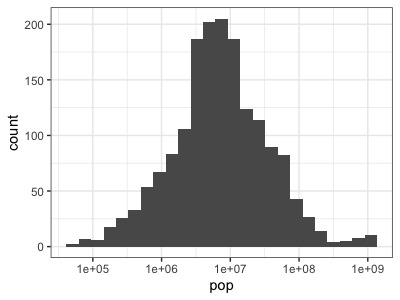
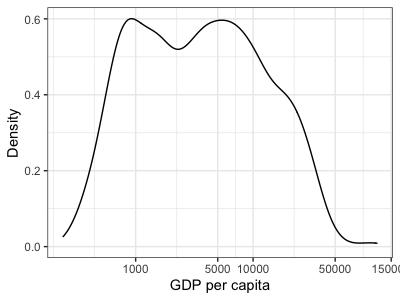
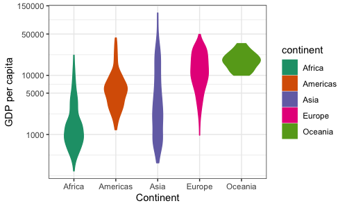
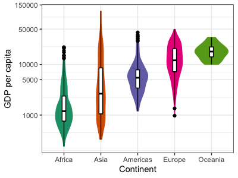
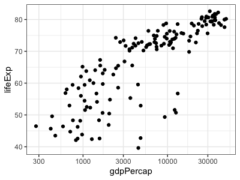
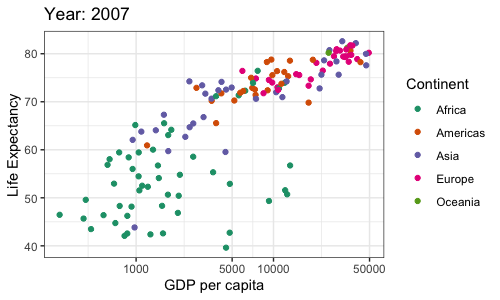
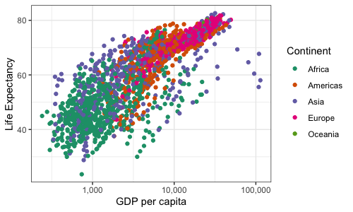
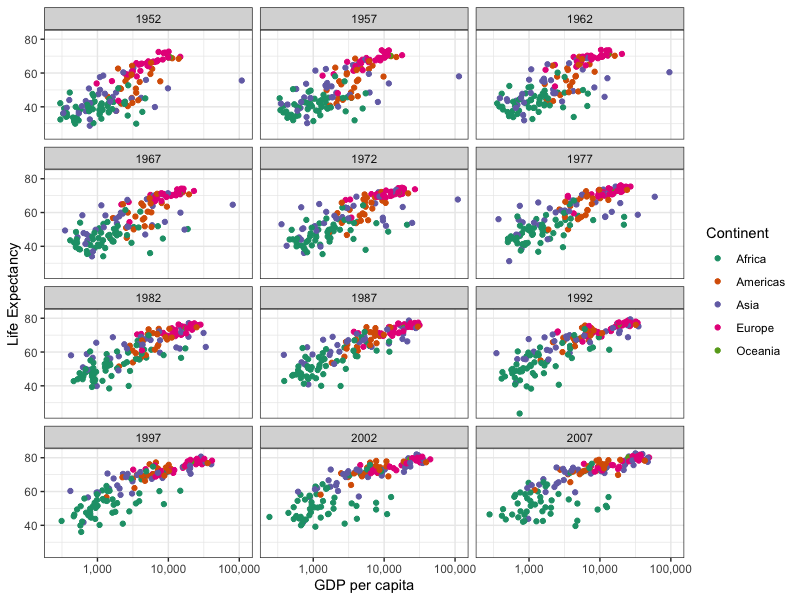
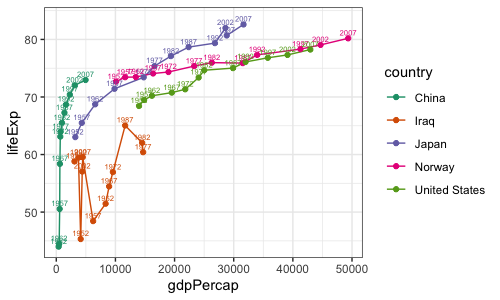

# Data visualisation with tidyverse

In this tutorial we will explore data visualisation using the R packages
[`dplyr`](https://dplyr.tidyverse.org) and [`ggplot2`](https://ggplot2.tidyverse.org). 

## Getting set up

`dplyr` and `ggplot2` are part of [tidyverse](https://www.tidyverse.org). If you followed the
[tidyverse installation section](/prerequisites/tidyverse.md) you'll have this already - if not let's install
it now:

```R
install.packages("tidyverse") 
```

We'll use real data on population size, life expectancy and GDP from
[gapminder.org](https://www.gapminder.org), and ecological data from
[palmerpenguins](https://allisonhorst.github.io/palmerpenguins/), so let's install those packages
too:

```R
install.packages("gapminder")
install.packages("palmerpenguins")
```

Lastly to make good-looking plots we need cool colour palettes - [Color
Brewer](https://colorbrewer2.org) is one of these so let's install:

```R
install.packages("RColorBrewer")
```

Load these into a running R session:

```
library(ggplot2)
library(dplyr)
library(palmerpenguins)
library(RColorBrewer)
```

As a last step we are going to default to a 'bw' style of plots, so let's set out `ggplot2` theme now:

```
ggplot2::theme_set(theme_bw())
```

## A first look at `gapminder` data using ggplot

We'll use real population data from [gapminder.org](https://www.gapminder.org). To load it, load
the `gapminder` library: ``` library(gapminder) ```

The gapminder data is now in a variable called `gapminder` - we'll use this a lot so let's start by
renaming it to something shorter and taking a look:

```{r gapminder}
d <- gapminder
View(d)
# or just head(d) if not in RStudio
```

The data contains measurements of life expectancy, population size, and gross domestic product
(GDP) per capita for different years. The simplest way to see what's in there is to create some
summaries using the `table` function:

```{r gapminder_tables}
table( d$year )
length( unique( d$country ))
```

Evidently the data contains entries for 12 years (with 5-year gaps between) and 142 countries.
Are all 142 countries represented at all 12 timepoints?

```
stopifnot( nrow(d) == (12 * 142) )
View( table(d$country, d$year) )
```

Yes they are!

### A warmup plot

As a warmup let's use `ggplot` to show the distribution of the continuous variables in the data:

```R
p = ggplot( data = d )
print( p + geom_histogram( aes( x = lifeExp ), bins = 25 ))
print( p + geom_histogram( aes( x = gdpPercap ), bins = 25 ))
print( p + geom_histogram( aes( x = pop ), bins = 25 ))
```


This code illustrates how ggplot2 works: it creates a plot object (`p` above) that is associated
with some data; then 'layers' are added to draw things, such as the histogram layer above. What's
more, the layers are associated with *aesthetic mappings* (`aes()` in the above) which tell ggplot
how the data variables should be mapped onto visual parameters (that is, things like bar height,
point size or colour, say.)  It should look something like this:


A less obvious but essential feature is that the way these data -> visual mappings are presented is
governed by *scales*. In the above, the scales are implicit (both x and y scales are linear). But
for example, we could alter the `x` scale of our plot so that bars are drawn in log space:

```
print(
	p
	+ geom_histogram( aes( x = pop), bins = 25 )
	+ scale_x_log10()
)
```



Compare these last two plots - it might take you a few moments to see exactly what has happened. If
you compare the x axes you'll see that they both have the same overall range - they go roughly up
to `1e09` (whjich of course means $1\times 10^9$, i.e. 1 billion.) But in the second plot every
tick represents a point 10 times larger than the one below, that is, it is a log scale, while in
the first version the scale is linear.

:::tip Questions

1. Which version of the plot does a better job of presenting the data?

2. Look at the histogram bars.  Is the histogram binning done *before* the transformation to log-scale, or after it?

:::

A subtly different plot is produced if we *log-transform the data* instead of changing the scale:

```R
print(
	p
	+ geom_histogram( aes( x = log10(pop)), bins = 25 )
)
```

The plotted bars themselves look identical, but if you look closely you'll see the X axis scale has
changed to reflect the log values instead. Which one of these is better probably depends on the context.

For me, neither of the above plots is perfect - I want a plot that can be understood at a glance,
which means including very clear axis labels. Something like:

```R
print(
	p
	+ geom_histogram( aes( x = pop), bins = 25 )
	+ scale_x_log10(
		breaks = 10^c( 5, 6, 7, 8, 9 ),
		labels = c(  "100 thousand", "1 million", "10 million", "100 million", "1 billion" )
	)
	+ xlab( "Population size" )
	+ ylab( "Number of countries" )
)
```


:::tip Question

Most countries in this data have between about 1 and 100 million individuals in - a few have much
larger or smaller populations. Only two countries have populations larger than a billion. What are
they? Try finding out:

```
d[ d$pop > 1E9 & d$year == '2007', ]
```
:::

In the rest of this tutorial we'll use ggplot2 to explore the gapminder dataset in more detail. 

:::tip
As
with other R objects, you can find documentation on ggplot2 using R's in-built help - for example
to find out how the above works:

```R
?scale_x_log10
```

ggplot2 also has [extensive online documentation](https://ggplot2.tidyverse.org) including a useful
cheatsheet.
:::

## The distribution of GDP per capita.

In the rest of this tutorial we'll show various ways to create good-looking visualisations with
this data.  Let's get started.

Histograms are ok - they summarise the empirical distribution of data in a largely transparent way.
However they look a bit jaggedy - the true distribution is probably a lot smoother than that. One
option is instead to plot a *smoothed histogram*, or *density plot*. That's easy with ggplot -
let's plot the GDP per capita this way:

```{r gapminder_gdp}
p2_1 <- ggplot(data = d, mapping = aes(x = gdpPercap)) +
  geom_density() +
  labs(x = "GDP per capita", y = "Density")

p2_1
```


As before let's change the scale of the x-axis to a log scale

```{r gapminder_gdp_log, fig.show="hide"}
p2_1 + scale_x_continuous(trans = "log10") 
# or scale_x_log10()
```

...and make the axis breaks prettier

```{r gapminder_gdp_pretty}
p2_1 + scale_x_continuous(
	trans = "log10",
	breaks = c(0, 1000, 5000, 10000, 50000, 150000)
)
```



Nice! But hmm... this is a bit odd looking - it has has at least two bumps. Let's next try to see
if this is caused by the distribution of GDP per capita differing in different continents.

## The distribution of GDP per capita, by continent.

Now we have another variable we want to add: continent. In a density plot, we can't add another
variable along the y-axis - so another way to show a different variable is to use colour.

Here, I assign both color and fill to continent to shade the area under the density plot.

```R
p2_2a <- ggplot(data = d, mapping = aes(x = gdpPercap, 
                                        color = continent,
                                        fill = continent)) +
  # the "alpha" parameter changes the transparency of the fill
  # the "size" parameter changes the thickness of the lines
  geom_density(alpha = 0.2, size = 1) +
  # keep the log scaling we applied previously
  scale_x_continuous(trans = "log10",
                     breaks = c(0, 1000, 5000, 10000, 50000, 150000)) +
  # change the labels for color and fill (which label the legend)
  labs(x = "GDP per capita", y = "Density",
       color = "Continent", fill = "Continent")

p2_2a
```


Let's change the colour scheme. People who are colour-blind do science, so let's try to keep plots
colour-blind friendly

```{r colours}
display.brewer.all(colorblindFriendly = T)
```

Since the continents are nominal (not ordered), we should use one of the qualitative color palettes
(Set2 or Dark2) rather than a sequential one.

```{r gapminder_gdp_colours, fig.show="hide"}
p2_2a + scale_color_brewer(palette = "Dark2") +
  scale_fill_brewer(palette = "Dark2")
```

### Bring on the violins

Density plots like this look kindof nice, but can be difficult to interpret with many groups
overlaid over each other.  Another way to plot multiple densities is a *violin plot*.

To make one, we'll reorganise the plot to have the continent on the x axis and the gdp distribution
on the y axis.  And, just for ease of identification we'll keep the colours as well:

```{r gapminder_gdp_violin}
p2_2b <- ggplot(data = d, mapping = aes(x = continent,
                                        y = gdpPercap,
                                        color = continent,
                                        fill = continent)) +
  geom_violin() +
  scale_y_continuous(trans = "log10",
                     breaks = c(0, 1000, 5000, 10000, 50000, 150000)) +
  scale_color_brewer(palette = "Dark2") +
  scale_fill_brewer(palette = "Dark2") +
  labs(x = "Continent", y = "GDP per capita")

p2_2b
```



We can also get rid of the legend since it doesn't add any new information:

```{r gapminder_no_legend, fig.show="hide"}
p2_2b + theme(legend.position = "none")
```

:::tip Note

I like this plot with colours, but it does break one of the **cardinal rules of data viz**. This is
that it's best to map one feature of the data to one aesthetic (whereas here we have mapped
continent to two: the x axis and colour at the same time.) Arguably as a *scientific plot* (as
opposed to a presentation tool) this is better without the colours:

```R
print(
	ggplot(data = d, mapping = aes(x = continent, y = gdpPercap))
	+ geom_violin( fill = 'grey' )
	+ scale_y_continuous(trans = "log10",
	                   breaks = c(0, 1000, 5000, 10000, 50000, 150000))
	+ labs(x = "Continent", y = "GDP per capita")
)
```


...because the colours distract from the distributions. (But to demo the possibilities we'll stick
with the colours for now.)

:::

### Adding summary statistics

These violins are essentially vertically-plotted, back-to-back histograms. They are pretty useful
and look good, but don't directly provide any quantification. To improve that, let's also add
some summary statistics such as the median and the inter-quartile range (IQR) as a boxplot on top
of the violins. Remember that we set the fill and color to match continents in the overall plot
aesthetics, so if we don't override that here, the overlaid boxplots will have the same fill and
color as the violins.

```{r gapminder_box, fig.show="hide"}
p2_2b + 
  geom_boxplot(width = 0.1, color = "black", fill = "white") +
  theme(legend.position = "none")
```


Sweet! This illustrates an important feature of ggplot2: the aesthetic mapping can be set on the
plot object itself, but can also be set (or overridden) seperately for each layer, allowing great
flexibility in the plot appearance.

### Reordering values

To make this plot easier to read, let's order the plots by median GDP per capita.

To do this in ggplot takes a bit of data manipulation - essentially, we tell ggplot what order we
want continents in by ordering them in the data itself. To do this we will *reorder the levels of
the `continent` variable*. This works because `continent` is actually a **factor** - discrete
values with a specific set of levels.  You can see them using the `levels` function:
```
levels(d$continent)
```

Right now they are in alphabetical order. Let's use `dplyr` to add a new column with the same
continent in, but now ordered by per capita gdp:

```
d$orderedContinent = reorder( d$continent, d$gdpPercap, FUN = median )
```

You should see something like:

    # A tibble: 1,704 × 7
       country     continent  year lifeExp      pop gdpPercap orderedContinent
       <fct>       <fct>     <int>   <dbl>    <int>     <dbl> <fct>           
     1 Afghanistan Asia       1952    28.8  8425333      779. Asia            
     2 Afghanistan Asia       1957    30.3  9240934      821. Asia            
     3 Afghanistan Asia       1962    32.0 10267083      853. Asia            
     4 Afghanistan Asia       1967    34.0 11537966      836. Asia            
     5 Afghanistan Asia       1972    36.1 13079460      740. Asia            
     6 Afghanistan Asia       1977    38.4 14880372      786. Asia            
     7 Afghanistan Asia       1982    39.9 12881816      978. Asia            
     8 Afghanistan Asia       1987    40.8 13867957      852. Asia            
     9 Afghanistan Asia       1992    41.7 16317921      649. Asia            
    10 Afghanistan Asia       1997    41.8 22227415      635. Asia            
    # … with 1,694 more rows
    # ℹ Use `print(n = ...)` to see more rows

Importantly the new variable is in a different order:
    $ levels(d$orderedContinent)
    [1] "Africa"   "Americas" "Asia"     "Europe"   "Oceania" 

So let's plot - don't forget to update to use the new `orderedContinent` variable:

```{r gapminder_ordered_violins}
  ggplot(
    data = d,
    mapping = aes(
      x = orderedContinent,
      y = gdpPercap,
      color = orderedContinent,
      fill = orderedContinent)
  ) +
  geom_violin() +
  geom_boxplot( width = 0.1, color = "black", fill = "white" ) +
  scale_y_continuous(trans = "log10",
                     breaks = c(0, 1000, 5000, 10000, 50000, 150000)) +
  scale_color_brewer(palette = "Dark2") +
  scale_fill_brewer(palette = "Dark2") +
  labs(x = "Continent", y = "GDP per capita") +
  theme(legend.position = "none")
```


:::tip Note

A fancier way to make these data manipulations is to use `dplyr` to "pipe" the data through
mutating functions. The `%>%` syntax is used for this (kindof similar to how the `|` character is
used in the UNIX shell).  Mutating the dataframe on the fly would look like this:

```R
d %>% mutate(
	orderedContinent = reorder(continent, gdpPercap, FUN = median)
)
```

It's also possible to pipe the output straight into ggplot - in this case we skip the `data`
argument as the data is piped in:

```R
d %>% mutate(
	orderedContinent = reorder(continent, gdpPercap, FUN = median)
) %>% ggplot(
  mapping = aes( ... )
  ...(etc.)
```

Whether this is clearer or not is a matter of personal preference - it certainly can make for
shorter code.

:::

### Is gdp related to life expectancy?

In the above we've been looking at the distribution of gdp across all years in the data.

But now let's focus on a single year:

```{r gapminder_subset}
d07 <- d[d$year == 2007, ]
```

and ask if the variables are related to each other.

The simplest and often best way to show the relationship between two variables is a *scatter plot*.
A basic scatter plot is easy:

```
print(
  ggplot( data = d07, aes( x = gdpPercap, y = lifeExp ))
  + geom_point()
  + scale_x_continuous(trans = "log10")
)
```



However, we already suspect this may differ by continent so let's colour by continent - and fix up
the axis labels etc. as we have been doing:

```{r gapminder_scatter}
p2_3a <- ggplot(
  data = d07,
  mapping = aes(x = gdpPercap, y = lifeExp, colour = continent)
) +
geom_point() +
scale_color_brewer(palette = "Dark2") +
# we know GDP per capita is best viewed on a log scale
scale_x_continuous(trans = "log10",
                     breaks = c(0, 1000, 5000, 10000, 50000, 150000)) +
labs(
  x = "GDP per capita",
  y = "Life Expectancy",
  color = "Continent",
  title = "Year: 2007"
)

p2_3a
```



It looks like there is a trend here! let's plot some trend lines with geom_smooth - starting with a simple linear model.

```{r gapminder_trend, fig.show="hide"}
p2_3a + geom_smooth(method = "lm", 
                    color = "black", fill = "grey")
```


We can even fit a separate regression line to each continent.

```{r gapminder_trend_continent, fig.show="hide", warning=FALSE, message=FALSE}
p2_3b = p2_3a + geom_smooth(aes(color = continent, fill = continent),
                    method = "lm") +
  scale_fill_brewer(palette = "Dark2") +
  labs(color = "Continent", fill = "Continent")
p2_3b
```


That's pretty interesting. In all the continents this data suggests a strong relationship between
per-capita GDP and life expectancy across countries, with (visually at least) similar slopes.

### Labelling points

Some countries seem to buck this trend however.  It would be useful to label them.
Let's try that now.  We'll use some thresholds based on the above plot to pick countries for labelling:

```R
dat_label <- d07[
  (d07$gdpPercap > 3000 & d07$lifeExp < 50)
  | (d07$gdpPercap < 1000 & d07$lifeExp > 55),
]
```

This is countries with high per-capita gdp but low life expectancy, or vice versa - if you look at
this dataframe you'll see there are 10 of them. Let's add them to our plot:

```
p2_3c <- p2_3b +
# for the label layer, let's jsut use the subsetted data.
# Setting position nudge moves the labels away from the points
geom_text(
  data = dat_label,
  aes(label = country),
  position = position_nudge(x = -0.1, y = -1),
  show.legend = F
)
p2_3c
```


:::tip Note

Despite the 'nudge', some of the labels are still on top of each other. One thing to try is the
`geom_text_repel()` geom which is provided by the `ggrepel` package instead.  Install it like this:
```R
install.packages( 'ggrepel' )
```

And now you can write:
```
p2_3b +
# for the label layer, let's jsut use the subsetted data.
# Setting position nudge moves the labels away from the points
geom_text_repel(
  data = dat_label,
  aes(label = country),
  show.legend = F
)
```


`ggrepel` has moved the labels off each other. (Still, it's still not totally obvious which points
go with with label. In general you can spend a lot of time getting labels like this in the right
places - we'll leave it there for now.)

:::

### Saving your figures
Make sure you don't lose all your hard work - let's save the plot to a pdf. (You can also save to
tiff, png, etc., but pdfs have the nice property that they don't lose anything due to image
resolution - I suggest using them unless your plot has a huge number of points.)

You can do this in RStudio by clicking on the `Export` button just above the plot pane.  Alternatively in R itself:


```R
ggsave(
  plot = p2_3c,
  filename = "gdp_vs_lifeexp_2007.pdf",
  width = 6,
  height = 4
)
```

:::tip Note

For pdf files, widths and heights are specified in inches by default. You can change this using the
`units` argument - see an example below.

:::

### Facetting

Our plot only shows one year of the data. What if we want to show all years at once? We'd like a
way to split the plot into several panes. This is what *facets* are designed for.

Let's give it a go using the
[`facet_wrap()`](https://ggplot2.tidyverse.org/reference/facet_wrap.html) command.  This tells
ggplot2 to split up the plot based on the value of a (categorical) variable - and arrange them as
multiple panes wrapping into a larger plot.

First, let's plot the data without the facet applied.

```R
p2_3d <- (
  ggplot(
    data = d,
    mapping = aes(x = gdpPercap, y = lifeExp,  color = continent)
  ) +
  geom_point() +
  scale_color_brewer(palette = "Dark2") +
  # the scales::comma parameter changes the way axis ticks are displayed
  scale_x_continuous(trans = "log10", labels = scales::comma) +
  labs(
    x = "GDP per capita",
    y = "Life Expectancy",
    color = "Continent"
  )
)

p2_3d
```



Not surprisingly it's pretty messy because all the data is on the same pane. Now let's add the
facet:

```
p2_3d + facet_wrap(~year, nrow = 4, ncol = 3)
```


Finally let's also save this plot to a [tiff](https://en.wikipedia.org/wiki/TIFF) and specify plot
dimensions and resolution - useful for publications:

```R
ggsave(
  plot = p2_3d + facet_wrap(~year, nrow = 4, ncol = 3),
  filename = "gdp_vs_lifeexp_allyears.tiff", 
  units = "cm",
  height = 23,
  width = 16.8,
  dpi = 300
)
```

:::tip Questions

One of the Asian countries is a huge outlier - very high GDP from the 1950s onwards.  Which is it?

Another country has especially low life expectancy 1992 - which is it?

What happens if you facet by country instead is this useful?

Can you add outlier labels to this plot as we did before?

:::

### Other plots

There are of course lots of other ways we could visualise this data - 
for example here is a plot using `geom_line` to focus on a few countries over time:

```R
print( 
  ggplot(
    data = d[ d$country %in% c( 'Japan', 'China', 'Norway', 'United States', 'Iraq' ), ],
    mapping = aes( x = gdpPercap, y = lifeExp, colour = country )
  )
  + geom_line()
  + geom_point()
  + geom_text( aes( label = year ), nudge_x = 0, nudge_y = 1, size = 2 )
  + scale_color_brewer(palette = "Dark2")
)
```


The sky is the limit - hopefully this tutorial has given you a start in how to explore the
possibilites. Read the [ggplot2 documentation](https://ggplot2.tidyverse.org) for many more ideas.

## Part 3 - Try it yourself! 

```{r penguins}
d <- penguins
```

Feel free to copy code from previous sections, or come up with your own.

