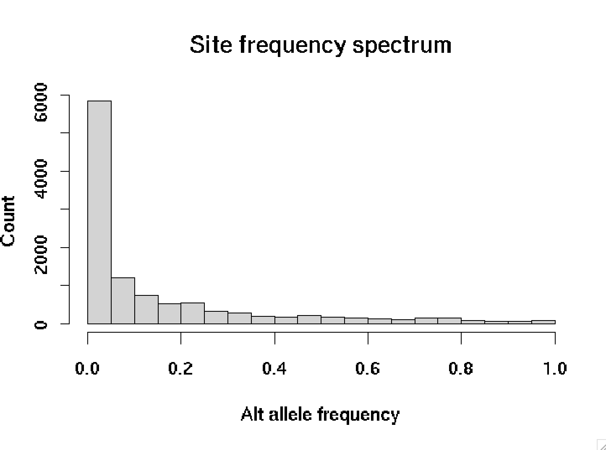
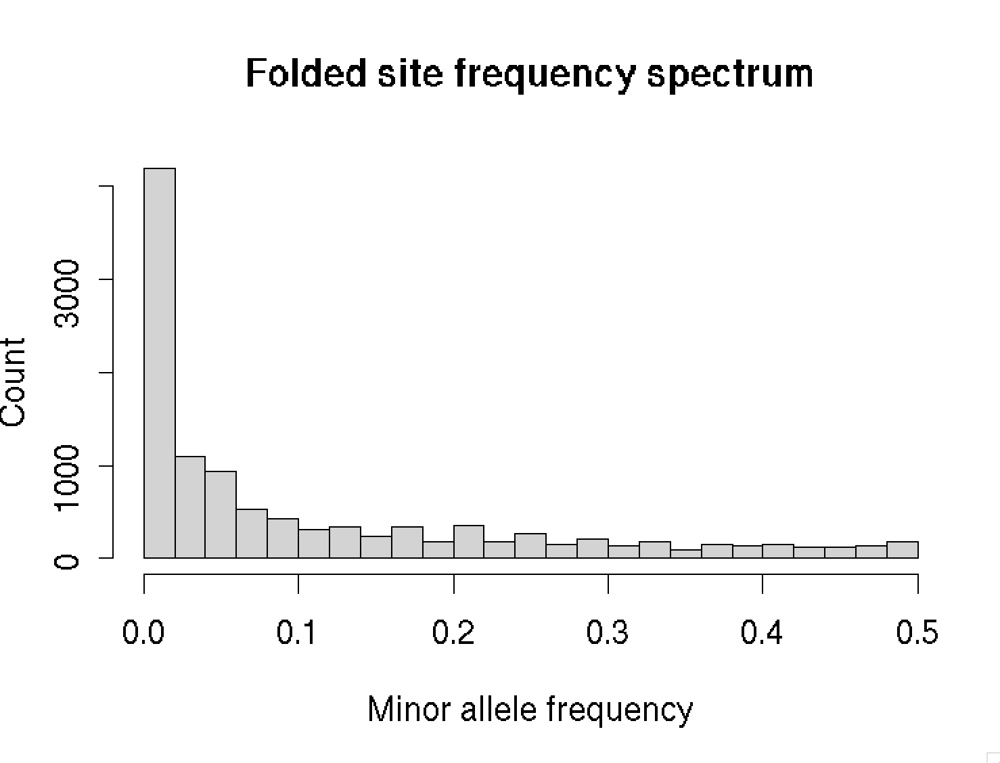

# Visualising haplotypes in R

In this page you will load up some real haplotype data (from the 1000 Genomes Project) and plot it in R.

Start by downloading the file `GWD_30x_calls.filtered.tsv.gz` from [this folder](https://www.well.ox.ac.uk/bioinformatics/training/gms/data/) and loading into R:
```r
library( tidyverse )
gwd = read_tsv( "https://www.well.ox.ac.uk/bioinformatics/training/gms/data/GWD_30x_calls.filtered.tsv.gz" )

print(gwd)
```

Have a look at the data.  The data consists of genotype calls for 112 'Gambian from the Western Division' individuals
from the recent high-coverage sequencing of [1000 Genomes Project](https://www.internationalgenome.org) samples.

It has data for >30,000 biallelic SNPs (in rows) and the samples in columns.

:::tip Note

If you want to see how this data was generated - follow the [Variant calling and imputation practical](/sequence_data_analysis/variant_calling_and_imputation/README.md).

This data comes from the region of the gene *FUT2*.

:::

## Plotting the haplotypes

Let's plot this data now.  To start, let's turn the genotypes themselves into a matrix:
```r
GT = as.matrix( gwd[,5:ncol(gwd)])
```

A simple way to plot is to use `image()`.  First we'll throw out monomorphic and rare variants:

```r
frequencies = rowSums(GT) / ncol(GT)
w = which( frequencies > 0 & frequencies < 1 )
GT = GT[w,]
metadata = gwd[w,1:4]
```

Let's first get the number of SNPs and haplotypes in the data:
```r
L = nrow(GT) # number of SNPs
N = ncol(GT) # number of haplotypes
```
and plot:
```r
image(
	GT,
	x = 1:L,
	y = 1:N,
	xlab = "SNPs",
	ylab = "Chromosomes"
)
```

Cool!  But a bit noisy.

## Ordering the haplotype

Let's use a simple approach to order the haplotypes in the region - [hierarchical
clustering](https://en.wikipedia.org/wiki/Hierarchical_clustering).

In R we can do this by first constructing a **distance matrix** and then using `hclust()` to cluster it.  Let's try now:


```r
distance = dist(
	t(GT),
	method = "manhattan"
)
```


Here we've used 'manhattan' distance, that is, the distance between two haplotypes is the number of mutational
differences between them.

:::tip Note

The `t()` part is needed around GT, otherwise we will be clustering SNPs instead of samples.  (You'll know if you got
this wrong because the output will be enormous below.

:::

You can see what the distance matrix looks like by converting to a matrix:
```r
as.matrix(distance)[1:10,1:10]
```

You ushould see something like this:
```
             HG02461_hap1 HG02461_hap2 HG02462_hap1 HG02462_hap2 HG02464_hap1 HG02464_hap2 HG02465_hap1 HG02465_hap2
HG02461_hap1      0.00000     36.87818     43.52011     42.80187     42.13075     38.28838     44.46347     40.59557
HG02461_hap2     36.87818      0.00000     45.40925     39.26831     41.86884     38.26225     41.58125     44.40721
HG02462_hap1     43.52011     45.40925      0.00000     40.84116     39.98750     43.42810     40.18706     43.33590
HG02462_hap2     42.80187     39.26831     40.84116      0.00000     44.75489     44.22669     42.24926     41.73727
HG02464_hap1     42.13075     41.86884     39.98750     44.75489      0.00000     43.39355     43.31282     42.32021
HG02464_hap2     38.28838     38.26225     43.42810     44.22669     43.39355      0.00000     43.53160     42.28475
HG02465_hap1     44.46347     41.58125     40.18706     42.24926     43.31282     43.53160      0.00000     46.22770
HG02465_hap2     40.59557     44.40721     43.33590     41.73727     42.32021     42.28475     46.22770      0.00000
HG02561_hap1     42.39104     42.01190     41.67733     41.43670     44.11349     40.97560     42.87190     41.53312
HG02561_hap2     46.04346     43.33590     43.26662     44.85532     45.33211     40.69398     42.95346     46.10857
```

Now let's cluster and order them using `hclust()`:
```r
the_order = hclust( distance )$order
```

Let's plot again - this time ordering the columns (haplotypes) in the data:
```r
image(
	GT[,the_order],
	x = 1:L,
	y = 1:N,
	xlab = "SNPs",
	ylab = "Chromosomes"
)
```

## Computing diversity

How much variation is there?  Here are a few ways to look at it.

First we could look at the frequencies of all the variants in the data:

```r
frequencies = rowSums( GT ) / ncol( GT )
hist(
	frequencies,
	breaks = 25,
	xlab = "Alt allele frequency",
	ylab = "Count",
	main = "Site frequency spectrum"
)
```



This picture is pretty typical - most variant alleles are pretty rare, and a few are common.

:::tip Note

These are the frequencies at **variable sites** only.  If we computed at every site, there would be an even bigger spike
at zero - counting all the sites that are not variable between people in our data. (How many of these are there in this
region?)

:::

This picture is for *alternate* alleles (versus reference alleles).  A better plot would show the frequencies of
 **derived** alleles (i.e. those that have arisen trhough mutation compared to the common ancestor).  To do that, we
 would need an ancestral allele, which we don't have right now.  So instead let's plot hte **folder site frequency spectrum**:


```r
hist(
	pmin( frequencies, 1 - frequencies ),
	breaks = 25,
	xlab = "Minor allele frequency",
	ylab = "Count",
	main = "Folded site frequency spectrum"
)

```



Another natural metric is to compute evolutionary distances between haplotypes by **counting mutations**.

The idea is that (ignoring recombination for a moment) - mutations that seperate two samples represent those that have
occurred since their most recent common ancestor.  Roughtly speaking the number of mutations 'counts' the evolutionary
distance between the haplotypes.  A natural metric is thus **number of pairwise differences** between the
two haplotypes.

Let's see how distantly related the haplotypes are on average, by computing the  **average number of pairwise
differences** between different haplotypes - also known as **nucleotide diversity** - now. To do this we'll write a
function which loops over all pairs of haplotypes in the data.

:::tip Note

How many pairs of distinct haplotypes are there?  The answer is of course the number of ways of drawing two things from $N$ things - known as '$N$ choose 2':
$$
N\quad\text{choose}\quad2 = \frac{N\cdot(N-1)}{2} \\

$$

...also known as the 2nd diagonal in pascal's triangle:
```
N
0           1
1         1   1   ↙
2       1   2   1
3     1   3   3   1
4   1   4   6   4   1
          etc.
```

In R, you can  compute this using the `choose()` function - or just do `N*(N-1)/2` as above, which is what I've done in
the function below.

:::

and so on.  

```r
average_number_of_pairwise_differences = function(
	haplotypes
) {
	N = ncol(haplotypes)
	total = 0
	# Sum over all pairs
	for( i in 1:(N-1) ) {
		for( j in (i+1):N ) {
			a = haplotypes[,i]
			b = haplotypes[,j]
			total = total + sum( a != b )
		}
	}
	# The total 
	return( total / (N*(N-1)/2))
}

average_number_of_pairwise_differences( GT )
```

```
1811.239
```

So haplotypes differ by about 1800 mutations on average, across this 1.1Mb region - or about 1.6 mutations per kilobase.

## Challenge questions

Here are some challenges:

:::tip Challenge 1

The *FUT2* gene is in this data around positions 48,695,971 - 48,705,951.

Can you make a version of the haplotype plot that shows all haplotypes as before, but the ordering is based only on the
SNPs in *FUT2* or a small region around it?

:::

:::tip Challenge 2

In the [genome-wide association study
practical](../../genome_wide_association_studies/genome_wide_association_analysis/README.md) you found an association in
the *FUT2* gene. Can you make a two-panel version of the haplotype plot, with the top panel being haplotypes that carry
the alternate allele of this associated SNP, and the lower panel being haplotypes that don't?

**Hints**:

* You can look up the position of the lead GWAS SNPs in the `metadata` variable.  (Both datasets are in GRCh37 'build 37' coords.)

* You can get the genotypes for the SNP (of course) out of the `GT` matrix.

* Use `layout()` in R to make a two-panel plot, e.g.:
```r
layout( matrix( 1:2, ncol = 1 ))
```
and then plot the panels in order.

:::

Good luck!
