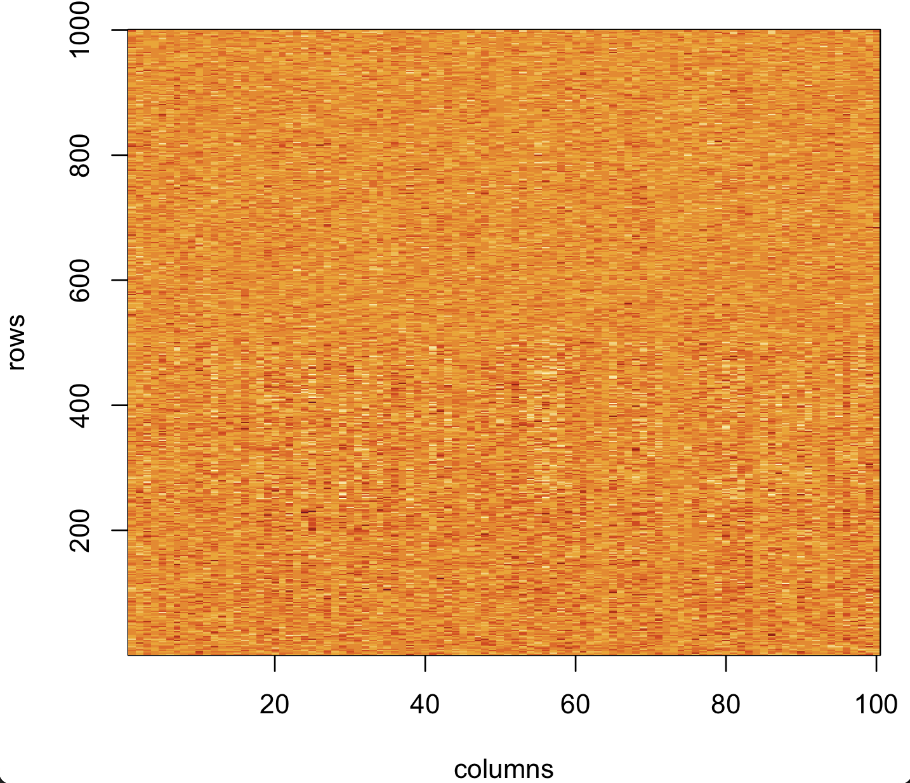
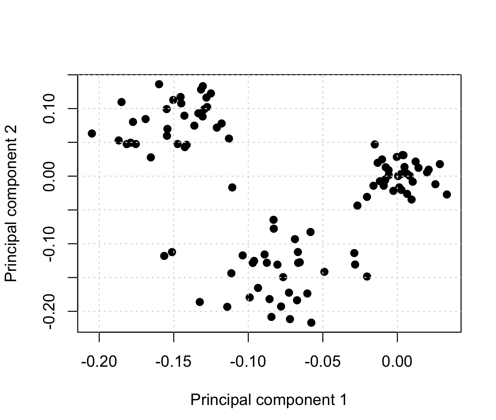
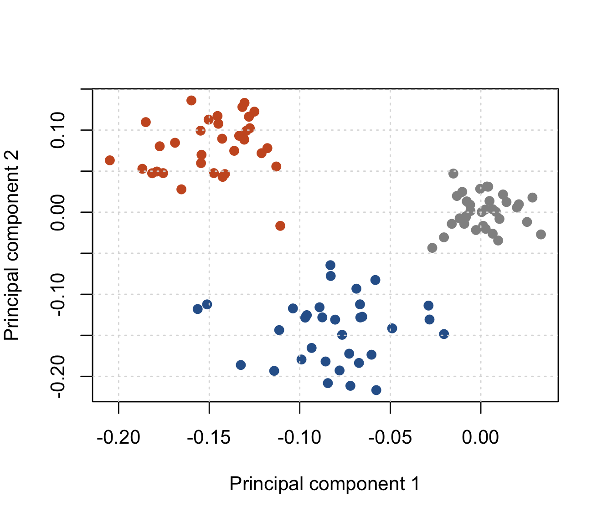

# A warm-up example


Before running the main practical, let's first see how PCa works by using it to recover some simulated structure from a matrix in R.

As before we will start with a giant matrix:
$$

X = \begin{array}{c|cccc}
& \text{column 1} & \text{column 2} & \cdots & \text{column $N$} \\
\hline
\text{row $1$} & x_{11} & x_{12} & \cdots & x_{1N} \\
\text{row $2$} & x_{21} & x_{22} & \cdots & x_{2N} \\
\vdots & \vdots & & \ddots & \\
\text{row $L$} & x_{L1} & x_{L2} & \cdots & x_{LN}
\end{array}
$$

that contains some structure, and we'll see if PCA can recover this structure for us.  (To make this simple we'll simulate the matrix so we know what the true structure is.)

## Simulating some data

Let's simulate some structured data now.  We'll work with a matrix with 1,000 rows and 100 columns:
```r
L = 1000
N = 100
X = matrix(
	NA,
	nrow = L,
	ncol = N
)
```

Let's start by filling this with random values from a normal distribution:
```r
X[,] = rnorm( L*N, mean = 0, sd = 0.5 )
```
:::tip Note

If you're unsure what this has done, explore the matrix now by [using your R
skills](/docs/programming/introduction_to_R/README.md) to subset rows and columns, or try `hist(X)` to see a histogram
of values.

:::


Now let's add some structure - first we'll take a couple of sets of rows to work with:
```r
rows1 = 1:500
rows2 = 250:500
```

and a couple of random sets of samples:
```r
cols1 = sample( 1:N, 66 )
cols2 = sample( cols1, N/3 )
```

Let's add some structure to our data by adding some random stuff with nonzero mean to each of the subsets:
```r
X[rows1,cols1] = X[rows1,cols1] + rnorm( length(rows1) * length(cols1), mean = 0.25, sd = 0.5 )
X[rows2,cols2] = X[rows2,cols2] + rnorm( length(rows2) * length(cols2), mean = -0.4, sd = 0.5 )
```

Finally, let's do what we will do in practice for a GWAS, and normalising the matrix.  We will do this by **standardising the rows**:
```r
for( i in 1:L ) {
	X[i,] = X[i,] - mean(X[i,] )
	X[i,] = X[i,] / sd(X[i,])
}
```

With this setup the matrix should now be structured like this:
* the matrix has 100 samples in total, of which:
* two-thirds of the samples have had a 'bit' added at the first 500 SNPs; and
* another half of those samples have an extra 'bit' added at SNPs 250-500.

Let's see if we can see this structure visually using `image()`:

```
image(
	t(X),
	x = 1:N,
	y = 1:L,
	xlab = "columns",
	ylab = "rows"
)
```



:::tip Question
Do you see any structure - if so is it what you expect?

**Note.** by default, `image()` will choose a colour scale to match the values in the matrix - try `hist(X)` again if you want to see the range of values.
:::

## Computing principal components

You can probably *just about* see the structure in the matrix above, but not very clearly - even though we know it is
there.  But now let's see if principal components can identify it.

There are several equivalent ways to run a PCA but the one we will use is based on computing a matrix of "similarity" (or, as we will say for genetic data below, 'relatedness') between columns.  This similarity matrix is of dimension
$N\times N$ and can be computed very simply indeed:

$$
R = \frac{1}{L} \cdot X^t X
$$

or in R:
```r
R = (1/L) * t(X) %*% X
image(R)
```

:::tip Note

In case you're not used to looking at matrix maths, here's what the above means.

It says: take the matrix $X$, which has dimension $L\times N$ (i.e. it has $L$ rows and $N$ columns) and *transpose* it.
(Transposing it means 'rotating' by 90 degrees, so the rows become columns and vice versa). Then multiply it by itself.
Like this:

$$
X^t X = \left(\begin{array}{cccc}
x_{11} & x_{21} & \cdots & x_{L1} \\
    &           & \ddots & \\
x_{1N} & x_{2N} & \cdots & x_{LN}
\end{array}\right)
\cdot
\left(\begin{array}{cccc}
x_{11} & \cdots & x_{1N} \\
x_{21} & \cdots & x_{1N} \\
    &    \ddots & \\
x_{L1} & \cdots & x_{LN}
\end{array}\right)
$$

To 'multiply' you go **across rows** and **down columns**, i.e. you compute the **dot product** of each row of $X^t$ and
each column of $X$.  (The rows of $X^t$ are just the columns of $X$, of course, so this is dot producting the columns of
X with themselves). The entry $r_{ij}$ in row $i$ and column $j$ of the result $R$ is thus the dot product of the $i$th and $j$th
columns of $X$:
$$
r_{ij} = \frac{1}{L} \sum_{l=1}^L x_{li} x_{lj}
$$

Roughly speaking this dot product, quantifies the **extent to which the two columns of $X$ point in the same direction
(in $L$-dimensional space).  Im fact it is the **covariance** between columns $i$ and $j$ (or almost - this is not quite true because we standardised the rows, not the columns of $X$, but this has a minor impact here.)

:::

We can now compute principal components by computing the *eigendecomposition* of the matrix $R$:

```r
R = t(X) %*% X
pca = eigen(R)
```

:::tip Note

As usual you can see the structure of the output objectusing `View()` or `str()`. The matrix $X$ has 100 columns, and
the output object has 100 *eigenvalues* (`pca$values`) and 100 *eigenvectors* (`pca$vectors`), each of length 100.  The
entries of the eigenvectors are the **principal components**.

:::

Let's see what this has made of the result by plotting the first two principal components against each other:

```r
plot(
	x = pca$vectors[,1],
	y = pca$vectors[,2],
	xlab = "Principal component 1",
	ylab = "Principal component 2",
	# Make the points filled-in, because it looks better
	pch = 19
)
grid()

```

You will probably see something like this:


Woah! PCA has indeed magically found out some structure in our data!

To see if it is correct, let's add a column with some colour:
```r
colours = rep( "grey50", N )
colours[ cols1 ] = "orangered3"
colours[ cols2 ] = "dodgerblue4"
plot(
	x = pca$vectors[,1],
	y = pca$vectors[,2],
	xlab = "Principal component 1",
	ylab = "Principal component 2",
	# Make the points filled-in, because it looks better
	pch = 19,
	# Colour the points
	col = colours
)
grid()

```



As you can see, PCA has seperated out the three populations of samples - indeed it has done it pretty well in my version
of the data above.

:::tip Note

The sample sets are clearly seperated in the first two principal components.  But the method isn't perfect, for example,
  it hasn't actually told us what the three sets are (we can see them allright, but would need extra work to get it to tell us what they actually are.)

:::

## PCA duality: computing row 'loadings'

What if we don't eigendecompose $X^t X$ (of dimension $N\times N$), but decompose $X X^t$ (of dimension $L\times L$)
instead?  Answer: we get the **row loadings**:

```r
loadings = eigen( (1/L) * X %*% t(X) )
```

```r
layout( matrix( 1:2, ncol = 1 ))
par( mar = c( 4, 4, 1, 1 ))
plot(
	1:1000,
	abs(loadings$vectors[,1]),
	xlab = "row",
	ylab = "Loading",
	pch = 19
)
plot(
	1:1000,
	abs(loadings$vectors[,2]),
	xlab = "row",
	ylab = "Loading",
	pch = 19
)

```


What may not be apparent is that these loadings are very closely related to the PCs themselves.

To see this, first look at the eigenvalues from both the above decompositions:
```r
plot( pca$values, loadings$values[1:100] )
```
They are the same!

It turns out that these two things (PCs and loadings) are 'dual' to each other - in particular the PCs are just the
**projections of the columns of X onto the loadings**.  Specifically:

* The $k$th loading expresses *how much each row contributes* to the $k$th PC.

* The $k$th PC also expresses *how much each column* contributes to the $k$ loading.

* The PCs can be computed (up to a scaling factor) by projecting  the columns of $X$ onto the loadings (i.e. taking dot products):
$$
PC_{k} = t(X) \cdot \text{loading}_{k} \times \text{scaling factor}
$$

You can check this as follows.  First compute the projections onto the loadings like this:

```r
projections = t(X) %*% loadings$vectors
```

Now for example let's plot the first projection against the first pca:

```
plot(
	projections[,1],
	pca$vectors[,1]
)
grid()

```

:::tip Note

It turns out that the scaling factor is the square root of the corresponding *eigenvalue*, which is the other thing returned by `eigen()`.  Make them both the same like this:
```r
plot(
	projections[,5] / sqrt(pca$values[5]),
	pca$vectors[,5]
)
grid()
```
:::

:::tip Note

PCA as a singular value decomposition

The method of computation above is similar to what we will run in practice for the GWAS data.
However, there's a simpler way in R just using the matrix $X$ itself - the *singular value decomposition*.  Run it like this:

```r
s = svd(X)
```

At this point:
* The columns of `s$u` are the loadings
* The columns of `s$v` are the principal components
* the entries of `s$d` are the square roots of the eigenvalues above.

:::
