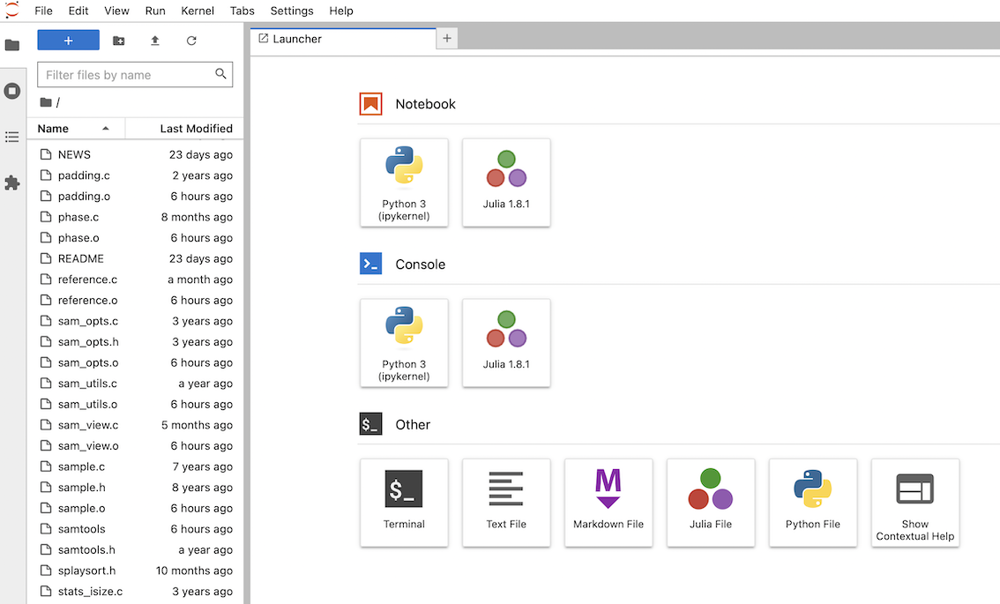
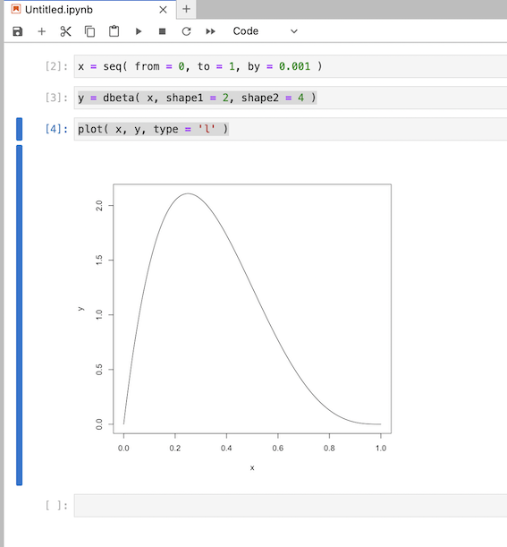

# Using R, python and julia with JupyterLab

The plain command-line interpreters for R, python and julia are useful, but for data analysis work you may want
something more interactive. One option for this is to use [JupyterLab](https://jupyter.org). JupyterLab works as
a server and a web app that talks to this server - so you work through your web browser. This is great when you start plotting and makes it easy to save 

### Installing JupyterLab

To install it you need the **jupyterlab** package, and **jupyter kernels** for each language you want to use.
For the purposes of this page I'm goinh to assume you have [activated a conda environment](CONDA.md), and we'll use conda (or rather `mamba`) to install the package.  Follow the tabs below to install what's needed:

1. Install the `jupyterlab` package using conda:

```
mamba install jupyterlab
```

2. Then install the jupyter kernels for your favourite languages.


import Tabs from '@theme/Tabs';
import TabItem from '@theme/TabItem';

:::tip Installing the Jupyter language kernels

<Tabs>
  <TabItem value="python" label="Install the python kernel">
To install a python kernel, install <a href="https://ipython.org">the ipython package</a>:

```
mamba install ipython
```

(However this is probably already installed.)

</TabItem>
<TabItem value="R" label="Install the R kernel">
To do this requires installing the <a href="https://irkernel.github.io">IRkernel package</a>.
From a running R session type:

```r
install.packages( 'IRkernel' )
IRkernel::installspec()
```

</TabItem>
<TabItem value="julia" label="Install the Julia kernel">
This involves installing the `IJulia` package.  From a running julia session, type `]` to get into package mode and type:

```
add IJulia
```
</TabItem>
</Tabs>

:::

### Trying JupyterLab

To get started, go to your terminal and run
```
jupyter lab
```

This will start the JupyterLab server (which runs in your terminal) and after a few moments will launch a new browser window/tab to interact with it.  It will look something like this:



Now you can start a new python, R, or julia 'notebook' session by clicking on the relevant icon.

**Exercise** Try an R notebook session for example, and let's plot the density of a [beta distribution](https://en.wikipedia.org/wiki/Beta_distribution).  Type these lines one at a time and press &lt;Shift-Enter&gt; to evaluate each cell:

```
x = seq( from = 0, to = 1, by = 0.001 )
```

```
y = dbeta( x, shape1 = 2, shape2 = 4 )
```

```
plot( x, y, type = 'l' )
```

It should look something like this:



In general notebooks are great for interactive analysis and for generating data-driven reports.

(Jupyter Lab isn't the only way to get this type of functionality - for example, similar functionality can be
had using [R Markdown documents](https://rmarkdown.rstudio.com) in RStudio, and for Julia the [Julia extension
for Visual Studio Code](https://code.visualstudio.com/docs/languages/julia) works great.)


