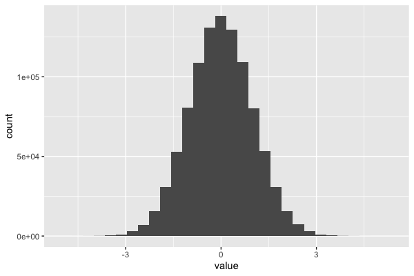
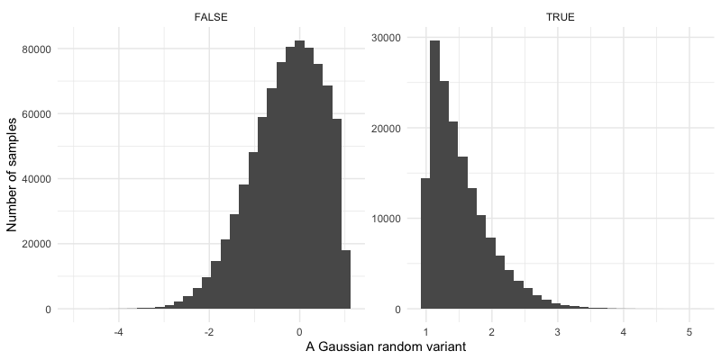

# Installing the R `tidyverse`

Base `R` is ok but it can be a bit... clunky. For many of the tutorials we wil use a set of
packages called ["tidyverse"](https://www.tidyverse.org) which make life smoother for your
analyses. If you've [successfully installed R](R.md) then this should be easy: in your R session
type

```
install.packages( tidyverse )
```

(You might have to select a CRAN mirror at this point - for best results choose one geographically
close to you.)  

### Testing it out
`tidyverse` is in fact a meta-package - a package that exists to install a bunch of other packages.
Now you can try them out. One of the packages is the `tibble` package that implements a nice data
frame data type.  Try it like this:
```
tibble::tibble( a = 1:10, b = 10:1 )
```

The output will be a **tibble**: a data frame with two columns called `a` and `b` each with the
values 1-10 in them, and both of type `<int>` (which means integer, i.e. positive or negative
whole numbers.).

Another useful part of this is [the `dplyr` package](https://dplyr.tidyverse.org) that lets you
manipulate data frames. For example we could filter the above data frame like this:

```
X = tibble::tibble( a = 1:10, b = 10:1 )
dplyr::filter( X, a > 5 & b > 3)
```

Lo and behold, only the selected rows are returned!  Wow.

When you get bored of typing all those `::`s, a simpler way is to load the libraries into the
current environment.  So for example we could do instead:
```
library( tibble )
library( dplyr )
X = tibble( a = 1:10, b = 10:1 )
filter( X, a > 5 & b > 3)
```

(But in real code it's often nicer just to specify - that way you know what package the function
comes from.)

### Another way to plot

As a final example here's another way to plot, courtesy of the [`ggplot2`
package](https://ggplot2.tidyverse.org). This provides a consistent way to generate plots from data
that is well-organised in data frames. Let's reconstruct our [sin example](R.md):

```
library( ggplot2 )
x = seq( from = 0, to = 2*pi, by = 0.01 )
X = tibble( a = x, b = sin(x))
myplot = ggplot( X ) + geom_line( aes( x = a, y = b ))
print(myplot)
```


or the histogram example:
```
X = tibble( value = rnorm( 1000000 ))
myplot = ggplot( X ) + geom_histogram( aes( x = value ))
print(myplot)
```


The advantages of `ggplot` over [base R](./R.md) might not be obvious to you from these examples.
One advantage is that the plot becomes an object (`myplot` in the above) that you can further
manipulate. For example let's plot that again with some stylistic improvements:

```
print(
  myplot
  + xlab( "A Gaussian random variant" )
  + ylab( "Number of samples" )
  + theme_minimal()
)
```


Or split so we can better see the upper tail of the distribution:

```
print(
  myplot
  + xlab( "A Gaussian random variant" )
  + ylab( "Number of samples" )
  + theme_minimal()
  + facet_wrap( ~(value > 1), scales = "free" )
)
```


