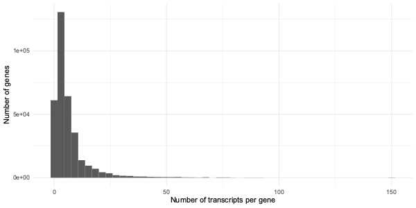

import Tabs from '@theme/Tabs';
import TabItem from '@theme/TabItem';

# Filter, group, summarise, join, arrange...

Now is a good point to introduce in a bit more detail a set of *data manipulation verbs* that make working with data
frames easy.  You've already been working with several of these - `filter`, `group by`, `summarise`, and `arrange`.
We'll describe a couple more 'verbs' - 'join' and 'select' - below.  

We'll calling them data 'verbs' because they *do* things to dataframes.  For example

- `filter` filters rows based on column values;
- `group by` groups rows based on column values;
- `summarise` computes summary values over the rows;
- `arrange` orders rows
- `join` joins two dataframes together, based on shared values.
- `select` selects (and renames) columns

By building these into pipelines you can conduct complex data manipulation tasks in a highly expressive way.

## Transcripts example

For example, wouldn't it be good to count the number of transcripts for each protein-coding gene?

Here's a way we could do that.  First make a dataframe of each coding gene and one of all transcripts.
Now join the two together, group by the gene, and count.

Let's try now using R.  First let's load the data.  We will want to avoid having the same column names, so let's use
SQL query syntax to rename them appropriately:

<Tabs>
<TabItem value="R" label="R code">

```r
library( RSQLite )
library( dplyr )
db = DBI::dbConnect( RSQLite::SQLite(), "genes.sqlite" )

genes = dbGetQuery(
	db,
	"SELECT dataset, ID AS gene_id,
	seqid, start, end, strand,
	Name, biotype
	FROM gff
	WHERE type == 'gene' AND biotype == 'protein_coding'
	"
)
transcripts = dbGetQuery(
	db,
	"SELECT dataset, Parent AS gene_id, ID AS transcript_id,
	start AS transcript_start, end AS transcript_end,
	attributes AS transcript_attributes
	FROM gff
	WHERE type == 'mRNA'"
)

```

</TabItem>
<TabItem value="dbplyr" label="dbplyr code">

```r
library( RSQLite )
library( dplyr )
library( dbplyr )
db = DBI::dbConnect( RSQLite::SQLite(), "genes.sqlite" )

genes = (
	db
	%>% tbl( "gff" )
	%>% filter( type == 'gene' & biotype == 'protein_coding' )
	%>% select( dataset, gene_id = ID, seqid, start, end, strand, Name, biotype )
	%>% collect()
)

transcripts = (
	db
	%>% tbl( "gff" )
	%>% filter( type == 'mRNA' )
	%>% select(
		dataset, gene_id = Parent, transcript_id = ID,
		transcript_start = start, transcript_end = end,
		transcript_attributes = attributes
	)
	%>% collect()
)
```

</TabItem>
</Tabs>

:::tip Note

These two versions of the code do behave a bit differently: The first produces R dataframes, and the second produces a
tidyverse-style tibble.  For the most part these work interchangeably although the way they print out is different.

:::

If you look at the column names of the results you'll see something important - we **renamed the identifier columns** to
be called 'gene_id' and 'transcript_id' in each table.  That was important because it makes joining them together easy.
Try that now:

```r
genes_and_transcripts = left_join(
	genes,
	transcripts,
	by = c( 'dataset', 'gene_id' )
)
```

Have a look at the resulting data frame.  You should see it has all the columns from `genes`, *and* all the columns from
`transcripts`. The linking columns, `dataset` and `gene_id`, appear only once.

:::caution The left in 'left join'

We used an 'left' join above.  There are also other joins which [can be used as
well](https://dplyr.tidyverse.org/reference/mutate-joins.html).  What's the difference?

This has to do with what happens when there is nothing matching a particular record.  A 'left' join keeps all records in
the left dataframe, **even if nothing matches them** in the right dataframe.    So, in our example, if there was a gene
with no transcripts, it would appear in the output.  (The transcript-specific columns would be there, but filled with
`NA` values).  On the other hand, a transcript with no matching genes would *not* appear - it will just be discarded.

You could also use the `inner_join()` (which keeps only records that match), `right_join()` (the reverse of
`left_join()`), and `full_join()` which will always keep *all* records from both dataframes.

*Do* any genes have no transcripts?  We could find out:

```r
(
	genes_and_transcripts
	%>% filter( is.na( transcript_id ))
)
```
Hopefully you'll see that there aren't any, so it didn't matter much which join we used.

There should be a one-to-many relationship between genes and transcripts - since each gene might have several
transcripts, but one transcript can't come from two genes!  Count how many rows `genes`, `transcripts` and
`genes_and_transcripts` have.  Is this what you expect?

To make this work, `left_join()` has repeated each gene record several times, once for each transcript.

:::


Now we're all set to summarise:
```
transcript_summary = (
	genes_and_transcripts[1:20,,drop=FALSE]
	%>% group_by( dataset, gene_id, start, end )
	%>% summarise(
		gene_length = ( end - start + 1 ),
		number_of_transcripts = n()
	)
)
```

 Maybe we should plot these?

```
(
	ggplot( data = transcript_summary )
	+ geom_histogram(
		aes(
			x = number_of_transcripts
		)
	)
	+ xlab( "NUmber of transcripts per gene" )
	+ ylab( "Number of transcripts" )
	+ facet_wrap( ~ dataset )
	+ theme_bw( 16 )
)

```


Hey, there's a gene there with 150 transcripts!

This brings us onto talking about [**extreme genes**](./extreme_genes/README.md).

