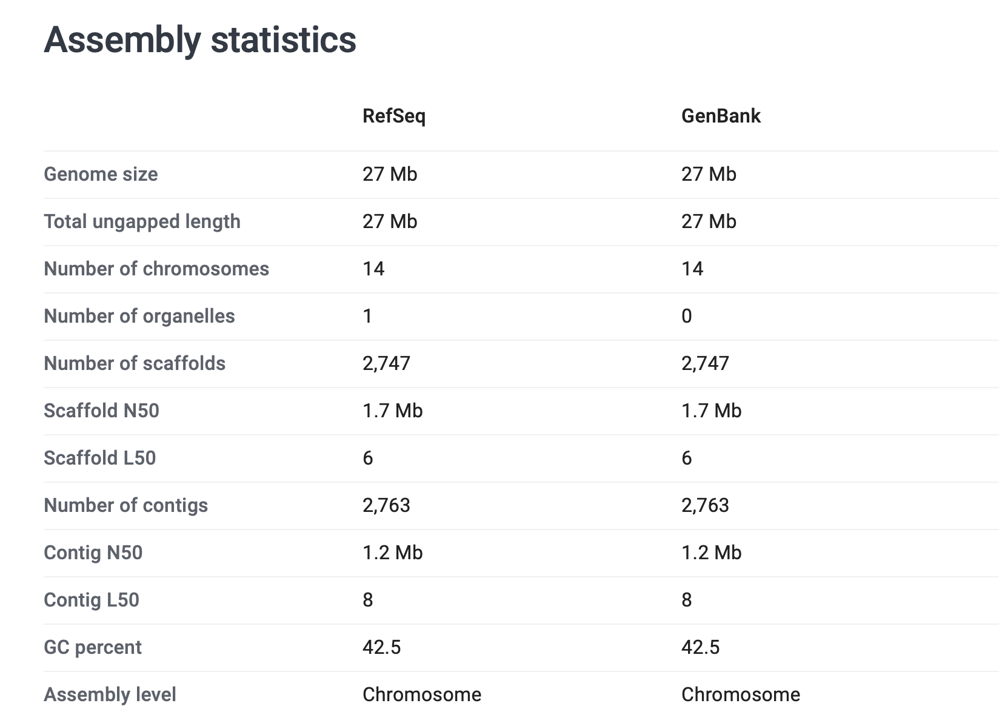

# Getting chromosome lengths

To answer questions like 'how much of the genome is in genes' we need to know what the length of each genome is.
Happily, this data is already in the GFF files - though it's a bit awkward to get at.  In fact:

* *Some* of the GFF files have records with `type='chromosome'` in, that reflect this data
* while others have records with `type='region'`.
* still others have records with `type='supercontig'`.
* Some GFF files - like the ones from
  [PlasmoDB](https://plasmodb.org/common/downloads/release-65/Pfalciparum3D7/gff/data/) - don't have them at all.
  (Luckily there are files from [Ensembl protists](https://ftp.ensemblgenomes.ebi.ac.uk/pub/protists/current/) which we
  can use instead.)

Here is some [dbplyr](https://dbplyr.tidyverse.org) code to load these chromosomes.

```r
contigs = (
	db
	%>% tbl( 'gff' )
	%>% filter(  type %in% c( 'chromosome', 'region', 'supercontig' ))
	%>% select( dataset, ID, type, seqid, source, start, end, attributes )
	%>% collect()
)
```

As a sanity check let's make sure that this really does capture the `seqid` values for gene records.
We'll use [the trusy `stopifnot()`](../programming_with_gene_annotations3/003_Getting_started_writing_some_code.md#test-driven-development) for this:

```
table( genes$dataset, genes$seqid %in% contigs$seqid )
```

```
                                                     TRUE
  Acanthochromis_polyacanthus.ASM210954v1.110       24016
  Asparagus_officinalis.Aspof.V1.57                 24141
  Bufo_bufo-GCA_905171765.1-2022_05-genes           20900
  Camelus_dromedarius.CamDro2.110.chr               18896
  Gallus_gallus.bGalGal1.mat.broiler.GRCg7b.110.chr 16711
  Homo_sapiens.GRCh38.110.chr                       20046
  Mus_musculus.GRCm39.110.chr                       21633
  Pan_troglodytes.Pan_tro_3.0.110.chr               21879
  Plasmodium_falciparum.ASM276v2.57                  5358
  Plasmodium_knowlesi.ASM635v1.57                    5102
  Plasmodium_vivax.ASM241v2.57                       5389
```

Good!

This suggests we can compute the genome lengths.
```r
contigs$sequence_length = contigs$end - contigs$start + 1

(
	contigs
	%>% group_by( dataset, type )
	%>% summarise(
		number = n(),
		length = sum(sequence_length)
	)
	%>% mutate(
		length_in_mb = sprintf( "%.1fMb", length / 1E6 )
	)
)
```

```
 dataset                                           type        number     length length_in_mb
   <chr>                                             <chr>        <int>      <dbl> <chr>       
 1 Acanthochromis_polyacanthus.ASM210954v1.110       region       30414  991584656 991.6Mb     
 2 Asparagus_officinalis.Aspof.V1.57                 chromosome      10 1111887942 1111.9Mb    
 3 Asparagus_officinalis.Aspof.V1.57                 supercontig  11782   75650082 75.7Mb      
 4 Bufo_bufo-GCA_905171765.1-2022_05-genes           region        1306 5044744194 5044.7Mb    
 5 Camelus_dromedarius.CamDro2.110.chr               region          37 2052758708 2052.8Mb    
 6 Gallus_gallus.bGalGal1.mat.broiler.GRCg7b.110.chr region          42 1041139641 1041.1Mb    
 7 Homo_sapiens.GRCh38.110.chr                       chromosome      25 3088286401 3088.3Mb    
 8 Mus_musculus.GRCm39.110.chr                       chromosome      22 2723431143 2723.4Mb    
 9 Pan_troglodytes.Pan_tro_3.0.110.chr               chromosome      26 2967125077 2967.1Mb    
10 Plasmodium_falciparum.ASM276v2.57                 chromosome      14   23292622 23.3Mb      
11 Plasmodium_knowlesi.ASM635v1.57                   chromosome      14   23462187 23.5Mb      
12 Plasmodium_vivax.ASM241v2.57                      chromosome      14   22621071 22.6Mb      
13 Plasmodium_vivax.ASM241v2.57                      supercontig   2733    4386630 4.4Mb       
```

:::tip Note

You might be wondering what 'region', 'chromosome', and 'supercontig' are - if so, so am I!

Looking up these genomes in [NCBI Datasets](https://www.ncbi.nlm.nih.gov/datasets/) sheds some light on this. For example, try looking up the [*Plasmodium vivax* assemblyy](https://www.ncbi.nlm.nih.gov/datasets/genome/GCF_000002415.2/).  You should see something like this:



In short the total genome size is 27Mb (check!) but some of this is in 2,747 'scaffolds' that are not chromosomes.  (They appear in this GFF file as 'supercontig'.)  These are, I think, bits of genome that have been assembled but the assemblers don't quite know where they should go.  In principle they might be parts of nuclear chromosomes, parts of the mitochondria or other organelles like the apicoplast, or other bits of DNA that were sequenced but not clear where they should go.

However other genomes, like *Bufo bufo*, seem to have only 'region' records even though several of those do seem to represent chromosomes.  It seems that files from the Darwin Tree of Life project, like the Dromedary Camel genome, use 'region' entries.  (That number 37 is not wrong - [camels have 74 diploid chromosomes](https://en.wikipedia.org/wiki/Dromedary#Genetics_and_hybrids)).

In any case - for our purposes, let's use the 'regions', 'chromosomes', and 'supercontigs' to represent the genome length.

:::

Ok!  Armed with chromosome lengths, we are ready to ask [how much of the genome is in genes?](./008_How_much_of_the_genome_is_in_genes.md)
