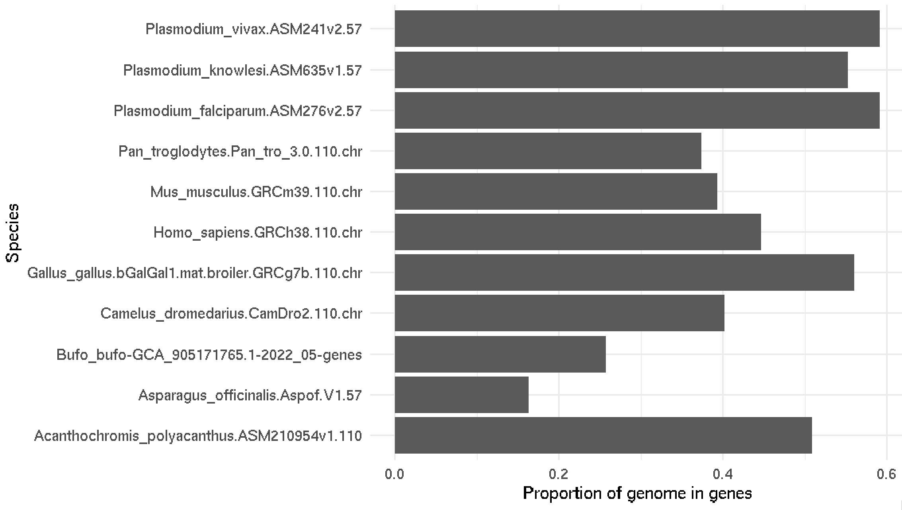

import Tabs from '@theme/Tabs';
import TabItem from '@theme/TabItem';

# A naive approach

Figuring out the proportion in genes should be pretty easy using [the dplyr data verbs](../004_filter_join_merge.md),
right?. We could

1. group genes by species and chromosome
2. compute the total length by summing
3. join to the `contigs` dataset to compute total chromosome/region length
4. and then summarise.

Here's a function that does 1-3 above:

```r
compute_lengths_per_chromosome = function(
   data,
   chromosomes = contigs
) {
   (
      data
      # Group by species / chromosome
      %>% group_by( dataset, seqid )
      # Add up the gene lengths
      %>% summarise(
         number_of_genes = n(),
         total_gene_length = sum( end - start + 1 )
      )
      # Add the chromosome lengths
      %>% left_join(
         chromosomes[, c( "dataset", "seqid", "attributes", "sequence_length" )],
         by = c( "dataset", "seqid" )
      )
   )
}

```

The idea is that this has both a 'total gene length' (sum of lengths of genes) and the total sequence length (length of
the chromosome or contig) in the same dataframe:

You can use it like this:
```
print( compute_lengths_per_chromosome( genes ) )
```

```
# A tibble: 5,469 × 6
# Groups:   dataset [11]
   dataset    seqid number_of_genes total_gene_length attributes sequence_length
   <chr>      <chr>           <int>             <dbl> <chr>                <dbl>
 1 Acanthoch… MVNR…              56           1349511 Alias=orp…         2466117
 2 Acanthoch… MVNR…              39           1029333 Alias=orp…         2338421
 3 Acanthoch… MVNR…              56           1399228 Alias=orp…         2213793
 4 Acanthoch… MVNR…              41           1113000 Alias=orp…         2013838
 5 Acanthoch… MVNR…              45           1012078 Alias=orp…         1950346
 6 Acanthoch… MVNR…              54            989013 Alias=orp…         2094391
 7 Acanthoch… MVNR…              84           1074990 Alias=orp…         1729193
 8 Acanthoch… MVNR…              72           1486459 Alias=orp…         2368326
 9 Acanthoch… MVNR…              50           1237060 Alias=orp…         2396890
10 Acanthoch… MVNR…              39            643138 Alias=orp…         1656807
```

And all we have to do is step 4 - sum them up across chromosomes:
```r
naive_proportions = (
   compute_lengths_per_chromosome( genes )
   %>% group_by( dataset )
   %>% summarise(
      total_gene_length = sum( total_gene_length ),
      total_genome_length = sum( sequence_length )
   )
   %>% mutate(
      proportion_in_genes = total_gene_length / total_genome_length
   )
)
print( naive_proportions )
```

```
# A tibble: 11 × 4
   dataset                                           total_gene_length total_genome_length proportion_in_genes
   <chr>                                                         <dbl>               <dbl>               <dbl>
 1 Acanthochromis_polyacanthus.ASM210954v1.110               422171067           830201259               0.509
 2 Asparagus_officinalis.Aspof.V1.57                         165883925          1015569172               0.163
 3 Bufo_bufo-GCA_905171765.1-2022_05-genes                  1290309576          5003028965               0.258
 4 Camelus_dromedarius.CamDro2.110.chr                       825762826          2052758708               0.402
 5 Gallus_gallus.bGalGal1.mat.broiler.GRCg7b.110.chr         583352821          1041139641               0.560
 6 Homo_sapiens.GRCh38.110.chr                              1379802830          3088286401               0.447
 7 Mus_musculus.GRCm39.110.chr                              1070748851          2723431143               0.393
 8 Pan_troglodytes.Pan_tro_3.0.110.chr                      1110722691          2967125077               0.374
 9 Plasmodium_falciparum.ASM276v2.57                          13776689            23292622               0.591
10 Plasmodium_knowlesi.ASM635v1.57                            12970692            23462187               0.553
11 Plasmodium_vivax.ASM241v2.57                               14052272            23768694               0.591
To figure out how much of the genome is covered by genes, or by exons, we face a problem.
In principle we could just add together the gene lengths.
```

```
(
   ggplot( data = proportions )
   + geom_col(
      aes(
         x = proportion_in_genes,
         y = dataset
      )
   )
   + ylab( "Species" )
   + xlab( "Proportion of genome in genes" )
   + theme_minimal(16)
)
```




Pretty cool huh!  Most species have 40-60% of the genome in genes.  Is this right?

:::caution However

Unfortunately this calculation is (slightly) **wrong**.   Why?

:::

To get it right, we need to do some more coding...
