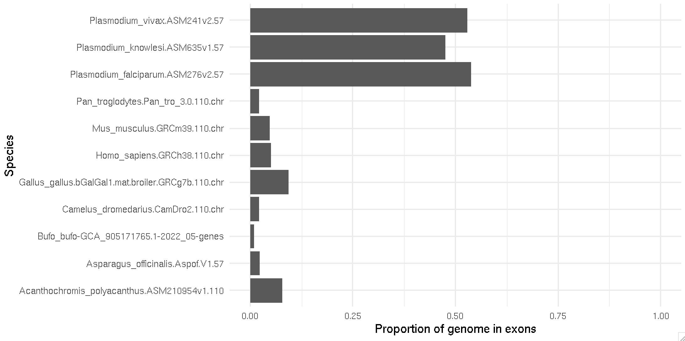

import Tabs from '@theme/Tabs';
import TabItem from '@theme/TabItem';

# How much of the genome is in exons?

You might be a bit underwhelmed by the difference between our 'naive' and 'correct' calculations for genes. However the
power of our functions really comes into play if we do the same thing for exons, or coding sequence.  

To do this, we just have to put back the `start` and `end` columns, since we renamed them earlier:

```r
covered_by_exons = compute_lengths_per_chromosome(
	exons %>% mutate( start = exon_start, end = exon_end )
)

exon_proportions = compute_proportion_of_genome_covered( covered_by_exons )

```

:::caution Warning

This might several minutes to run!  (There are a lot of exons and coding sequence regions.)

:::

The result will look like this:

```
> print( exon_proportions[, c( "dataset", "total_genome_length", "proportion_covered" )] )
# A tibble: 11 × 3
   dataset                                           total_genome_length proportion_covered
   <chr>                                                           <dbl>              <dbl>
 1 Acanthochromis_polyacanthus.ASM210954v1.110                 831322490            0.0776 
 2 Asparagus_officinalis.Aspof.V1.57                          1015711224            0.0240 
 3 Bufo_bufo-GCA_905171765.1-2022_05-genes                    5004510881            0.00917
 4 Camelus_dromedarius.CamDro2.110.chr                        2052758708            0.0225 
 5 Gallus_gallus.bGalGal1.mat.broiler.GRCg7b.110.chr          1041139641            0.0933 
 6 Homo_sapiens.GRCh38.110.chr                                3088286401            0.0507 
 7 Mus_musculus.GRCm39.110.chr                                2723431143            0.0483 
 8 Pan_troglodytes.Pan_tro_3.0.110.chr                        2967125077            0.0220 
 9 Plasmodium_falciparum.ASM276v2.57                            23292622            0.538  
10 Plasmodium_knowlesi.ASM635v1.57                              23462187            0.476  
11 Plasmodium_vivax.ASM241v2.57                                 23771395            0.529 
```

Or you can plot it:
```r
p = (
   ggplot( data = exon_proportions )
   + geom_col(
      aes(
         x = proportion_covered,
         y = dataset
      )
   )
   + ylab( "Species" )
   + xlab( "Proportion of genome in exons" )
   + xlim( 0, 1 )
   + theme_minimal(14)
)
print(p)
```



:::tip Question

Does this agree with what you understand about how the human or other genomes are organised?
Try looking at a gene in the UCSC genome browser, does it roughly tie in with the above?

:::


## Conclusion and challenge

I think it is pretty incredible that only a tiny fraction of many genomes actually codes for mRNA. For example, in the
human genome (which must be the best-annotated genomes available), only about 5% is annotated as protein coding.

On the other hand some genomes have much higher proportions.  The genomes of malaria species, in particular, seem to be
packed full of genes.

:::tip Challenge

Now do the same thing for coding sequence.  (Make sure and fix the `seqid`, `start` and `end` columns, since we renamed them
in `cds`). You might see something like this:


Are you surprised by these numbers?  Which species have the least proportion of genome in genes?  Which have the most?

:::

:::tip Challenge
How much of the genome is in untranslated regions?  What about:

* in `tRNA` fields (which encode transfer RNAs?)
* in non-coding RNAs?
* in pseudogenes?

:::
