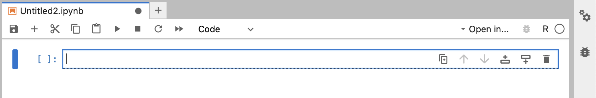
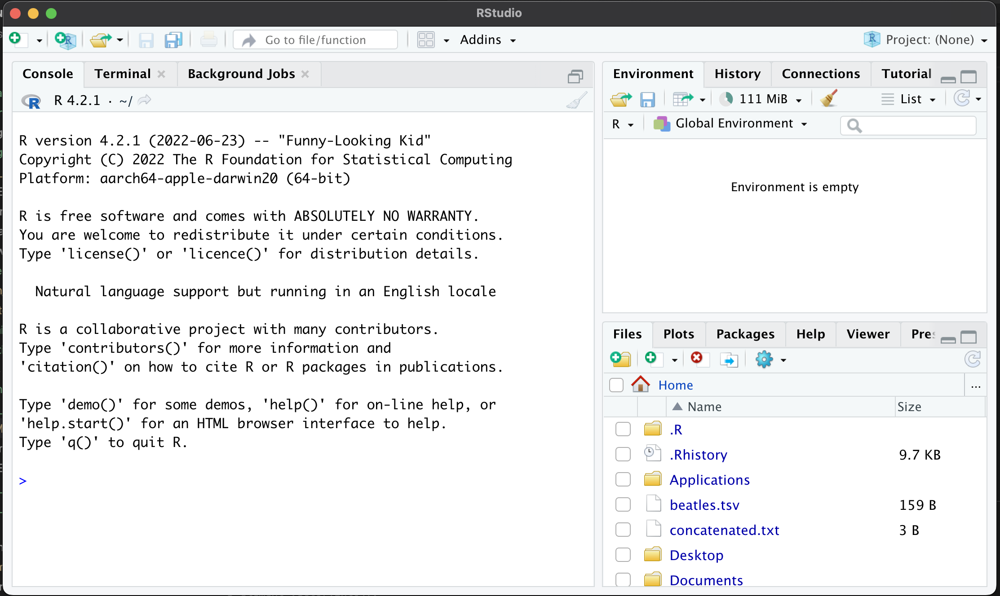

# Introduction to R

*Suggested prerequsite courses:* ***Introduction to the Command Line***, ***Programming Concepts***.

This short course is designed to teach the basics of the **R programming language**.

To use R, the very first thing you'll need to do is get R running.  For this tutorial you can choose one of two options:

**Option 1**: You can run R inside JupyterHub - either a hosted instance or your own installation.  (Instructions for setting that up can be found [on the environment setup pages](/prerequisites/Jupyterlab.md).  Start by logging into the site, start a new tab by pressing the `+` button, and then choose 'R' from the 'Notebook' section.  You should see something like this:



You can type your commands into the box.

Or **Option 2**: you can download and install R and RStudio, and run it locally on your laptop.  To do this, visit the
[Rstudio download page](https://posit.co/download/rstudio-desktop/) and then download 'R' and 'RStudio Desktop'.

Once you have done this, install both packages and then start RStudio.  You should see something like this:


The R prompt is in the left hand pane - you can type your commands in there.

:::tip Note

There are a couple of differences between these two environments, which we list here for clarity:

* In R/Rstudio you press `<enter>` to run a command, while in JupyterHub you press `<shift>-<enter>`.

* the prompt looks different - in RStudio it looks like `>`, while in JupyterHub it looks like `[ ]:` followed by a box
  in the page. In this tutorial we will write `>` to indicate the prompt.

* Some of the output is formatted differently.  (For example you'll notice this when we talk [about vectors or
  values](vectors.md).)

* Plots (and R help pages) appear inline in JupyterHub, but in a seperate pane for RStudio.

In this tutorial we will mostly write things the way R / RStudio show them, but as long as you're happy to allow for
these differences, you can use the JupyterHub notebook.

:::

## Checking it works

Whichever way you start R, you should now have an **R prompt**.

To check your R is really working, let's try out a command.  For example we could print a message:
```
> print( "Hello there!" )
```

:::caution Note

The `>` is just there to indicate the prompt - don't type that!  Type the command and press `<enter>` to run it.

Or if you are using JupyterHub, press `<shift>-<enter>` instead.

:::

You should see a result like:
```
[1] "Hello there!"
```

Congratulations, you've got R working!

You're now ready to try out some [fundamentals](./fundamentals.md).
