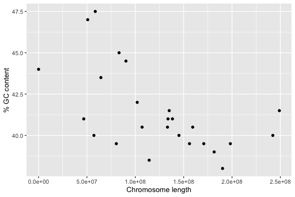

# Working with data

Now we come to what R is really good at - loading, manipulating, and plotting data.
Let's do that now by downloading and plotting some data on human chromosomes.

## Getting the data

We'll use the data in this file:

[GRCh38 sequence report](https://www.well.ox.ac.uk/bioinformatics/training/msc_gm/2023/data/GRCh38_sequence_data.tsv)

To get this file, right-click on the link above and choose 'copy link'.

You ought to be able now to load the data directly into R using the `read_tsv()` function:

```
> X = read_tsv( "<paste your link here inside the quotes>" )
```

**Note.** depending on your setup, you may need to remove the trailing slash (`/`) from the end of the URL to make this
work.

This data comes from the [NCBI page on the GRCh38 human genome
assembly](https://www.ncbi.nlm.nih.gov/datasets/genome/GCF_000001405.26/).  

:::tip Note

The file is in a **tab-separated value** or **tsv** format (that is, the fields on each row are separated
by tab characters, rather than commas or spaces), which is why we used the `read_tsv()` to load it.  For comma-separated
or space-separated files, use `read_csv()` or `read_table()` instead.
:::

You could also, if you prefer, download the file first, then load it in.
Downloading can be done from the web browser, but make sure you know the path to the downloaded file.

Another way to download is to use R's `download.file()` function:
```
> download.file( "<your link here>", destfile = "GRCh38_sequence_data.tsv" )
```

This downloads to your current directory, so that you can load like this:
```
> X = read_tsv( "GRCh38_sequence_data.tsv" )
```

## Viewing the data

We'll only scratch the surface of data manipulation here but here are a few ways to look at this data.
First, you can view the data by printing it:
```
> print(X)
```
You should see something like this:
```
# A tibble: 455 × 4
   name     length role               gc_percent
   <chr>     <dbl> <chr>                   <dbl>
 1 1     248956422 assembled-molecule       41.5
 2 2     242193529 assembled-molecule       40  
 3 3     198295559 assembled-molecule       39.5
 4 4     190214555 assembled-molecule       38  
 5 5     181538259 assembled-molecule       39  
 6 6     170805979 assembled-molecule       39.5
 7 7     159345973 assembled-molecule       40.5
 8 8     145138636 assembled-molecule       40  
 9 9     138394717 assembled-molecule       41  
10 10    133797422 assembled-molecule       41  
# ℹ 445 more rows
# ℹ Use `print(n = ...)` to see more rows
```

What you are looking at is a **data frame**, an important type of data structure.  (Specifically, this is a **tibble**,
which is the tidyverse flavour of the data frame data structure).  Dataframes have a few distinguishing features:

* It has multiple rows (how many?) and multiple columns (how many?)
* It has **column names** that help tell you what the columns represent.
* The columns have different types - here they are `<chr>` meaning 'character' or string data, `<dbl>` meaning
  numerical.  With tidyverse, these types are printed straight after the column names.

In short - data frames are a flexible and useful format for scientific data.

As above, you can probably only see a few rows here.  To see them all, follow the suggestion and use
`print()`
```
> print( X, n = 1000 )
```

If you scroll back through these results you'll see the rows have different `roles`, and different `lengths`.

:::tip Note

Some of the rows say `NA` in the `gc_percent` column.  This is R's way of saying 'missing data'.
For some reason, GC percent has not been provided for these contigs.

:::

Another way to view the data is `View()`:
```
> View(X)
```
In Rstudio, this opens a scrollable-aroundable table in the top-left pane.

## Plotting the data

The file represents all the contigs (including the main chromosomes) in the human reference assembly. One of those
columns is the **contig length**, while another is the **percentage GC content**.  (That is, the proportion of DNA bases that are G's or C's.)  Wouldn't it be good to plot these against each other?

To do this you need to know how to get the values out of one column.  You do these using the `$` symbol, for example:
```
> X$length
```
or, equivalently, use double square brackets:
```
> X[['length']]
```

(This second way is often better if the name of the columns contains spaces.)

Whichever way you do it you should see a vector of chromosome lengths, like:
```
  [1] 248956422 242193529 198295559 190214555 181538259 170805979 159345973 145138636 138394717
 [10] 133797422 135086622 133275309 114364328 107043718 101991189  90338345  83257441  80373285
(etc.)
```

:::tip Challenge

Use the `plot()` function to plot GC content against chromosome length.

**Hint** The plot examples on [this page](functions.md#many-values-make-light-work) may help.

:::

If you managed to plot using `plot()`, congratulations!  It's good to use `plot()`, but here is another way to plot
using the tidyverse [ggplot2 package](https://ggplot2.tidyverse.org).  For now we will just demonstrate this, and will
come back to how it works later in the term:
```
> p = (
	ggplot( data = X )
	+ geom_point( aes( x = length, y = gc_percent ))
	+ xlab( "Chromosome length" )
	+ ylab( "% GC content" )
)
> print(p)
```

You should see a plot something like this:



Hey, that's interesting!  It looks very much like shorter chromosomes tend to have higher GC content.

If you like this plot, you can use the 'export' button in RStudio to save it to a file.  Or you can use the `ggsave()` function:
```
> ggsave( p, file = "gc_by_length.pdf" )
```


## Subsetting and sorting data

If you `View()` the data again, you'll see that the `gc_percent` value is missing for everything except the main
'assembled molecules' - that is the main human chromosomes.  (It is also there for one other contig, right at the bottom
of the file - what is that?)

What happens to the other ones in the plot?  The answer is that they won't be plotted - they've been silently dropped
due to the missing value.  

How could we just pull out those rows, and perhaps order them by GC content?  Again, here we are just going to very
quickly show how to do this here using tidyverse-style filtering, and we will come back to this in other tutorials.

The tricks here are:

* the `is.na()` function will tell us if a value is missing.  And `!is.na()` will tell us if they are **not** missing.   (`!` indicates a logical 'NOT' operation, that is, it inverts the condition.)
* The `filter()` function can be used to filter a data frame.

Putting this together we can write:
```
> filter( X, !is.na( gc_percent ))
```

:::tip Question
How many rows does this result have?  Use `View()` or `print()` to see the whole data frame.
:::

If we wanted to sort the result, that's also possible.  Let's use the tidyverse `arrange()` function to do it.
First let's capture the above as a new variable `Y`:
```
> Y = filter( X, !is.na( gc_percent ))
```
and now sort:
```
> arrange( Y, gc_percent )
```
(You can read this as 'arrange the dataframe `Y` by the `gc_percent` column').

:::tip Question
Which chromosome has the highest GC percent?  Which the lowest?
:::

:::tip Question
Use `arrange()` to sort by length instead.  What is the GC percentage of the longest chromosome?  What about the
mitchondrion?
:::

## Finding specific rows

What if we just wanted to pull out data from specific rows?  Say those with > 42.5% GC content?

This is easy as well by filtering on a condition:
```
> filter( X, gc_percent > 42.5 )
```

It's some of the chromosomes from 16 onwards, as well as the mitochondrion.

What about just those with that are also longer than a megabase?
```
> filter( X, gc_percent > 42.5 & length > 1E6 )
```

Here we've used the `&` operator, which combines logical expressions into compound ones (via a logical AND).

## A research question

So we found that, in the human genome, GC content is correlated with chromosome length!  That's pretty interesting.
Here's a mini research project that you could try if you're interested.

:::tip Research project

You could try to find out if this relationship holds for the genomes of other species. 

For example, does it hold for [*mus musculus*](https://www.ncbi.nlm.nih. gov/datasets/genome/GCF_000001635.27/) (house
mice)? What about for [*bos taurus*](https://www.ncbi.nlm.nih.gov/datasets/genome/GCF_002263795.3/) (cattle)? Or
[chimpanzees](https://www.ncbi.nlm.nih.gov/datasets/genome/GCF_028858775.1/)?  Or for [other genomes
](https://www.ncbi.nlm.nih.gov/datasets/genome/) of your choice?

**Hint**. These genome assembly pages have a downloadable list of chromosome sizes and other data in the table, near the
bottom under 'Chromosomes'.   The file you download is a bit different to the one we've used above, as it has more
columns and they have different names.  But you can still load it with `read_tsv()`.

If you find it hard to view all the columns at once, try listing the columns names:
```
> colnames(X)
```

and you can also subset columns by giving it a vector of columns names, something like:
```
> X[, c( "Chromosome name", "Seq length", "Role", "GC Percent" )]
```

Good luck!  This is the end of this tutorial.

:::
