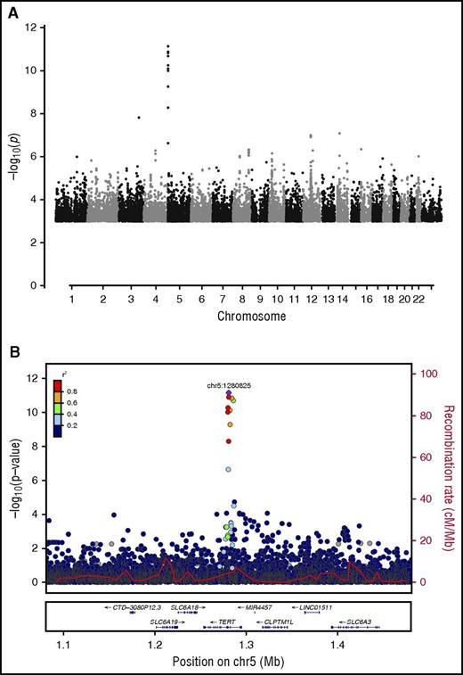
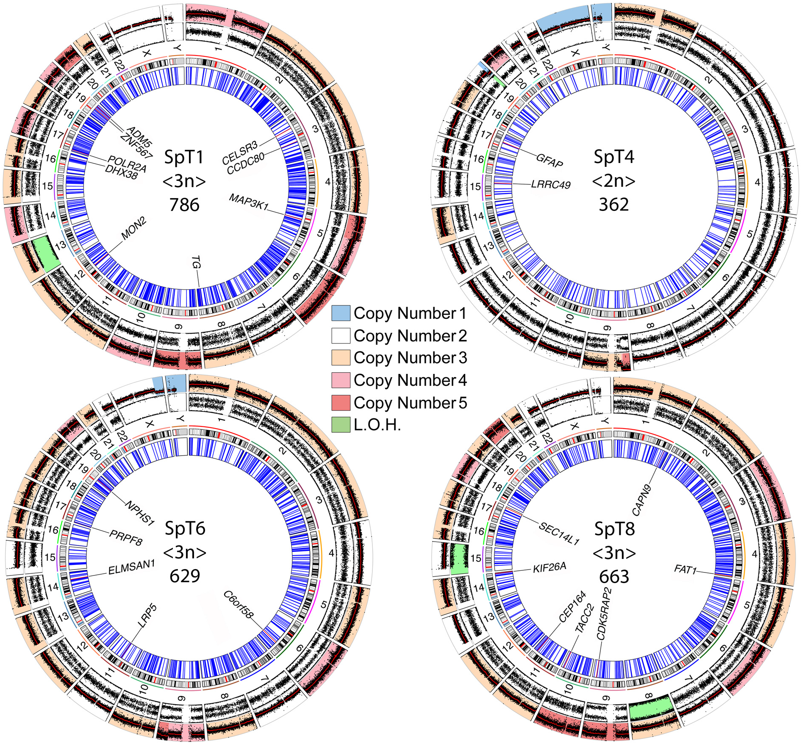
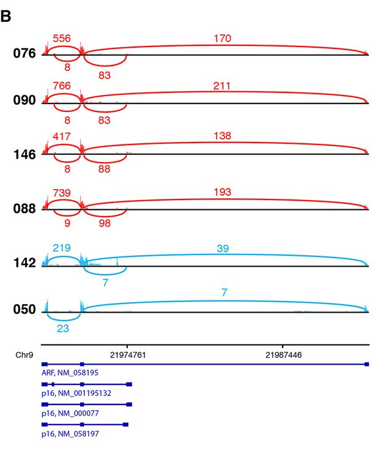
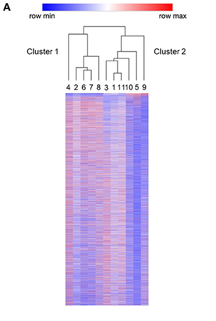
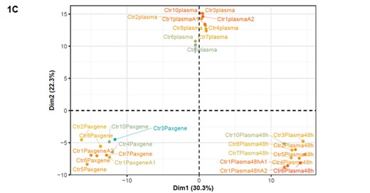
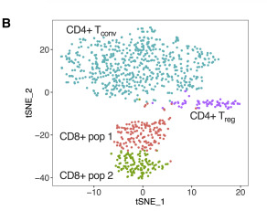
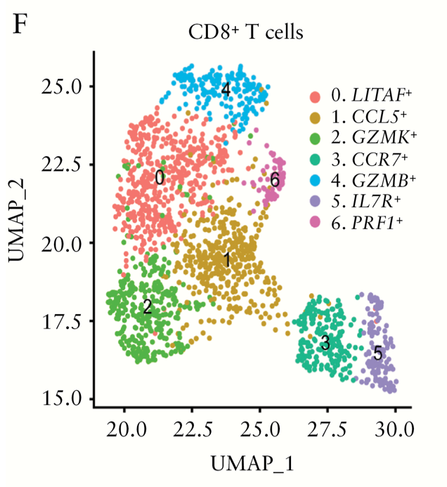
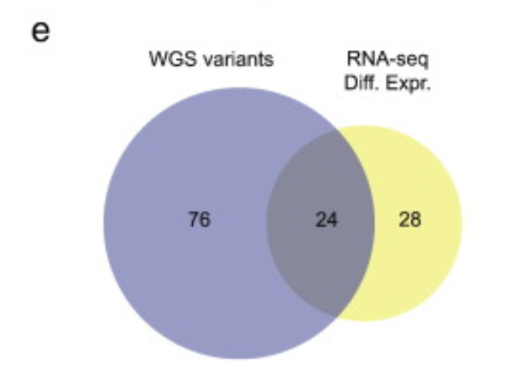
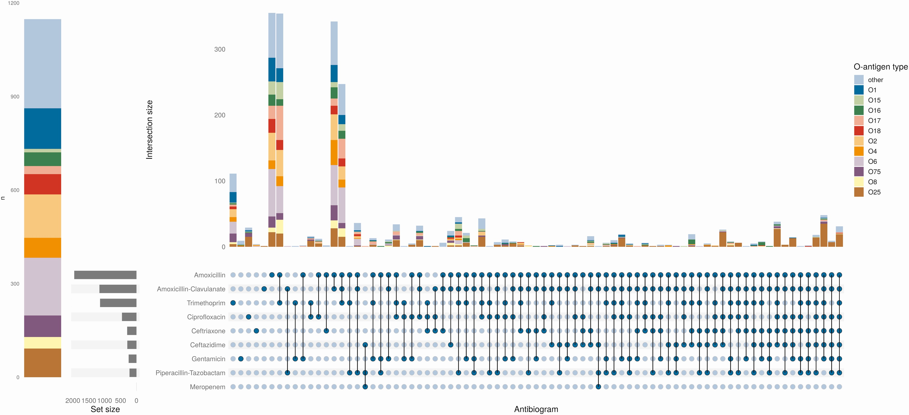
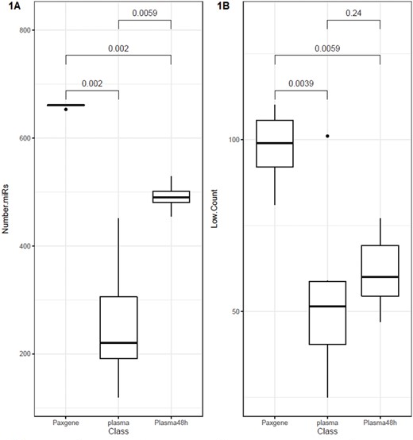

# Data Visualisation Tutorial

Authors: Ben Wright, Helen Lockstone

Bioinformatics Core

## Tutorial Plan

Tutorial groups: 4 (hopefully)

Each group is given one of these sets of plots to look at and discuss. Each set comes with some 
questions to think about. In the Friday 
session, each group will give a short, informal presentation about their group of plots.

Please co-ordinate to make sure no two groups cover the same set of plots!

For each set of plots you'll find the following:

- A plot of each type taken from the literature. These are presented as they were in the paper, 
right down to the tiny size and/or blurry details. The figure captions have been trimmed off, to 
make it a little more difficult, for some more than others.
- A list of questions about those plots to think about. Try to answer them based on just the plots
to begin with.
- Links to explanations of those plots online. These should help give more context and help with
questions you can't puzzle out. If you are still drawing a blank, you can find the plot in its
original context by following the doi. But, again, see how much you can work out before looking at
the paper.

For Friday, plan to make a short presentation describing the plot types and the answers you've 
arrived at for the questions. Try to include some other examples of those plots from the literature.

Note that the names the sets have been given here aren't formal classifications of plot types, just 
a way of showing what the theme is for each set.

## Set 1: Locus-centric Plots

### Example Plots

From [https://doi.org/10.1182/blood-2017-02-769869](https://doi.org/10.1182/blood-2017-02-769869)

From [https://doi.org/10.1371/journal.pone.0178169](https://doi.org/10.1371/journal.pone.0178169)

### Questions to Consider

- What types of experiment would produce this data?
- What channels are used in these plots (as per CM4.4 data visualisation theory)?
- What data is shown in each of those channels?
- What conclusions can you draw from these particular plots?
- What might these plots look like when the data quality is good and there are significant findings?
- What might these plots look like when the data quality is good but there are *no* significant findings?

### Plot Explanations

- [Manhattan Plot](https://www.sciencedirect.com/topics/biochemistry-genetics-and-molecular-biology/manhattan-plot)
- [Circos Plot](https://www.ncbi.nlm.nih.gov/pmc/articles/PMC2752132/)

## Set 2: Gene-centric Plots

### Example Plots

From [https://doi.org/10.1128/mBio.02079-16](https://doi.org/10.1128/mBio.02079-16)

From [https://doi.org/10.3389/fonc.2020.00307](https://doi.org/10.3389/fonc.2020.00307)

From [https://doi.org/10.1016/j.clim.2015.05.020](https://doi.org/10.1016/j.clim.2015.05.020)

### Questions to Consider

- What types of experiment would produce this data?
- What channels are used in these plots (as per CM4.4 data visualisation theory)?
- What data is shown in each of those channels?
- What conclusions can you draw from these particular plots?
- What might these plots look like when the data quality is good and there are significant findings?
- What might these plots look like when the data quality is good but there are *no* significant findings?

### Plot Explanations

- [Shashimi Plot](https://ui.adsabs.harvard.edu/abs/2013arXiv1306.3466K/abstract)
- [Heatmap](https://chartio.com/learn/charts/heatmap-complete-guide/)
- [Volcano Plot](https://training.galaxyproject.org/training-material/topics/transcriptomics/tutorials/rna-seq-viz-with-volcanoplot/tutorial.html)

## Set 3: Dimensional Reduction Plots

### Example Plots

From [https://doi.org/10.1093/ndt/gfaa142.P1611](https://doi.org/10.1093/ndt/gfaa142.P1611)

From [https://doi.org/10.1016/j.celrep.2020.108661](https://doi.org/10.1016/j.celrep.2020.108661)

From [https://doi.org/10.1093/ecco-jcc/jjaa054](https://doi.org/10.1093/ecco-jcc/jjaa054)

### Questions to Consider

- What types of experiment would produce this data?
- What channels are used in these plots (as per CM4.4 data visualisation theory)?
- What data is shown in each of those channels?
- What sort of 'groups' might be found in these plots?
- What do the values on the axes represent?
- What do the distances between points represent?
 
### Plot Explanations

- [PCA Plot](https://bioturing.medium.com/how-to-read-pca-biplots-and-scree-plots-186246aae063)
- [tSNE Plot](https://distill.pub/2016/misread-tsne/)
- [UMAP Plot](https://umap-learn.readthedocs.io/en/latest/plotting.html)

## Set 4: Significance-centric Plots

### Example Plots

From [https://doi.org/10.1016/j.clim.2015.05.020](https://doi.org/10.1016/j.clim.2015.05.020)

From [https://doi.org/10.1093/cid/ciab006](https://doi.org/10.1093/cid/ciab006)

From [https://doi.org/10.1093/ndt/gfaa142.P1611](https://doi.org/10.1093/ndt/gfaa142.P1611)

### Questions to Consider

- What types of experiment would produce this data?
- What channels are used in these plots (as per CM4.4 data visualisation theory)?
- What data is shown in each of those channels?
- What conclusions can you draw from these particular plots?
- What might these plots look like when the data quality is good and there are significant findings?
- What might these plots look like when the data quality is good but there are *no* significant findings?

### Plot Explanations

- [Venn Diagram](https://www.lucidchart.com/pages/tutorial/venn-diagram)
- [UpSet Plot](https://upset.app/)
- [Box & Whisker Plot](https://www.tableau.com/data-insights/reference-library/visual-analytics/charts/box-whisker)
