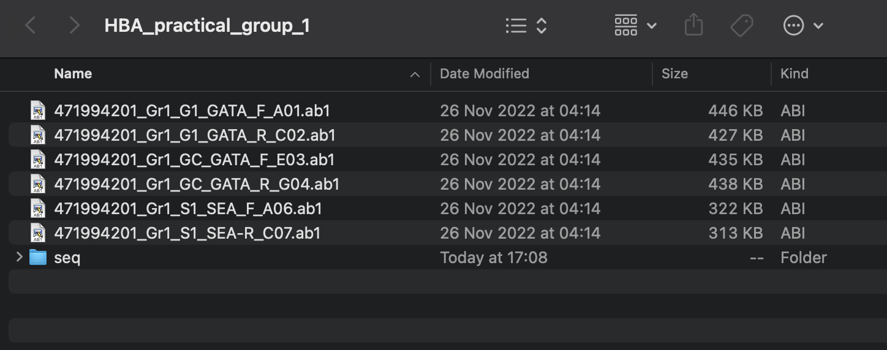
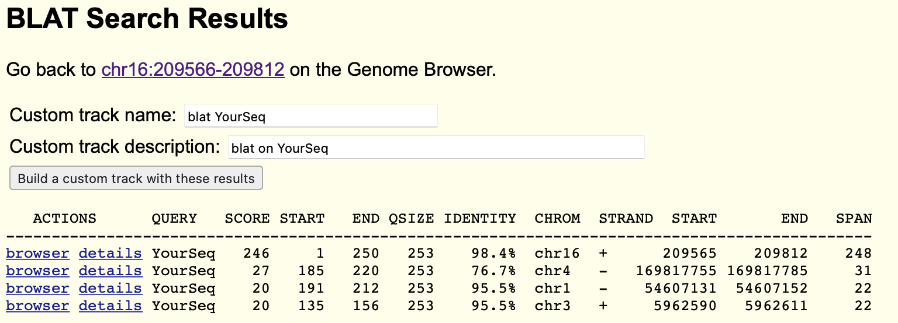

# Viewing Sanger trace files

If you got here, you should have downloaded a folder of Sanger sequence data.  (If not please [go and do that
now](./README.md#getting-the-data).)

## What's in the folder 
Now open your data folder - you should see a list of files, something like this:



:::tip Note

I'm viewing these on a mac - yours will look slightly different if you are working on Windows.

:::

The files consist of Sanger Sequencing 'DNA Electropherogram' results encoded in the `.ab1` format. To view one of the `.ab1`
files - double-click on it (or right-click and choose `Open with -> FinchTV`). 

**Note** Please start with one of the `_GATA1` files.

You should see something like this:


The files are also knows as *trace files* because they contain all the data that came out of the sequencing run. This includes
the chromatogram itself i.e. the measured flourescence intensities of the four bases incorporated at each point in the run
(presented as coloured lines), the inferred DNA sequence (presented at the top of the window if you turn on the right option),
and quality information about the bases (grey bars at the top of the window). 

Try the icons along the top to see what they do (skip the load/save ones for now). You should be able to look at the information
in the file, alter how the chromatogram is viewed, and also see it in reverse orientation. This icon is particularly usefule:


as it lets you see the whole sequence at once. (You can also use the sliders at the left and right to zoom in and out of the
trace.)

:::tip Questions

Explore the data now and try to answer the following questions:

- How long is the sequence?
- How long did it take to run?
- What do you notice about the signal at different positions along the sequence?
- Are there and 'N' base calls?  Why?
- Are there any non-N base calls you wouldn't be confident in?  Why?  What do the quality scores for these bases look like?

:::

### Three experiments, six files

You should have six files in your folder. These correspond to the three experiments you ran, which were something like this:

| samples / assays                      | GATA1 site assay | SEA variant assay |
| ------------------------------------- | ---------------- | ----------------- |
| SEA deletion variant sample (S1)      |                  |         Y         |
| GATA1 control sample (GC)             |      Y           |                   |
| GATA1 'Vanuatu' mutation sample (G1)  |      Y           |                   |

The reason there are *six* files (not three) is that each product was sequenced twice - once on forward and once on reverse
strand.  This is typical of Sanger sequencing providers and provides an extra view of each sequence.

The filenames are of the form:

```
[run_id]_[group]_[sample]_[assay]_[fwd or reverse]_[well id].ab1
```

which consists of:

* an identifier for the sequencing run (`471994201`), which the sequencing service has created to track this run;
* an identifier (`Gr1` - `Gr11`) for the group;
* the sample identifier (`G1`, `GC`, or `S1`);
* the PCR assay used (`GATA` or `SEA`);
* whether the file corresponds to forward strand (`F`) or reverse strand (`R`) sequence;
* and an identifier for the well the sample was submitted in.

Of these, the group id, sample id and assay name were of course generated by our experiment, while the sequencing provider
generated the other parts to track its process.


The primer pairs for the PCR reaction were:

| assay               | primer sequence |
| --------------------| ------------------ |
| GATA1 assay forward primer | `CATTGTTGAGATGATTTGCTGGAGACACACAGATG` |
| GATA1 assay reverse primer | `GAAATACCAAGAGCTTCCTTGCACCAACAGCT` |
| SEA variant assay forward primer | `CTCTGTGTTCTCAGTATTGGAGGGAAGGAG` |
| SEA variant assay reverse primer | `ATATATGGGTCTGGAAGTGTATCCCTCCCA` |

:::tip Question

Does the primer sequence appear in the resulting sequence file? Is this what you expected from the experiment?

:::


### Aligning the sequence

To go further than this, let's use the [UCSC Genome Browser BLAT tool](https://genome.ucsc.edu/cgi-bin/hgBlat) to align the
sequences to the human reference assembly and see where they lie.

There are a couple of ways to do this - the simplest one is to click the information icon and copy the sequence onto your
clipboard. Now visit the [BLAT page](https://genome.ucsc.edu/cgi-bin/hgBlat) and paste in the sequence. It should look something
like this:


For our purposes we will use the "Feb 2009 (GRCh37/hg19)" version of the genome reference assembly - make sure you have selected
this at the top.  (The reason is that the [resources used to design the
primers](https://canvas.ox.ac.uk/courses/158645/modules#module_340266) are all from a few years ago - they report build 37
coordinates, rather than the more recent build 38, so it's most convenient to use that here.)

Once you have pasted the sequence in and selected the assembly version - you're ready to BLAT! Click 'Submit' and wait a few
moments for the results to appear.

:::tip Note

Another related tool is [NCBI BLAST](https://blast.ncbi.nlm.nih.gov/Blast.cgi), which will align the sequence to a huge database
of known sequences (including from other organisms). You can try that directly from FinchTV by right-clicking on the sequence
and choosing 'BLAST Sequence -> Nucleotide BLAST'. Feel free to try this as well. However, UCSC Genome Browser provides probably
the best visualisation so we'll use that here.

:::

### Understanding alignment outputs

You will hopefully see something like this:



You'll probably notice a few things about the results - first, it will probably have several rows representing several different
alignments! For each of these, the output shows information about the part of the query sequence aligned (`QUERY`, `SCORE`,
`START`, `END`, and `QSIZE` columns) and information about where it aligned in the reference genome (`CHROM`, `STRAND`, `START`,
`END` and `SPAN`).

Look at the results and try to answer these questions:

:::tip Questions

- How many alignments did BLAT report?

- What part of the query sequence was aligned in each result? How many results represent alignments of the whole query (or most of it?)

- What level of identity did each alignment have?

- Make sure you understand what the last five columns are showing. The *HBA1*/*HBA2* genes are on chromosome 16 - is that where
  the alignments are?  Which strand are they on and how long did they span on the reference assembly?
  
:::

BLAT is a very 'sensitive' alignment tool - it tries to find *all* reasonable alignments, even those between substrings.
However, we are mainly interested in full-length or nearly full-length alignments here. Before going on make sure you know which
row corresponds to the 'best' alignment here.

### Inspecting an alignment

Let's have a look at the best alignment in more detail. First, try clicking the 'details' button. This page gives you a complete
description how the alignment to the reference assembly looks. Possibly the best thing to look at it the side-by-side alignment
at the bottom of the page.  It might look something like this:

    000001 tacntccctggatcaggccctggggcctgagtccggaagagaggtctgta 000050
    >>>>>> ||| |||||||||||||||||||||||||||||||||||||||||||||| >>>>>>
    209565 tacatccctggatcaggccctggggcctgagtccggaagagaggtctgta 209614
    
    000051 tggacacacccatcaatgggagcaccaggacacagatggaggctaatgtc 000100
    >>>>>> |||||||||||||||||||||||||||||||||||||||||||||||||| >>>>>>
    209615 tggacacacccatcaatgggagcaccaggacacagatggaggctaatgtc 209664
    
    000101 atgttgtagacaggatgggtgctgagctgccacacccacattattagaaa 000150
    >>>>>> |||||||||||||||||||||||||||||||||||||||||||||||||| >>>>>>
    209665 atgttgtagacaggatgggtgctgagctgccacacccacattattagaaa 209714
    
    000151 ataacagcacaggcttggggtggaggcgggacacaagactagccagaagg 000200
    >>>>>> |||||||||||||||||||||||||||||||||||||||||||||||||| >>>>>>
    209715 ataacagcacaggcttggggtggaggcgggacacaagactagccagaagg 209764
    
    000201 agaaagaaaggtgaaaagctgttggtgcaaggaagctctttgggtatttc 000250
    >>>>>> ||||||||||||||||||||||||||||||||||||||||  |||||||| >>>>>>
    209765 agaaagaaaggtgaaaagctgttggtgcaaggaagctctt..ggtatttc 209812

You get: the query sequence (top rows), and the reference sequence (bottom rows). Every vertical line is a 'match' and missing
lines are mismatches, insertions or deletions between the sequences.

:::tip Question

The original plan was to sequence samples carrying the gain-of-function mutation from [Bozhilov et al Nature Communications
2021](https://doi.org/10.1038/s41467-021-23980-6). As that paper says:

> "The candidate SNV (a T to C transition at coordinate hg19 chr16:209,709)
> [...] is thought to down-regulate α-globin expression [and] is found within an
> unremarkable non-coding region of the α-globin locus.

Does your sequence have the 'T' allele or the 'C' allele at position 209,709? Does it have a GATA motif there? What about the
refrence sequence? Is this what you expect given which sample it is?

:::

### Visualising alignments on the genome browser

Finally let's look at all our alignments on the genome browser.

:::tip Challenge

Create a FASTA file with all of your sequences in.  There are a few ways to do this, but here is one:

- For each .ab1 file, load the file into FinchTV and inspect it to check it looks sensible. You should see a nice, clean trace,
  with clear signal for bases - except maybe at the start and end.

- If the trace looks good, go ahead and export it as a FASTA file. You can do this by clicking on the `File -> Export -> DNA
  Sequence:FASTA` option. Choose the default options should create a new file with the same name but a `.seq` ending in the same
  directory. (This is a FASTA file that just contains the sequence.)
  
- Now using a text editor (such as `Notepad`) or your UNIX command-line skills, concatenate all these FASTA files together into
  a single file.

For example, if you are on Windows 10 you could do this by opening the Ubuntu terminal and doing:
```
cd /mnt/c/Users/[your usename]/Desktop/HBA_practical_group_[n]
cat *.seq > combined.fasta
```

(If on a Mac or linux, you could try `cd ~/Desktop/HBA_practial_group_[n]` instead.)

Finally - open the file in a text editor (like `Notepad`) and let's add in the original primer sequences. In FASTA format they
should look something like this:

```
>GATA1_fwd
CATTGTTGAGATGATTTGCTGGAGACACACAGATG
>GATA1_rev
GAAATACCAAGAGCTTCCTTGCACCAACAGCT
>SEA_fwd
CTCTGTGTTCTCAGTATTGGAGGGAAGGAG
>SEA_rev
ATATATGGGTCTGGAAGTGTATCCCTCCCA
```

Add these lines to the end of `combined.fasta` and save it.

:::

You should now have a file `combined.fasta` with all your sequences in - at least, the ones that looked like they sequenced
properly.  

:::tip Note

The SEA sequences look a bit different to the GATA1 sequences. What's the difference? Is there anything wrong with these traces?

:::

Now let's BLAT these all at once. Open a new window with the [UCSC Genome Browser BLAT
tool](https://genome.ucsc.edu/cgi-bin/hgBlat) and paste in your FASTA file. Make sure you have selected the `Feb. 2009
(GRCh37/hg19)` reference assembly and click 'Submit'. You should see *lots* of results - all the alignments of each of the
sequences. This time, let's visualise these on the genome by clicking on 'Build a custom track with these results' - you should
see something like:


To visualise them, find the first alignment on chromosome 16 (probably the top row) and click the first 'browser' link.

Congratulations!  You can now see how the alignments are arranged along the genome.

The **Challenge questions** below are based on using the genome browser to explore your alignments.

Here are some suggestions on how to do this. First, it's good to get a bird's eye view by zooming out. You will probably want to
zoom out about 300x to see all the alignments, so click the 'zoom out 10x' button a couple of times and 'zoom out 3x'.  

:::warning Note

Before going on, it's worth making a note of the region shown - then if you get 'lost' you can easily get back here. The region
is shown in the box at the top left - it will look something like `chr16:187,324-260,34`. Make a note of this now before going
on.

:::

To move around, you can click and drag the canvas area (try to grab the 'white' bit as opposed to any of the objects), or use
the zoom buttons to zoom in and out. Another really useful way to zoom around is to select a region to zoom to, by dragging
along the ruler at the top. Try this now - if you can get lost you can always zoom out again or reset to your coordinates noted
above.


:::tip Challenge questions

Use the genome browser to explore the alignments now.  Here are some questions to consider.

* Do the PCR primer sequences align on the forward or reverse strand - is this what you expect? (Note: you can click on the
  alignment to get more information on it. You can always get back again by clicking the back button in your browser, or the
  'Genome Browser' button at the top of the page, or else the 'browser' button in the alignments.)

* Where do the sequenced segments lie compared to the PCR primers? Are they directly on top or not?  Is this what you expect?

* Zoom into the alignments near the GATA1 site. Which of your sequences carry the mutant 'C' base at chr16:709,209? Is this what
  you expect?

* The SEA variant sequence seems to be split into two segments. Zoom into these to take a look at them. One is around
  chr16:215,000, which is upstream of *HBM*, and the other around `chr16:235,000`, downstream of *HBQ1*. Why do your sequences
  split into two alignments like this?  Are they in the expected place?

:::

**Note.** You can compare your results to the informatino [on
canvas](https://canvas.ox.ac.uk/courses/158645/modules#module_340266) - in particular this figure:


which comes from [Chong et. al *Blood*  (2000) 95 (1): 360–362](https://ezproxy-prd.bodleian.ox.ac.uk:2102/10.1182/blood.V95.1.360)

:::tip Extra challenge

Look back at the site chr16:709,209 and look at the DNA sequence there. Does it look like a T->C transition at that site creates
a GATA-1 site, as the [authors of this paper](https://doi.org/10.1038/s41467-021-23980-6) claim? Why?

**Hint.** GATA transcription factors are named after the motif they bind. But they might bind in either orientation - forward
sequence, or *reverse complement*. (To reverse-complement the sequence, you have to first **reverse** the sequence, then swap
all the bases to their complementary ones `C <-> G` and `A <-> T`.

**Hint 2**. If you want to see empirical evidence about what GATA1 really binds, you can look at
[Factorbook](https://factorbook.org). Searching for GATA1 produces [this
result](https://www.factorbook.org/tf/human/GATA1/motif/ENCSR000EFT). GATA1 really does bind a GATA sequence! (How closely do
the other bases in the motif match this particular sequence?)

:::

## Next steps

The UCSC genome browser has an incredible wealth of information on it about many of the thousands of experiments conducted on
the human genome (as well as mouse and other genomes). We will explore this a bit more in the session later today. Feel free to
click around and explore the data - but be warned the amount and breadth of data can be pretty overwhelming at first!


