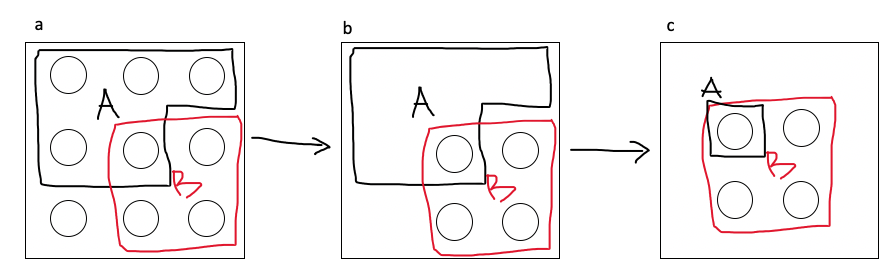
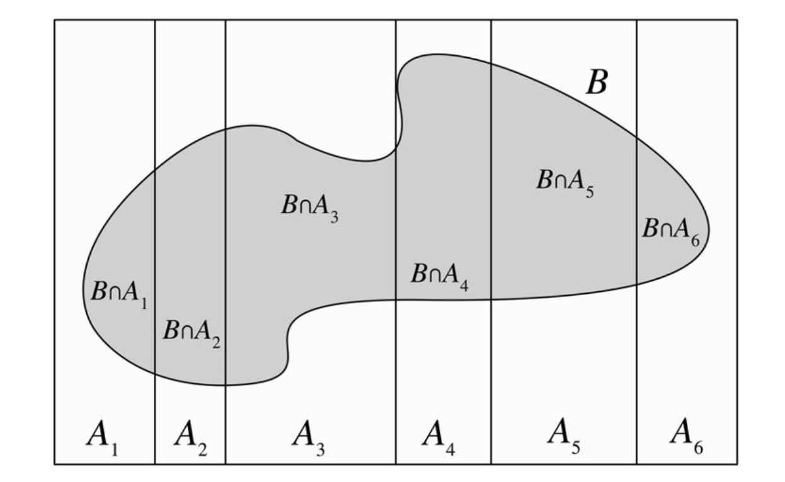
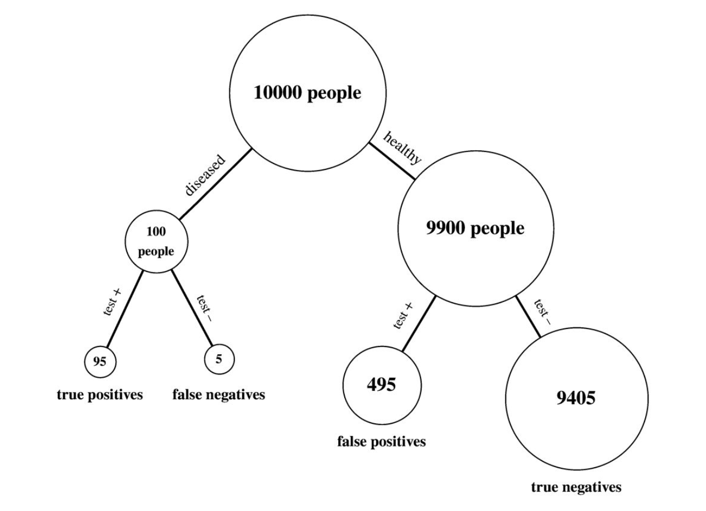

# Quick introduction to Bayesian statistics

### Prerequisite

```{r,eval=T, warning=F,message=F}
# install.packages('rethinking')
library(rethinking)
```

## 1. Background

### 1.1 Conditional probability

Whenever we observe new evidence (i.e., obtain data), we acquire information that may affect our uncertainties. A new
observation that is consistent with an existing belief could make us more sure of that belief, while a surprising observation
could throw that belief into question. Conditional probability is the concept that addresses this fundamental question: how
should we update our beliefs in light of the evidence we observe?

Conditional probability is essential for scientific, medical, and legal reasoning, since it shows how to incorporate evidence
into our understanding of the world in a logical, coherent manner. In fact, a useful perspective is that all probabilities are
conditional; whether or not it's written explicitly, there is always background knowledge (or assumptions) built into every
probability.

Suppose, for example, that one morning we are interested in the event R that it will rain that day. Let $P(R)$ be our assessment
of the probability of rain before looking outside. If we then look outside and see ominous clouds in the sky, then presumably
our probability of rain should increase; we denote this new probability by $P(R|C)$ (read as “probability of R given C”), where
C is the event of there being ominous clouds. When we go from $P(R)$ to $P(R|C)$, we say that we are “conditioning on C”. As the
day progresses, we may obtain more and more information about the weather conditions, and we can continually update our
probabilities. If we observe that events B1,…, Bn occurred, then we write our new conditional probability of rain given this
evidence as $P(R|B_1,…, B_n)$. If eventually we observe that it does start raining, our conditional probability becomes 1.

Furthermore, we will see that conditioning is a very powerful problem-solving strategy, often making it possible to solve a complicated problem by decomposing it into manageable pieces with case-by-case reasoning. Just as in computer science a common strategy is to break a large problem up into bite-size pieces (or even byte-size pieces), in probability a common strategy is to reduce a complicated probability problem to a bunch of simpler conditional probability problems.

#### 1.1.1 Definition

If A and B are events with $P(B)>0$, then the conditional probability of A given B, denoted by $P(A|B)$, is defined as

$$
P(A|B) = \frac{P(A,B)}{P(B)}
$$

- A is the event whose uncertainty we want to update.
- B is the evidence we observe (or want to treat as given).
- $P(A)$ the prior probability of A. (“prior” means before updating based on the evidence).
- $P(A|B)$ the posterior probability of A. (“posterior” means after updating based on the evidence).
- It is important to interpret the event appearing after the vertical conditioning bar as the evidence that we have observed or that is being conditioned on: $P(A|B)$ is the probability of A given the evidence B, not the probability of some entity called $A|B$. 

#### 1.1.2 Intuition



Consider a finite sample space, with the outcomes visualized as pebbles with total mass 1. Since A is an event, it is a set of
pebbles, and likewise for B. Figure above (a) shows an example. Now suppose that we learn that B occurred. In panel (b), upon
obtaining this information, we get rid of all the pebbles not in B because they are incompatible with the knowledge that B has
occurred. Then $P(A \cap B)$ is the total mass of the pebbles remaining in A. Finally, in panel (c), we renormalize, that is,
divide all the masses by a constant so that the new total mass of the remaining pebbles is 1. This is achieved by dividing by
$P(B)$, the total mass of the pebbles in B. The updated mass of the outcomes corresponding to event A is the conditional
probability $P(A|B) = \frac{P(A \cap B)}{P(B)}$.

#### 1.1.3 Example: two cards

A standard deck of cards is shuffled well. Two cards are drawn randomly, one at a time without replacement. Let $A$ be the event
that the first card is a heart, and $B$ be the event that the second card is red. Find $P(A|B)$ and $P(B|A)$.

Solution: 

- Event A: first card is a heart
- Event B: second card is red

$$
\begin{aligned}
P(A) &= \frac{1}{4} \\
P(B) &=  \frac{26 \times 51}{52 \times 51} = \frac{1}{2} \\
P(A,B) &= \frac{13 \times 25}{52 \times 51} = \frac{25}{204} \\
P(A|B) &= \frac{P(A,B)}{P(B)} = \frac{25/204}{1/2} = \frac{25}{102} \\
P(B|A) &= \frac{P(A,B)}{P(A)} = \frac{25/204}{1/4} = \frac{25}{51}
\end{aligned}
$$
This is a simple example, but already there are several things worth noting.

1. It's extremely important to be careful about which events to put on which side of the conditioning bar. In particular, $P(A|B) \neq P(B|A)$. 

2. Both $P(A|B)$ and $P(B|A)$ make sense (intuitively and mathematically); the chronological order in which cards were chosen does not dictate which conditional probabilities we can look at. When we calculate conditional probabilities, we are considering what information observing one event provides about another event, not whether one event causes another.

3. We can also see that $P(B|A) = 25/51$ by a direct interpretation of what conditional probability means: if the first card drawn is a heart, then the remaining cards consist of 25 red cards and 26 black cards (all of which are equally likely to be drawn next), so the conditional probability of getting a red card is 25/(25 + 26) = 25/51. It is harder to find $P(A|B)$ in this way: if we learn that the second card is red, we might think “that's nice to know, but what we really want to know is whether it's a heart!”.

### 1.2 Bayes' rule

The definition of conditional probability is simple—just a ratio of two probabilities—but it has far-reaching consequences.

$$
P(A \cap B) = P(B) P(A|B) = P(A) (B|A)
$$

Using the above equality, we get: 

$$
P(A|B) = \frac{P(B|A) P(A)}{P(B)}
$$
Bayes' rule is simple, yet it has important implications and applications in probability and statistics, since it is so often necessary to find conditional probabilities, and often $P(B|A)$ is much easier to find directly than $P(A|B)$ (or vice versa).

#### 1.2.1 Law of total probability (LOTP)

The **law of total probability (LOTP)** relates conditional probability to unconditional probability. It uses conditional probability to decompose complicated probability problems into simpler pieces, and it is often used in tandem with Bayes’ rule.

Let $A_1, ..., A_n$ be a partition of the sample space S (i.e., the $A_i$ are disjoint events and their union is S), with $P(A_i)>0$ for all i. Then

$$
\begin{align}
P(B) &= P(B\cap A_1) + P(B \cap A_2) + ... + P(B\cap A_n) \\
P(B) &= P(B|A_1) P(A_1) + P(B|A_2) P(A_2) + ... + P(B|A_n) P(A_n)
\end{align}
$$


The law of total probability tells us that to get the unconditional probability of B, we can divide the sample space into disjoint slices $A_i$, find the conditional probability of B within each of the slices, then take a weighted sum of the conditional probabilities, where the weights are the probabilities $P(A_i)$. The choice of how to divide up the sample space is crucial: a well-chosen partition will reduce a complicated problem into simpler pieces, whereas a poorly chosen partition will only exacerbate our problems, requiring us to calculate $n$ difficult probabilities instead of just one!

#### 1.2.2 Example: Random coin

You have one fair coin, and one biased coin which lands Heads with probability 3/4. You pick one of the coins at random and flip it three times. We observe (H,H,H). Given this information, what is the probability that the coin you picked is the fair one?

Let A be the event that the chosen coin lands Heads three times and let F be the event that we picked the fair coin. We are interested in $P(F|A)$, but it is easier to find $P(A|F)$ and $P(A|F^c)$ since it helps to know which coin we have; this suggests using Bayes’ rule and the law of total probability ($F^c$ is the event that occurs when F does not occur). 

Solution:

- Event A: chosen coin lands Heads 3 times
- Event F: fair coin is picked

$$
\begin{aligned}
P(F|A)   &= \frac{P(A|F) P(F)}{P(A)}\\
      &= \frac{P(A|F) P(F)}{P(A|F) P(F) + P(A|F^c) P(F^c)}\\
        &= \frac{(1/2)^3  \times 1/2}{(1/2)^3  \times 1/2 + (3/4)^3 \times 1/2} \\
        &\approx 0.23
\end{aligned}
$$

Before flipping the coin, we thought we were equally likely to have picked the fair coin as the biased coin: $P(F) = P(F^c) = 1/2$. Upon observing three Heads, however, it becomes more likely that we've chosen the biased coin than the fair coin, so $P(F|A)$ is only about 0.23. 

**(Prior vs. posterior):** It would not be correct in the calculation in the above example to say after the first step, “$P(A) = 1$ because we know A happened.” It is true that $P(A|A) = 1$, but $P(A)$ is the prior probability of A and $P(F)$ is the prior probability of F, both are the probabilities before we observe any data in the experiment. These must not be confused with posterior probabilities conditional on the evidence A.

#### 1.2.3 Example: Testing for COVID

Fred is being tested for COVID, which currently infects 1% of the population. The test result is positive, i.e., the test claims that Fred has COVID. 

- Let D be the event that Fred has COVID and 
- T be the event that he tests positive.

Suppose that the test is “95% accurate”; there are different measures of the accuracy of a test, but in this problem it is assumed to mean that $P(T|D) = 0.95$ and $P(T^c|D^c) = 0.95$. The quantity $P(T|D)$ is known as the **sensitivity or true positive rate** of the test, and $P(T^c|D^c)$ is known as the **specificity or true negative rate**. Find the conditional probability that Fred has COVID, given the evidence provided by the test result.

Solution:

Applying Bayes’ rule and the law of total probability, we have

$$
\begin{aligned}
P(D|T) &= \frac{P(T|D) P(D)}{P(T)} \\
&= \frac{P(T|D) P(D)}{P(T|D) P(D) + P(T|D^c) P(D^c)} \\
&= \frac{0.95 \times 0.01}{0.95 \times 0.01 + 0.95 \times 0.99} \\
&\approx 0.16
\end{aligned}
$$
Many people, including doctors, find it surprising that the conditional probability of having COVID given a positive test result is only 16%, even though the test is 95% accurate. The key to understanding this surprisingly low posterior probability is to realize that there are two factors at play: the evidence from the test, and our prior information about the prevalence of the disease. Although the test provides evidence in favor of disease, COVID infection rate is also low! The conditional probability $P(D|T)$ reflects a balance between these two factors, appropriately weighing the rarity of the disease against the rarity of a mistaken test result.

For further intuition, consider a population of 10000 people as illustrated in Figure below, where 100 have COVID and 9900 don't; this corresponds to a 1% disease rate. If we tested everybody in the population, we'd expect that out of the 100 diseased individuals, 95 would test positive and 5 would test negative. Out of the 9900 healthy individuals, we'd expect $(0.95) \times (9900) \approx 9405$ to test negative and 495 to test positive.
Now let's focus in on those individuals who test positive; that is, let's condition on a positive test result. The 95 true positives (i.e., the individuals who test positive and have the disease) are far outnumbered by the 495 false positives (i.e., the individuals who test positive despite not having the disease). So most people who test positive for the disease are actually disease-free!



The above was just a quick background, if you are interested in learning more you should read an introductory book in probability. Here are some recommended readings:

- Online course from Harvard with videos and book:
  * https://projects.iq.harvard.edu/stat110/home
  * https://www.amazon.co.uk/Introduction-Probability-Chapman-Statistical-Science/dp/1466575573
  
- Online course from MIT with videos and book:
  * https://ocw.mit.edu/courses/res-6-012-introduction-to-probability-spring-2018/
  * https://www.amazon.co.uk/Introduction-Probability-Dimitri-P-Bertsekas/dp/188652923X/ref=sr_1_1?qid=1667565146&refinements=p_27%3AJohn+N.+Tsitsiklis&s=books&sr=1-1


## 2. Bayesian statistics in practice

### 2.1 A very generic problem

We have some data and would like to model it. What does this mean in practice?

In any Bayesian inference problem, we follow a 4 step process:

  1. Identify the observed data you are working with. 
  2. Construct a probabilistic model to represent the data (likelihood). $\color{blue}{p(\text{data}|\theta)}$
  3. Specify prior distributions over the parameters of your probabilistic model (prior). $\color{teal}{p(\theta)}$
  4. Collect data and apply Bayes’ rule to re-allocate credibility across the possible parameter values (posterior). $\color{red}{p(\theta | \text{data})}$

**So the essence is this: *You* decide on a model (a probability distribution that fits your data best) and then use the data to find out what  parameters values of that model are likely to have generated the observed data.** There is no guarantee that the model is a good one, but at least it is a start.

Bayes' Theorem tells us:

$$
\begin{aligned}
\color{red}{p(\theta | \text{data})} &= \frac{\color{blue}{p(\text{data}|\theta)} \color{teal}{p(\theta)}}{\color{black}{P(\text{data}})} \\
 & = \frac{\color{blue}{p(data|\theta)}\color{teal}{p(\theta)}}{\int_\theta {\color{blue}{p(data|\theta)}}{\color{teal}{p(\theta)}} d\theta} \\
 &\propto \color{blue}{p(data|\theta)}\color{teal}{p(\theta)}
\end{aligned}
$$

### 2.2 Example: Number of de novo mutations

We have measured the number of de novo mutations in the genome of 1 child (by comparing their genome to their parents genome). We observe 37 mutations. What is the rate of de novo mutations in human populations?

1. Identify the observed data you are working with.
    - 37 mutations in one genome.
    
2. Construct a probabilistic model to represent the data (likelihood). $\color{blue}{p(\text{data}|\theta)}$
    - What do you think would be a good probabilistic model for mutations? Could we assume that mutations are Normally distributed?
    - A possibility is the Poisson distribution which is very popular distribution for modelling discrete data. The Poisson distribution is often used in situations where we are counting the number of events in a particular region or interval of time, and there are a large number of trials, each with a small probability of success. We have 6 billion bases in the human genome. Each one could mutate, but the probability of the mutation is very low for each site.
    - Poisson distribution has one parameter often called $\lambda$ which is the mean and variance of the distribution. Possion has the following PMF:
$$
   P(X = k) = \frac{e^{-\lambda} \lambda^k}{k!} ~~~~~~~~~k = 0,1,2,...
$$

let's plot this likelihood function:

```{r}
# number of mutations observed
n_mutation = 37

# Let's use a grid to work out the likelihood.
  lambda_seq = seq(0.001,100,length.out = 100)
# let's use R functions to calculate likelihood.
  likelihood = dpois(n_mutation,lambda_seq)
# you can calculate likelihood manually using Poisson definition.
  like_manual = exp(-lambda_seq) * lambda_seq^n_mutation / factorial(n_mutation)
  
  #let's plot the results:
  plot(lambda_seq,likelihood,xlab = 'Lambda', ylab = 'likelihood',pch = 2)
  points(lambda_seq,like_manual,col=2,pch = 3)
  
```

   The above calculations can result in numeric errors as $37!$ and $\lambda^{37}$ can result in huge numbers which can not be stored in memory or can have low precision in computer memory. So it is usually better to work with log of the likelihood rather than the likelihood itself. Try using log of the likelihood to see what you get. Use the log rules such as **log (a * b) = log(a) + log(b)** and **log(a/b) = log(a) - log(b) **.

3.  Specify prior distributions over the parameters of your probabilistic model (prior). $\color{teal}{p(\theta)}$
      - What prior distribution for $\lambda$ would be suitable? Priors are both engineering assumptions, chosen to help the machine learn, and scientific assumptions, chosen to reflect what we know about a phenomenon that we are modeling.
     - There’s no law mandating we use only one prior. If you don’t have a strong argument for any particular prior, then try different ones. Because the prior is an assumption, it should be interrogated like other assumptions: by altering it and checking how sensitive inference is to the assumption.
     - Maybe we could use an uniformative prior like $\lambda \sim \text{Uniform}(0,100000)$. This indicates that before seeing the data we believe the mean number of de novo mutations per genome can be any value between 0 and 100000 with equal probability and it cannot be greater than 100000.
     - These types of uninformative priors are hardly ever the best prior. One easy way to understand what the prior implies about the number of mutations is to use **prior predictive simulation**. This means to simulate from the prior distribution on lambda and then putting the sampled $\lambda$s through the likelihood to generate mutations. By simulating from prior distribution, you can see what your choices imply about observed mutations. This helps you diagnose bad choices. Lots of conventional choices are indeed bad ones, and we’ll be able to see this through prior predictive simulations.

```{r}
# simulate lambda from the prior distribution.
prior_lambda = runif(10000,min = 0,max = 100000)
# Use the simulated lambdas to simulate number of muations.
prior_mutations = rpois(10000,prior_lambda)

# let's plot the implication of the chosen prior on the number of mutations.
hist(prior_mutations,xlab = 'Number of mutations')
```

  - If you don't know anything about the de novo mutation rate, perhaps this is the best prior that you can come up with. But if you know about the subject (before seeing the data) you might have a much better idea on what is a sensible prior. For instance if you look at the literature, you can see that the mean number of de  novo mutations in humans has been estimated to be around 70 mutations per genome. However our chosen prior indicates that the probability of having 100 or less mutations is 0.001. 


4. Collect data and apply Bayes’ rule to re-allocate credibility across the possible parameter values (posterior). $\color{red}{p(\theta | \text{data})}$

  - posterior is the result of multiplying the likelihood with the prior and then normalizing so that it sums to one. Let's do that for this instance.
  
```{r}
# let's use a grid approximation to see what is going on.
# let's define a range of values for lambda.
lambda_seq = seq(0,100,length.out = 1000)
# define the prior on lambda
lambda_prior = dunif(lambda_seq,min = 0,max = 1e5)

# let's calculate the likelihood.
likelihood = dpois(n_mutation,lambda_seq)

# let's calculate the posterior
lambda_post_not_normalised = likelihood * lambda_prior

#normalise so that it sums to one.
lambda_post_normalised = lambda_post_not_normalised /sum(lambda_post_not_normalised)

# for plotting I am going to scale everything so that we can see them on the same scale.
plot(lambda_seq,likelihood/max(likelihood),col = 2,xlab = 'lambda',ylab = '')

points(lambda_seq,lambda_prior/max(lambda_prior),col = 3)

points(lambda_seq,lambda_post_normalised/max(lambda_post_normalised),col = 4,pch = 3)

legend(80,0.8,c('likelihood','prior','posterior'),pch = c(1,1,3),col = c(2,3,4))
```

  - As you can see the prior has no impact here at all. Posterior is completely determined by the likelihood.
  - Change the prior on $\lambda$ and see what you get. What happens if we use our knowledge and use a prior which is as follows: $\lambda \sim \text{Normal}(70,10)$? Try this in your own time.
  

Once your model produces a posterior distribution, the model’s work is done. But your work has just begun. It is necessary to summarize and interpret the posterior distribution. Exactly how it is summarized depends upon your purpose. But common questions include:

  - How much posterior probability lies below some parameter value?
  - How much posterior probability lies between two parameter values?
  - Which parameter value marks the lower 5% of the posterior probability?
  - Which range of parameter values contains 90% of the posterior probability? 
  - Which parameter value has highest posterior probability?

These simple questions can be usefully divided into questions about (1) intervals of defined boundaries, (2) questions about intervals of defined probability mass, and (3) questions about point estimates.

To answer the above questions, one needs to know integral calculus as you need to calculate the area under the posterior function. However we can convert this into a counting problem with sampling from posterior distribution. The posterior distribution is a probability distribution. And like all probability distributions, we can imagine drawing samples from it. The sampled events in this case are parameter values. The posterior defines the expected frequency that different parameter values will appear, once we start plucking samples out of it. 

Working with samples transforms a problem in calculus into a problem in data summary, into a frequency format problem. An integral in a typical Bayesian context is just the total probability in some interval. That can be a challenging calculus problem. But once you have samples from the probability distribution, it’s just a matter of counting values in the interval. An empirical attack on the posterior allows the scientist to ask and answer more questions about the model, without relying upon a captive mathematician. For this reason, it is easier and more intuitive to work with samples from the posterior, than to work with probabilities and integrals directly.

Also some of the most capable methods of computing the posterior produce nothing but samples. Many of these methods are variants of Markov chain Monte Carlo techniques (MCMC). So if you learn how to conceptualize and process samples from the posterior, when you inevitably must fit a model to data using MCMC, you will already know how to make sense of the output. MCMC is no longer a technique only for experts, but rather part of the standard toolkit of quantitative science.


Let's sample from the posterior distribution and find its mean and get its 90% credible interval.

```{r}
# Again we are using a grid approximation where the parameter values are stored in "lambda_seq" and the posterior distribution is stored in "lambda_post_normalised"

posterior_samples = sample(lambda_seq,size=10000,replace = TRUE,prob = lambda_post_normalised)
# dens(posterior_samples,adj = 1)

mean(posterior_samples)
quantile(posterior_samples,probs = c(0.05,0.95))
```

So the mean of $\lambda$ is 37.9 and its 90% percentile interval is $(28.3,48.3)$. You might get slightly different results as the sampling is random.


### 2.3 Example: Number of de novo mutations version 2.

We have measured the number of de novo mutations in the genome of 10 children (by comparing their genome to their parents genome). Data: 42, 49, 40, 36, 50, 37, 39, 43, 54, 55. Also by looking at litrature our prior knowledge is that the mean number of de novo mutations in the population is 70 with standard deviation of 5. What is the mean number of mutations and its 90% percentile interval given the data above and the prior knowledge about the number of mutations?

Let's assume that the number of mutations have a Poisson distribution, i.e. we have decided on our likelihood. We also assume that these children are not related so that we can assume the number of mutation in each child is independent of other children. The independence assumptions means that we can multiply the likelihoods for each of the children to get the likelihood for the whole data.
$$
P(X_1 =42, ...,X_{10} = 55 | \lambda) = \prod_1^{10} \frac{e^{-\lambda} \lambda^{x_i}} {x_i!} = \frac{e^{-\lambda}\lambda^{42}}{42!} ...\frac{e^{-\lambda}\lambda^{55}}{55!}
$$

```{r}
num_mut = c(42, 49, 40, 36,50, 37, 39, 43, 54, 55)

# let's use grid approximation.
lambda_seq = seq(0,200,length.out = 1000)

# define the prior on lambda. We are assuming a normal distribution with mean 70 and sd of 5.
lambda_prior = dnorm(lambda_seq,mean=70,sd=5)

# let's calculate the likelihood.
# sapply just gives each value of lambda_seq to the function "function(x) prod(dpois(num_mut,x))" and stores the output which is the likelihood for that lambda value. If you are not comfortable with this, you can write your own for loop to get the same exact resutls as sapply.
likelihood = sapply(lambda_seq, function(x) prod(dpois(num_mut,x)))

# let's calculate the posterior
lambda_post_not_normalised = likelihood * lambda_prior

#normalise so that it sums to one.
lambda_post_normalised = lambda_post_not_normalised /sum(lambda_post_not_normalised)

# let's plot the scale version of the likelihood, prior and posterior.
plot(lambda_seq,likelihood/max(likelihood),col = 2,xlab = 'lambda',ylab = '')

points(lambda_seq,lambda_prior/max(lambda_prior),col = 3)

points(lambda_seq,lambda_post_normalised/max(lambda_post_normalised),col = 4,pch = 3)

legend(80,0.8,c('likelihood','prior','posterior'),pch = c(1,1,3),col = c(2,3,4))

```

As you can see the posterior has moved away from likelihood towards the prior and that is because the posterior is a combination of the likelihood and prior. Bayes' rule is the logical way to combine these two sources of information and to get the posterior distribution.  The role of the prior becomes much more important when we don't have much data. You should try the previous example where we observed data only for one child with the Normal prior on $\lambda$ to see what you get.

let's use sampling from the posterior distribution to determine the mean and 90% percentile interval of $\lambda$, the mean mutation number parameter.

```{r}

posterior_samples = sample(lambda_seq,size=10000,replace = TRUE,prob = lambda_post_normalised)
# dens(posterior_samples,adj = 1)

mean(posterior_samples)
quantile(posterior_samples,probs = c(0.05,0.95))

```

So the mean of $\lambda$ is 48.8 and its 90% percentile interval is $(45.4,52.3)$. You might get slightly different results as the sampling is random.


### 2.4 Posterior predictive checks

After a model is updated using data, it is worth simulating implied observations, to check both whether the fit worked correctly and to investigate model behavior.

The observations in our example case are number of de novo mutations. The implied predictions of the model are uncertain in two ways, and it’s important to be aware of both. 

  - First, there is observation uncertainty. For any unique value of the parameter $\lambda$, there is a unique implied pattern of observations that the model expects. There is uncertainty in the predicted observations, because even if you know $\lambda$ with certainty, you won’t know the number of mutations in each child. 
  
  - Second, there is uncertainty about $\lambda$. The posterior distribution over $\lambda$ embodies this uncertainty. And since there is uncertainty about $\lambda$, there is uncertainty about everything that depends upon $\lambda$. The uncertainty in $\lambda$ will interact with the sampling variation, when we try to assess what the model tells us about outcomes.

We’d like to propagate the parameter uncertainty—carry it forward—as we evaluate the implied predictions. All that is required is averaging over the posterior density for $\lambda$, while computing the predictions. For each possible value of the parameter $\lambda$, there is an implied distribution of outcomes. So if you were to compute the sampling distribution of outcomes at each value of $\lambda$, then you could average all of these prediction distributions together, using the posterior probabilities of each value of $\lambda$, to get a posterior predictive distribution. This is a hard calculus problem, but if you have samples from the posterior distribution, it becomes an easy counting problem.

How do we do this in practice? All you need to propagate parameter uncertainty into precdictions is to use samples from the posterior distribution to simulate from the assumed model for data generating process (likelihood).

```{r}
# sample from the posterior distribuiton:
posterior_samples = sample(lambda_seq,size=10000,replace = TRUE,prob = lambda_post_normalised)

# simulate from the model using posterior samples.
simulated_mutations = rpois(10000,posterior_samples)

# let's plot the model predictions.
 dens(simulated_mutations,xlab ='Number of mutations')
 
# let's plot the observed data points.
for (i in 1:10){
  abline(v=num_mut[i],col = 2)
}
```


