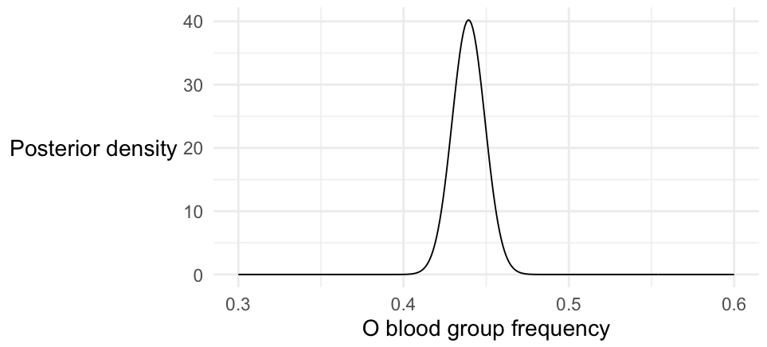

# Estimating allele frequencies

Let's use [Bayes](./bayes.md) to estimate allele frequencies - quantifying our uncertainty - for a couple of important
variants in global populations.  Here are the datasets:

1. Data on the O blood group variant (rs8176719): [O blood group data](https://raw.githubusercontent.com/whg-training/whg-training-resources/main/docs/statistical_modelling/introduction/data/1000_genomes_o_blood_group_grouped.tsv)

rs8176719 has two alleles - the functional 'C' allele, and a deletion allele that results in a
[frameshift](https://en.wikipedia.org/wiki/Frameshift_mutation).  Individuals that have two copies of the deletion have
'O' blood group.

2. Data on **rs61028892**, a variant that has been associated with [control of fetal
haemoglobin](https://www.medrxiv.org/content/10.1101/2023.05.16.23289851v1.full) in individuals with sickle cell
disease: [rs61028892 data](https://raw.githubusercontent.com/whg-training/whg-training-resources/main/docs/statistical_modelling/introduction/data/1000_genomes_rs61028892_grouped.tsv)

Both datasets above come from the [1000 Genomes Project Phase 3
dataset](https://www.internationalgenome.org/data-portal/data-collection/phase-3).

:::tip Challenge

Load one or both of these datasets into R using `read_tsv()`.  Then  use `dbeta()` to plot the posterior distribution of
the allele frequency and/or the O blood group frequency across all populations and then in individual populations.

**Hint.** `ggplot()` is one good way to do this.  Some further tips on this are below.

:::

:::tip Challenge

Add the posterior mean and lower and upper values forming a 95% credible set to the data frame.

Add 95% credible intervals for each population to the data frame, using `qbeta()`, and then plot these as the estimates
(points) and 95% confidence intervals

:::

## Plotting the posterior

To get `ggplot()` to plot a posterior density for the whole dataset, or for individual populations, is not conceptually
difficult - we're just plotting the beta distribution after all.  But does require a bit of complexity in terms of code.
In short, `ggplot()` takes a single data frame as data, so you have to build a big dataframe that represents the
posterior density at a grid of x axis values, for each population you want to plot.

You could find lots of ways to do this, but here's one way that is fairly re-useable.  Let's write a function that reads
in one row of data and generates the dataframe we need.  Rather than hard-code this for the O blood group example, we'll
make it work with generic 'reference' and 'alternate' counts (e.g. non-O blood group, and O blood group counts) so it
can be re-used for other examples:

```r
generate_posterior = function(
	row,
	at= seq( from = 0, to = 1, by = 0.01 )
) {
	posterior_distribution = dbeta(
		at,
		shape1 = row$alternate_count + 1,
		shape2 = row$reference_count + 1
	)
	tibble(
		population = row$population,
		reference_count = row$reference_count,
		alternative_count = row$alternate_count,
		at = at, 
		value = posterior_distribution
	)
}
```

For example, for the O blood group data you could apply this to the whole dataset like this:
```r
overall_counts = (
	X
	%>% summarise(
		population = 'all',
		reference_count = sum( `C/C` + `-/C` ),
		alternate_count = sum( `-/-` )
	)
)
print( overall_counts )
overall_posterior = generate_posterior(
	overall_counts,
	at = seq( from = 0, to = 1, by = 0.01 )
)
```

If you print this, you should see a data frame with 101 rows (one for each of those `at` values) showing the posterior
distribution.

:::tip Note

Make sure you understand what that data frame is showing.  To recap, it's the *posterior distribution of the frequency of O blood
group across all populations*, evaluated at a grid of 101 points between zero and one.

The posterior is a [beta distribution](./some_distributions.md) so we used `dbeta()` to compute it.

:::

Want to plot it?  No problem!
```r
p = (
	ggplot( data = overall_posterior )
	+ geom_line( aes( x = at, y = value ))
)
print(p)
```

Ok that's not good enough.  Let's zoom in:

```r
print( p + xlim( 0.35, 0.55 ))
```

:::tip Challenge

Ok that's not good enough either.  Here are some things you should do to fix it.

1. Does your plot look kind of jagged-y?  That's because the posterior distribution is concentrated around a small region (almost all the mass is between about 0.4 and 0.47), but we have only evaluated on a grid of 101 points across the interval.  To fix this, *increase the number of grid points* (i.e. the `at` variable above) and replot.

2. **Always give your plots meaningful x axis and y axis labels**.  (Otherwise you'll just waste people's time making them ask what they are).  The `xlab()` and `ylab()` functions can be used for this, e.g.:
```r
p = (
	ggplot( data = overall_posterior )
	+ geom_line( aes( x = at, y = value ))
	+ xlab( "My x axis label" )
	+ ylab( "My y axis label" )
)
print(p)
```

3. Let's get rid of the grey background and make the text bigger, using 'theme_minimal()`:
```
print( p + theme_minimal(16) )
```

4. Personally, I don't like that the y axis label is printed at 90 degrees to the reading direction - do you?  That can
   be fixed too with a bit of ggplot magic, which I always have to [look up in the
   documentation](https://ggplot2.tidyverse.org) - it looks like this:

```r
print(
	p
	+ theme_minimal(16)
	+ theme(
		axis.title.y = element_text( angle = 0, vjust = 0.5 )
	)
)
```

**Note**. you have to do this call to `theme()` *after* `theme_minimal()`, otherwise it resets this property.

**Challenge** Put all this together to make a final plot of the posterior distribution now.  It should look something like this:



:::

Congratulations!  


## Plotting multiple populations

Plotting multiple populations ought to be easy now - we just somehow need to call `generate_posterior()` for each row of
our data, instead of for the whole set.  One way to do that is simple to loop over the rows and accumulate the results:
```
per_population_posterior = tibble()
for( i in 1:nrow( data )) {
	# summarise one row, as before
	population_data = (
		X[i,]	
		%>%
		summarise(
			population = population,
			reference_count = sum( `C/C` + `-/C` ),
			alternate_count = sum( `-/-` )
		)
	)
	per_population_posterior = bind_rows(
		per_population_posterior,
		generate_posterior( population_data )
	)
}
```

If you look at `per_population_data` you should see it has thousands of rows (or tens of thousands if you increased the
number of `at` values), the same number of rows per population.  You could count them like this:
```
per_population_posterior %>% group_by( population ) %>% summarise( number_of_rows = n() )
```

Getting ggplot to plot this is now easy - we use a **facet**:
```
p = (
	ggplot( data = per_population_posterior )
	+ geom_line( aes( x = at, y = value ))
	+ facet_grid( population ~ . )
)
print(p)
```


Cool!

:::tip Note

That `facet_grid()` call works like this.  You give it two variables to facet over rows and columns of the result, and write `variable1 ~ variable2`.
In our case, we just want to facet over one variable rows, so we do `population ~ .`.  

`ggplot()` then does all the work of splitting up the data up into each of the facets and arranges the plot into rows and columns.
It's a very powerful feature for quickly exploring datasets.

:::

As usual, this initial plot isn't quite good enough to start with.  We should do several things:

1. Those y axis scales are useless - too hard to see. We should get rid of them.
2. The facet labels (on the right) are useless as well!  We can't see the population names.
3. A more subtle bug is that the posteriors all have slightly different heights (depending on how spread-out the
   distribution is).  But at the moment they all have the same scale.

All this can be fixed with suitable calls to ggplot - see the comments below:

```r
p = (
	ggplot( data = per_population_posterior )
	+ geom_line( aes( x = at, y = value ))
	+ facet_grid(
		population ~ .,
		# Make y axis facets have their own scales, learnt from the data
		scales = "free_y"
	)
	+ theme_minimal(16)
	+ xlab( "O blood group frequency" )
	+ ylab( "Posterior density" )
	+ theme(
		# remove Y axis tick labels
		axis.text.y = element_blank(),
		# rotate facet labels on right of plot
		strip.text.y.right = element_text(angle = 0, hjust = 0),
		# rotate overall y axis label 90
		axis.title.y = element_text(angle = 0, vjust = 0.5)
	)

)
print(p)
```


## Ordering populations

That's all very well, currently the populations are sorted in alphabetical order.  Wouldn't it be nicer to order the
populations by allele frequency? 

The way to do this in ggplot is not obvious at first glance - you have to re-order the data itself.  In R, there is a
specific way to do this known as a **factor**.  A factor is a set of string values that take one of a set of levels.
You specify the order of the levels, and voila, the data is ordered.

Let's do that now.  First let's compute the frequency in the original data:

```
data$O_bld_grp_frequency = data[['-/-']] / ( data[['C/C']] + data[['-/C']] + data[['-/-']])
```

Now let's use that to get an ordered list of populations.  An easy way is to use the [dplyr `arrange()` function](https://dplyr.tidyverse.org/reference/arrange.html) to order the dataframe by the frequency, then get the populations:

```r
ordered_populations = (
	data
	%>% arrange( O_bld_grp_frequency )
)$population
```

Finally, we'll convert the `population` column of `per_population_posterior` to a factor with these levels:

```r

per_population_posterior$population = factor(
	per_population_posterior$population,
	levels = ordered_populations 
)
```

That's it!  (If you try `str(data)` you'll see that the `population` column is now a factor.)

Now if you regenerate the above plot, things should be in order.

:::tip Question

In which populations is O blood group at lowest frequency?  In which populations at highest frequency?

:::