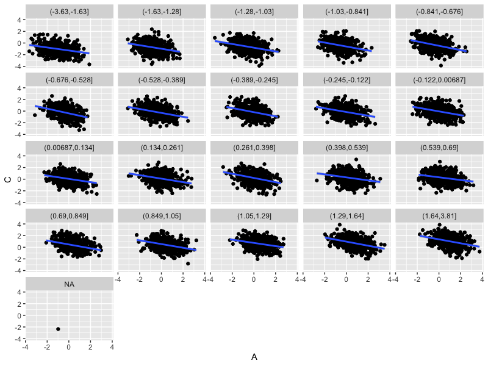

import Tabs from '@theme/Tabs';
import TabItem from '@theme/TabItem';

# Causal thinking

In the [linear regression example](./linear_regression_1,md) we saw some pretty odd behaviour. A model fit of genotype on expression
gave no very strong evidence for association, yet when we [included a covariate](./linear_regression_1,md#including-covariates) this
changed and there seemed to be an effect.

To figure out why this might be we need to think causally.

## Three worlds

To start, let's look at the 'three worlds' of scientific inference:

<center>


</center>

The first world is the natural world - that's what we want to know about. This world contains all the wonders of life, but also all
the annoying and fiddly bits.

The second world is the theoretical world - that's where we build scientific theories - simplified models of how the world works.
This world is much cleaner and more simple than the real world. Arguably this is where advances in scientific understanding
really happen.

The third scientific world is the one we've been working in - *data analysis world*. Here we have data and apply statistical
models.  The aim is to help us distinguish between our scientific theories.

Linking these worlds are *experiments* - either purely observational experiments, which measure variables on real-world
populations, or controlled experiments which are typically much more theoretically controlled. Experiments generate data relevant
to scientific models that can then be tested using data analysis methods.

The point of this diagram is that, while there are some settings where purely knowing correlations between variables is useful,
what we want to know most is *how the world works*. Statistical models typically don't tell us that without the scientific
theories that motivate them. In this tutorial we'll see how that plays out in a purely simulated example.

## Causal graphs

Let's look at a simple way to represent a functional / mechanistic model: causal graphs.

A **causal graph** is made up of nodes which stand for quantities of interest and arrows between nodes. An arrow between two nodes
means that one *causes* or *causally affects* the other.

For example

$$
X \rightarrow Y
$$

means "X causally affects Y": changing $X$ would affect $Y$. (The graph alone does not say anything about *how* $X$ affects $Y$, or
how strong the effect is - just that there is an effect.)

The other important point is that variables and arrows that don't appear in the graph are assumed *not* to be there. Thus, in the
above graph, changing $Y$ would definitely not affect $X$ (as there's no arrow or path from $Y$ to $X$.) Similarly, in this diagram:

$$
X \rightarrow Y \rightarrow Z
$$

we can be sure that all of the causal effect of $X$ on $Z$ is through $Y$, and not via some other path.

### An exercise: three variables

To get a sense of this, let's consider the simplest nontrivial case: three variables. Specifically, let's imagine that we are
interested in estimating the (causal) effect of some exposure variable $A$ (for example, a genotype or a new drug) on an outcome
$C$ (which could be a disease trait, or a biomarker, for example.). But there is a third variable $B$ that might be causally
related to $A$ and/or $C$. Should we condition on $B$ or not?

To make this concrete, let's consider a set up where

* $A$, $B$, and $C$ are each gaussian variables with variance $1$.
* all causal effects are linear and equal to $0.5$.

In other words = $A\rightarrow C$ means $C = 0.5 A + \epsilon$ - where $\epsilon$ is a gaussian variable with just the right
variance to make $C$ have variance $1$.

:::tip Question

Consider the nine causal diagrams below:


Suppose all variables are gaussian with variance 1, all effects are linear and all effect sizes are 0.5.

For each diagram, **first** try to decide by looking at the diagram whether you think $B$ should be included or not. (Or maybe it
doesn't matter?)

**Second**, try downloading loading the matching dataset from [this
folder](https://www.well.ox.ac.uk/~gav/projects/whg-training-resources/data/statistical_modelling/regression_modelling/data/causal/)
 and use `lm()` in R to check your answer is right. More precisely, what is the impact of including $B$ in as a covariate on a) the
regression estimate $\hat{\beta}$ and b) the standard error of conditioning on $B$?

:::

:::tip Question

Can you figure out which of the diagrams are *observationally equivalent*? (That is, they produce identical data distributions?)

**Note.** In these examples, all variables are gaussian with mean zero and variance 1, and all effects are linear. Thus the joint
data distribution is fully determined by the covariances between the three variables.

:::

See if you can complete these before going further

### Worked example

As an example let's analyse diagram #8, which stretched out looks like:
$$
A \stackrel{0.5}{\rightarrow} C \stackrel{0.5}{\rightarrow} B
$$

Let's simulate from this model now.  I'll simulate a very large sample size so that we can get accurate estimates:
```R
A = rnorm( 100000 )
C = 0.5 * A + rnorm( 100000, sd = sqrt(0.75) )
B = 0.5 * C + rnorm( 100000, sd = sqrt(0.75) )
```

When I fit the example dataset I get this:

    > l = lm( C ~ A ); summary(l)$coeff
                    Estimate  Std. Error     t value  Pr(>|t|)
    (Intercept) -0.001401156 0.002739580  -0.5114491 0.6090377
    A            0.497460492 0.002744025 181.2886108 0.0000000

    > l = lm( C ~ A + B ); summary(l)$coeff
                    Estimate  Std. Error     t value  Pr(>|t|)
    (Intercept) -0.001249272 0.002451502  -0.5095947 0.6103366
    A            0.399875908 0.002532207 157.9159381 0.0000000
    B            0.398648014 0.002527165 157.7451237 0.0000000

So fitting the model with $B$ in gives us estimates of around 0.4 - for both $A$ and $B$ - yet the causal effects were $0.5$ and
$0$! What's going on?

Well, this model corresponds to the following formula:

$$
A \sim N(0,1)
$$

$$
C = 0.5\times A + \epsilon_C
$$

$$
B = 0.5\times C + \epsilon_B = 0.25 \times A + 0.5\times \epsilon_C + \epsilon_B
$$

(where, as before, $\epsilon_C$ is chosen so that $C$ has variance $1$ and similarly for $\epsilon_B$.)

The unadjusted linear regression estimate is $0.5$ (it is equal to the covariance between $A$ and $C$.). This is indeed the
causal effect.

The adjusted estimate is different - but it still gets the contribution of $A$ right. Because since $B = 0.25 \times A + ...$ the
fitted contribution of $A$ to $C$ is:

$$
0.4 + 0.4\times 0.25 = 0.5
$$

In other words, the regression has made a perfectly sensible estimate - it just doesn't understand that it's the effect of $A$ on
$C$ that we are interested in.

One way to understand this is to say that some of the association with $A$ is 'explained by' $B$ - and in this case the estimate
for $B$ is positive because $B$ also 'explains' some of the noise in $C$.

**Note.** Diagram 2 is sort of similar in that $B$ is correlated to $A$. In this case, however, there's a different behaviour:
```
A = rnorm( 10000 )
B = 0.5 * A + rnorm( 10000, sd = sqrt( 0.75 ))
C = 0.5 * A + rnorm( 10000, sd = sqrt( 0.75 ))
```

    > l = lm( C ~ A ); summary(l)$coeff
                   Estimate  Std. Error    t value  Pr(>|t|)
    (Intercept) 0.003590284 0.008678783  0.4136851 0.6791136
    A           0.506865138 0.008710480 58.1902630 0.0000000
    
    > l = lm( C ~ A + B ); summary(l)$coeff
                   Estimate  Std. Error    t value   Pr(>|t|)
    (Intercept) 0.003520708 0.008677774  0.4057155 0.68496031
    A           0.497305419 0.010094251 49.2662029 0.00000000
    B           0.018778370 0.010023912  1.8733575 0.06104819
    
In this case including $B$ does not alter the point the estimate of $A$ on $C$. One way to understand this is that $B$ has no other
component of $C$ in it (other than $A$), so all of the association of $B$ with $C$ is 'explained' by $A$. This leads to the
coefficient of $B$ being close to zero. **However**, including $B$ has imnpacted the precision of our estimate: the standard error
for $\beta$ has changed from 0.0087 to 0.010. This might not look very much but look at its effect on the z-score (i.e. how many
standard errors away from zero the estimate is):

    > 0.506865138/0.008710480
    [1] 58.19026
    > 0.497305419/0.010094251
    [1] 49.2662

Including $B$ has made the estimate about less certain, by about 10 standard errors.
    
In this example with 10,000 samples, both estimates are anyway very many standard errors away from zero, but clearly including
$B$ is adding to the uncertainty of our estimate.

:::tip Hint

The effect sizes we are looking at here are very strong! (Each effect explains $\frac{1}{4}$ of the variance of the target
variable). Try reducing the sample size to 100 to see how this affects the resulting P-value.

:::

## Observational equivalence

One of the important things to realise is that *more than one causal model can produce the same observable data*. This puts limits
on the extent to which the data can help us distinguish scientific theories.

An example of this in the above are diagrams 6 and 7. We can check this by following through the definitions in each diagram to
compute variable covariances:

$$
\text{cov}(A,B) = 0.5,
\quad
\text{cov}(B,C) = 0.75,
\quad\text{and}\quad
\text{cov}(A,C) = 0.75
$$
    
A full computation of $\text{cov}(B,C)$ in diagram 6 looks as follows:

$$
\text{cov}(B,C) = \text{cov}(0.5 A + \epsilon_B, 0.5 A + 0.5 B + \epsilon_C)
$$
$$
= \text{cov}(0.5 A + \epsilon_B, 0.5 A + 0.25 A + 0.5 \epsilon_B + \epsilon_C )
$$
$$
= \text{cov}(0.5 A, 0.75 A) + \text{cov}( \epsilon_B, 0.5\epsilon_B)
$$
$$
= \frac{3}{8} + \frac{1}{2}\text{var}( \epsilon_B )
$$

:::tip Note

This calculation uses the key properties of covariance, namely:

* $\text{cov}(\cdot,\cdot)$ is **bilinear**, so linear changes to either of the variables can be split out, e.g.:
    - $\text{cov}(\alpha X, Y) = \alpha \cdot \text{cov}(X, Y)$ if $\alpha$ is a number,
    - $\text{cov}(X+Z, Y) = \text{cov}(X, Y) + \text{cov}(Z, Y)$.
    - And similarly for changes to the 2nd variable.

* The covariance between any two independent quantities is zero.

* And by definition $\text{var}(X) = \text{cov}(X,X)$.
:::

If the above calculation seems too hard, don't worry! In general in these diagrams the covariance can be read off by simply
following all paths between two variables (regardless of arrow direction) and multiplying coefficients. So in this example, there
are two undirected paths that connect $B$ to $C$ - one has coefficient $0.5\times 0.5 = 0.25% (through $A$) and the other has
coefficient $0.5$, ergo, the total covariance is $0.75$. 

However there is **one exception** to this rule about following all paths. A path that is "blocked" by a collider - i.e. a variable where
two arrows collide:

$$
X \rightarrow \stackrel{\text{blocking variable}}{Y} \leftarrow Z
$$

doesn't contribute to the covariance. 

:::note Note

Why is this? **Hint.** follow through the contributions of variables to the collider - you should be able to see that unlike
other nodes that join two other variables, the collider does not generate a shared component to the incoming variables.

:::

:::tip Question

Which variables are colliders in diagram 6 and 7?

:::

### Confounding

The fact that diagrams 6 and 7 are observationally equivalent is particularly important for the following reason.

In diagram 6, variable $B$ is part of a causal path from $A$ to $C$. The full causal effect of $A$ on $C$ is 0.75, and this is
what we get from an unadjusted estimate of $A$ on $C$. Thus in diagram 6 we should **not** control for $B$. (Although if we were
specifically interested in just the direct effect of $A$, we could control for $B$.)

However in diagram 7, variable $B$ is not part of a causal path from $A$ to $C$. The full causal effect of $A$ on $C$ is 0.5. If
we do not include $B$ in our estimate, we get an **inflated estimate of the effect** equal to 0.75. In this case $B$ is known as
a **confounding variable** or a **confounder** - more generally we say the estimate of $A$ on $C$ is confounded by the path
through $B$. To accurately estimate causal effects it is mandatory to control for the confounding variable.

:::warning Warning
To get an accurate estimate, you **must** control for confounders.
:::

However - the surprising thing here is that, as we saw above, diagrams 6 and 7 are observationally equivalent. Therefore, we
can't tell from the data whether $B$ is a confounder or not!

:::tip Conclusion

The only way to tell whether $B$ should be included or not in diagrams 6-7, is through our scientific knowledge about what $A$,
$B$ and $C$ represent - that is, what the true causal diagram is.

:::

### Diagram 9: colliders

Finally let's look at diagram 9.  In diagram 9, variable $B$ is a collider (two arrows meet at it).  Let's simulate that now:
```
A = rnorm( 10000, sd = 1 )
C = 0.5 * A + rnorm( 10000, sd = sqrt(0.75) )
B = 0.5 * A  + 0.5 * C + rnorm( 10000, sd = sqrt(0.5) )

```
> l = lm( C ~ A ); summary(l)$coeff[,1:2]
                     Estimate  Std. Error     t value  Pr(>|t|)
    (Intercept) -0.0008303819 0.008687452 -0.09558405 0.9238528
    A            0.4895884550 0.008781247 55.75386231 0.0000000

    > l = lm( C ~ A + B ); summary(l)$coeff
                   Estimate  Std. Error    t value     Pr(>|t|)
    (Intercept) -0.00203657 0.007387861 -0.2756643 7.828116e-01
    A            0.06833455 0.010105579  6.7620615 1.436458e-11
    B            0.55480287 0.008967174 61.8704222 0.000000e+00

In this diagram conditioning on $B$ gets the answer completely wrong.

In some ways this is like diagram 8 that we studied above. However, this collider example is even more insidious because it can
generate completely spurious effects. (Whereas the problem in diagram 8 only occurs if $A$ actually contributes to $C$ - that is,
if there is a nonzero causal effect in the first place.). To see that we can try again with zero effect:

```
A = rnorm( 10000, sd = 1 )
C = rnorm( 10000, sd = 1 )
B = 0.5 * A  + 0.5 * C + rnorm( 10000, sd = sqrt(0.5) )
```

    > l = lm( C ~ A ); summary(l)$coeff
                    Estimate  Std. Error    t value  Pr(>|t|)
    (Intercept) -0.001944327 0.010010210 -0.1942344 0.8459963
    A           -0.017850158 0.009992815 -1.7862993 0.0740811

    > l = lm( C ~ A + B ); summary(l)$coeff
                    Estimate  Std. Error     t value      Pr(>|t|)
    (Intercept) -0.003406093 0.008153387  -0.4177518  6.761375e-01
    A           -0.351401096 0.009390186 -37.4221675 5.732243e-287
    B            0.669783192 0.009403352  71.2281297  0.000000e+00

In both cases the estimate conditional on $B$ gets the estimate of $\beta$ completely wrong.

:::warning Warning

To get an accurate estimate, you **must not** control for colliders.

:::

To understand this behaviour, let's keep this last dataset with zero causal effect of $A$ on $C$ and let's plot the variables:

```R
plot_data = tibble( A = A, B = B, C = C )
print(
    ggplot( data = plot_data, aes( x = A, y = C ))
    + geom_point()
    + geom_smooth( method = "lm" )
)
```


This looks as expected.  But now let's look at the same thing within strata of fixed $B$:

```
plot_data$B_quantile = cut( plot_data$B, quantile( B, seq( from = 0, to = 1, by = 0.05 )))
print(
    ggplot( data = plot_data, aes( x = A, y = C ))
    + geom_point()
    + geom_smooth( method = "lm" )
    + facet_wrap( ~ B_quantile )
)
```


For fixed values of $B$, the association between $A$ and $C$ is drastically different - much closer to zero.

You can see why this is: since $B = 0.5 A + 0.5 C + \epsilon_B$, for a fixed value of $B$ there must be a negative relationship
between $A$ and $C$:

$$
C = 2B - A - 2\epsilon_B
$$

Controlling for $B$ in the regression is like looking at the effect of $A$ on $C$ within strata like this -
it 'soaks up' the global effect of $B$.

:::tip Question

In the actual diagram 9, this effect is tempered by the fact that $A$ *does* have an effect on $C$. How do the plots look if you
simulate from diagram 9?

:::

