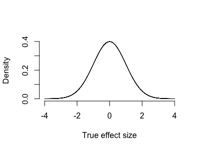

# How to interpret evidence

So you've done a statistical test, got an estimate, a standard error and a P-value. How do you know when there's enough evidence
for you to start thinking the effect might really be there? This part of the tutorial will walk you through the main ways to
think about this problem.


### Example

For example, in our [linear regression example](./linear_regression_1.md) we observed a possible association between the
genotypes of a SNP in the gene *ATP2B4* and expression of *ATP2B4*. The fitted coefficients (including a covariate, `stage`)
were:

                   Estimate  Std. Error   Pr(>|t|)
    (Intercept)      0.0447      0.0165     0.0131
    dosage           0.0392      0.0109     0.0017
    stagefetal      -0.0477      0.0124     0.0009

So the estimate $\hat{\beta}$ of the effect of the genotype dosage $\beta$ is 0.0392, and the P-value is 0.0017. Is this enough
evidence to conclude that the effect is nonzero?

:::tip A sanity check

Before getting started - note that by even asking this question we are making a key assumption - that it's sensible
to try to discern 'true' effects from 'zero' effects.

Suppose genetic effects on expression actually follow a continuous distribution - say, a gaussian-like distribution where there
are many small effects and a few larger ones:



Here essentially *all* effects are nonzero. It is pointless to ask whether one of them might be nonzero.

On the other hand, maybe most variants have no effect at all, or very small effects, and a few have large effects - something like:


Here it definitely makes sense to try to call some effects as 'nonzero' - with enough data we ought to be able to distinguish
those effects out in the tails.

In many problems - such as looking for genetic variants that affect gene expression - it seems likely though that the real
distribution might be a kind of mixture between these two. For example there might be:

* lots of variants across the genome that don't affect expression at all

* a small number of variants in gene promoter regions that strongly affect expression.

* a number of more variants in more distant enhancer regions, that might perhaps have substantial but more modest effects.

* and of course expression is affected by many other factors, such as chromatin accessibility and the availability of relevant
  transcription factors. So in principle there might be a large set of variants in other parts of the genome that also affect
  expression to a more limited extent.

So the true distribution of real effects might look something like:


In this case we are in a kind of half-way house - it sort of makes sense to try to distinguish the zero effects from the nonzero
ones, but we have to be aware we'll also be calling many small-but-nonzero effects as zero as we do it.

:::

With this warning aside, for the rest of this page I'll assume we are happy to try to ask whether $\beta$ is nonzero - that is,
we are assuming a 'mixture' model where some effects are zero and some aren't. To make this concrete, we'll assume:

* that truly nonzero effects $(\beta \neq 0)$ come along at some frequency $\Pi$, and

* The strength of the truly nonzero effects are distributed according to some distribution $\beta \sim \Omega$.

(For example, the mixtures depicted above had 95% of the mass on the 'spike' near zero and $5% on a diffuse distribution centred
at zero.)

With this model, it makes sense to try to find those truly nonzero effects.

## Analysing the p-value

### A key formula for p-values

The standard way to approach this is to seek a threshold $\alpha$ such that if the p-value is smaller than the threshold

$$
p < \alpha
$$

then the effect is likely to be genuinely nonzero.   That is, we would like
$$
P(\beta\neq 0 | p<\alpha )
$$
to be high.

The expression above can be computed this using [Bayes' rule](../probability_cheatsheat/):

$$
P(\beta\neq 0 | p < \alpha) = \frac{P( p < \alpha | \beta\neq 0 )\cdot P(\beta \neq 0)}{P(p < \alpha)}
$$

The terms on in the above formula have specific names:

* $P(p<\alpha|\beta\neq 0)$ is the *statistical power* - it's the chance of detecting a truly nonzero effect.

* $P(\beta\neq 0)$ is the probability* that the effect is truly nonzero before we've seen any data. Recall that in our mixture
  model of effects this was denoted $\Pi$.

If we include these and expand the denominator we get the key formula:

:::tip Key formula (probability version)
$$
P(\beta\neq 0 | p < \alpha) = \frac{\text{power} \cdot \Pi}{\text{power}\cdot\Pi + \alpha\cdot(1-\Pi)}
$$
:::

If you find that too complex, a slightly simpler version of the same formula can be given by working on the odds scale (remember
that if $x$ is a probability, the odds correponding to $x$ is $\frac{x}{1-x}$):

:::tip Key formula (odds version)
$$
\text{odds}(\beta\neq 0 | p < \alpha)
= \frac{\text{power}}{\alpha} \cdot \frac{\Pi}{1-\Pi}
$$
:::

**Given** that we are happy to assume the mixture model of effects outlined above (that is, such that the question 'is $\beta
\neq 0$' makes sense), the formula tells us how to pick p-value thresholds to have good condfidence that our 'discoveries'
represent real associations.

:::tip Note

The left hand side of the key formula can be called the "**posterior probability (or odds) of association**" given $p<\alpha$.

Another name for it is the **positive true discovery rate** given $p < \alpha$. This naming comes about by analogy to the
'positive false discovery rate' which is effectively defined as one minus the quantity above:

$$
\text{pFDR}(p<\alpha) = P(\beta = 0 | p < \alpha)
$$

:::

### Interpreting evidence

The key formula gives us a way to pick a sensible p-value threshold $\alpha$. To apply it you have to know two things:

* the power of the test

* the prior probability $\Pi$

There are three ways to work these out. Either

1. you can make them up.
2. you can learn them from other, previously published datasets.
3. or you can try to learn them from the dataset itself.

All three of these approaches can be useful.

:::tip Example: the WTCCC GWAS paper

The 'key formula' appears in Box 1 of the original [Wellcome Trust Case-Control Consortium
paper](https://doi.org/10.1038/nature05911), which was one of the earliest large genome-wide association studies. It was used to
pick a threshold of $\alpha = 5\times 10^{-7}$ for following up on putative genetic associations. 

Here's how the calculation was presented. The authors supposed there might be, heuristically, around a million 'linkage
disequilibrium blocks' in the human genome. (A linkage disequilibrium block is a region of the genome, perhaps bordered by
recombination hotspots, over which common genetic variants have become correlated due to ancestral processes such as [genetic
drift](../population_genetics/popgen_simulation/)). And they supposed that, perhaps, 10 such regions in the
genome might be genuinely associated with a given common disease - giving an approximate prior odds of

$$
\frac{\Pi}{1-\Pi} \approx 10^{-5}
$$

If the power were around 50% then this would give

$$
\text{odds}(\beta\neq 0 | p < \alpha)
= \frac{0.5}{\alpha} \times 10^{-5}
$$

If $\alpha = 5\times 10^{-7}$ then
$$
\text{odds}(\beta\neq 0 | p < \alpha)
= \frac{5\times 10^{-1}}{5\times 10^{-7}} \times 10^{-5}
= 10
$$

So - if the assumptions are right - $p < 5\times 10^{-7}$ should give us a posterior odds of 10, or a posterior probability of
about a 90% that the association is truly nonzero.

Now obviously these values are made up - the prior probability estimate could have been wildly out of range, and the true power
wasn't known either. Nevertheless, this heuristic calculation, which was based on the core hypothesis about the genetic
architecture of common diseases, provided a useful and defensible threshold. In practice it worked well and led to key new
findings which were later replicated in other studies.

:::

### Example - estimating the discovery rates

[John Storey's 2001 paper](https://doi.org/10.1111%2F1467-9868.00346) introduced the idea that - if we have conducted lots of
similar tests - the quantities $\Pi$ and the power can be estimated from the data itself. The proposed approach goes something
like this. Suppose we have conducted $M$ tests (of independent hypotheses) with P-values $p_1,\cdots,p_M$. To apply our formula,
we'd need to know both the power and the true proportion $\Pi$ of true positives. However, if $M$ is large we might be able to
estimate them as follows:

* Tests with p-values greater than (say) $\lambda = \frac{1}{2}$ probably reflect the null model - i.e. those where the true
  effect is zero. And P-values for null tests should be uniformly distributed. So, we could estimate $\Pi$ as the excess in
  small p-values over what we'd predict from the number of large p-values:
  
$$
\Pi \approx 1 - \frac{
    \# \{p_i|p_i > \lambda\}
}
{(1-\lambda)M}
$$

* We can't estimate the power directly, but could take

$$
P(p_i<\alpha) \approx \frac{\# \{p_i|p_i < \alpha\}}{M}
$$

Combining with the above estimate $\hat{\Pi}$ of $\Pi$ gives


Plugging these in leads to the positive false discovery rate estimate:
$$
P(\beta=0|p<\alpha) = \frac{\alpha}{1-\lambda} \cdot \frac{
    \#\{p_i|p_i>\lambda\}
}
{
    \# \{p_i|p_i < \alpha\}
}
$$

and of course the corresponding true discovery rate $P(\beta\neq 0|p<\alpha)$ is one minus this quantity.


So, we could estimate
  the total number of 

* The power could be estimated


of the 'positive false discovery rate'
in the framework of testing multiple hypotheses. What's striking about that is that it is essentially the same idea as presented
in the 'key formula' above (the only real difference being that it focusses on 'false' discovery rates, whereas the key formula
is phrased in terms of true discoveries.). In our terminology, that paper's formula can be defined as:
$$
\text{pFDR}(p<\alpha) = P(\beta=0|p<\alpha) = 1 - P(\beta\neq 0| p < \alpha)
$$

In other words, the pFDR is just one minus the 'true discovery rate' that appears on the left of the key formula.

Storey's paper, however, goes further: it says that we should be able to estimate $\Pi$ from the data. Specifically if we assume
that 'large'

:::


### A sanity check


A very simple way to answer this is to say: under the null model $\beta=0$, we will have
$$
\hat{\beta} \sim N\left( 0, \text{se}^2 \right)
$$
and
$$
\text{p-value} \sim \text{uniform}(0,1)
$$

For any threshold value $\alpha$ the chance of seeing $P < \alpha$ is therefore just $\alpha$.   

This is the 'type I error / type II error' way of thinking about it. It is *mathematically* correct but.... fundamentally wrong
as a way of doing science.

 suffers from some major
problems:

* 

To answer this, first note that the question only makes sense if there's some chance beforehand that the effect is nonzero. We have
to be in a world where there are some truly nonzero effects and some zero ones - otherwise there's nothing to choose between. And
the hypothesis we are testing has to be at least somewhat plausible (otherwise there would be no point in testing it.)

## Analysing the P-value

To answer this let's focus on the P-value for a moment, and let's try to pick a P-value threshold $T$ so that, once we have run our
experiment, we can be reasonably confident that observing $p < T$ implies the association is truly nonzero. In other words, if $p$
is the p-value, we want:

$$
P(\text{true association}|p < T) > \text{a large probability - say 90\% or more.}
$$

To analyse this, we need to turn to a key tool in statistical analysis: Bayes' theorem. Applying Bayes' theorem to this allows us to
flip around the two terms, leading to:

$$
P(\text{true association}|p < T) = \frac{P(p < T|\text{true association}) \cdot P( \text{true association})}{P(p < T)}
$$

The two terms on the top have specific names in statistical analysis:

* The first term $P(p<T|\text{true association})$, is known as the **statistical power**. It is the probability of detecting a truly nonzero effect at the given threshold.  I'll come back to power below.

* The second term $P(\text{true association})$ is the **prior probability** of the association being being nonzero - before we have
  seen the data.

Lastly, the denominator can be computed by just summing over the two possibilities - association zero or nonzero. Putting this all
together leads to the formula:

$$
P(\text{true association}|p < T) = \frac{\text{power} \cdot \text{prior}}{\text{power} \cdot \text{prior} + ( 1-\text{power} ) \cdot T }
$$

This formula is the crucial one that lets us interpret P-values.

:::tip Note

Much of the apparent complexity in this formula is in the denominator. This can be got rid of by working odds (i.e. relative
probabilities) instead. If we instead ask for the relative probability of association or not, we get:

$$
\frac{
    P(\text{true association}|p < T)
} {
    P(\text{no association}|p < T)
}
= \frac{\text{power}}{1-\text{power}} \cdot \frac{\text{prior}}{T}
$$

This is the same formula again but now written on the odds scale.
:::


### Figuring out the power

The power term reflects the key question: how likely we are to detect an association given it is real? In principle any
detection method can be used, but in the formulation above, this is how likely we are to see $p < T$ for a real association.

To understand power let's go back to the basic statistical model for the regression. To compute power we use the conceit is that
we **know what the distribution of the variables** is, namely:

1. We *assume* some true effect size - let's call it $\beta$.
2. We know the sampling setup (number of samples etc.) and this determines the standard error.
3. Therefore we know what the sampling distribution of the regression estimate is, and how far away from zero it is.

Let's try to implement that now to conduct a power analysis.

To simplify things let's first *regress out* the stage variable from our analysis - this will let us focus on just the genotype
effect.

```
data$new_outcome = data$reads_per_base_per_million - ( data$stage == 'fetal' ) * -0.0477
```

And let's refit the dosage to check this hasn't changed things:
```
fit <- lm( new_outcome ~ dosage, data = data )
summary(fit)$coeff
```

You should see that we get the same regression estimate - and a similar but slightly lower standard error:


                  Estimate  Std. Error  t value     Pr(>|t|)
    (Intercept) 0.04473709 0.016069057 2.784052 0.0108200468
    dosage      0.03917738 0.009546443 4.103872 0.0004681469


The important fact to realise is that the **standard error is (approximately) known beforehand.**. It is largely determined by
the sample size and the variance of the predictor and outcome. For our linear regression the formula is:

$$
se = \sqrt{\frac{\sigma^2}{\text{var}(\text{genotype}) * N}}
$$

For the variance of a genotype let's just note that the 'G' allele in our data has frequency about 0.8 - this gives the genotype
dosage a variance of $2\times 0.8 \times (1 - 0.8) = 0.32$.

```
f = 0.8
dosage_variance = 2 * f * (1-f)
print( dosage_variance )
````

    [1] 0.32

What about the residual variance?  Well, the outcome has variance around 0.001206:
$$
outcome_variance = var( data$new_outcome )
$$

...so if we imagine for a momenr that the **true effect size was equal to the estimate** - $\beta = 0.039$ then we could
compute the residual variance as:

```
beta = 0.039
residual_variance = outcome_variance - beta^2 * dosage_variance
```

This gives our calculation as:
```
se = sqrt(
    residual_variance / (
        dosage_variance * N
    )
)
```

Let's wrap this all up in a function so we can explore easily:
```
compute_se <- function(
    outcome_variance,        # total variance of outcome variable
    predictor_variance,      # variance of our predictor variable e.g. dosage
    beta,                    # true effect size
    N                        # number of samples
) {
    residual_variance = outcome_variance - beta^2 * predictor_variance
    return(
        sqrt(
            residual_variance / (
                predictor_variance * N
            )
        )
    )
}

compute_se( var(data$new_outcome), 0.32, 0.039, 24 )
```

You should get a value like:

    [1] 0.009674881

:::tip Note

1. Compare this value to the one estimated previously.  Are they similar?

2. Try manipulating the data to check the estimate holds in different scenarios. For example, what happens if you double the
sample size? (E.g. you could do this by using `data = rbind(data,data)` in the `lm()` call). What happens if you mutiply the
outcome variable by a constant first?

:::


:::tip Note

This formula uses two essential facts about variance:

1. The **variance of the sum** of two independent things, is the **sum of the variances**. (Here the two things are the effect of
the genotype, and the independent error)

2. The variance of $\beta$ times a variable, is $\beta^2$ times the variance of the variable.

These facts allow us to add and subtract variances in the way we have above.

:::


To compute these quantities we have to posit 1. a true effect size

Finally to compute the power we need to posit a true effect size. Let's try for example $\beta = 0.02$ on this scale.


Here in principle $\sigma^2$ is the true residual variance of the outcome variable. Let's implement that in R and check it
gives a sensible answer.  For example, if the true 

$$
se <- function(
    sigma2,                # outcome variance
    v2,                    # genotype variance
    N                      # sample size
) {
    sqrt( sigma2 / ( v2 * N) )
}

se(
    var( data$new_outcome ),
    var( data$dosage ),
    24
)
$$


1. the regression estimate is
distributed around the true parameter value as an approximately Gaussian (normal) variable with the given standard error. To
write this in symbols, let's call $\beta$ the 'true' parameter value and $\hat{\beta}$ its estimate - so $\hat{\beta} = 0.0392$
above. Then:

$$
\hat{\beta} \sim N\left( \beta, \text{se}^2 \right)
$$

Or, written another way:
$$
\hat{\beta} = \beta + \text{sampling noise}
$$
where the 'sampling noise' is a gaussian variable with the given standard error.

2. The P-value just reflects how many standard errors away from zero the estimate is:

$$
p = \text{tail probability $|x| > |\hat{\beta}| }
$$


$$
$$

(let's give it a hat  $\hat{\beta}$ 

)$\beta$ is distributed around the 


There are two factors that determine the power: the magnitude of the **true effect size** is, and how accurate our estimates of
it are.

To explore this, let's go back to the linear regression example above. The basic model we have been using is that the
regression estimate is normally distributed around the true effect size, with the given standard error.


 there is in our estimated
effect.

. The first is the standard error of the regression estimate.

The first is the **true effect size**. In general, larger effects are easier to detect than
small effects.

$$
se = \sqrt{s^2 \left(X^t X\right)_{jj}^{-1}}
$$


## A traditional answer

A basic answer to this question can be given very simply. Our P-value is less than 0.05; if there were no true association, the
P-value would be uniformly distributed.  Therefore an association of this strength is very unlikely (<5%) to have arisen by chance.

This answer is mathematically true - but unfortunately it is scientifically pretty useless, as a bit of reflection will tell you.
The crucial problem is that it makes no reference to what a 'true association' actually looks like.


To answer this we will need to turn to 


