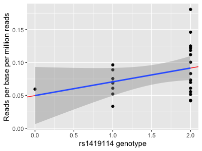
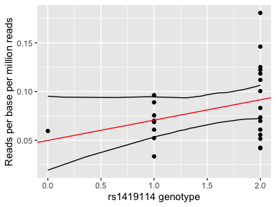
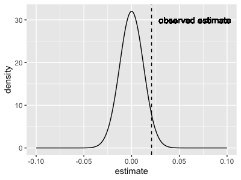
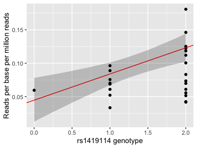

import Tabs from '@theme/Tabs';
import TabItem from '@theme/TabItem';

# Getting started: linear regression

### Prerequisites

For this tutorial you will need to have [installed R and Rstudio](/prerequisites/R.md). We will use R to analyse some expression
data.  I'll also be using the [tidyverse](/prerequisites/tidyverse.md) in examples.

### Getting the data

In this part of the practical we will use linear regression to estimate the possible effect of a genotype on gene expression
values. To get started, create a new empty directory and change into it:
```
mkdir regression_tutorial
cd regression_tutorial
```

The data can be found in [this
folder](https://github.com/whg-training/whg-training-resources/tree/main/docs/statistical_modelling/regression_modelling/data/) -
download the file `atp2b4_per_gene_data.tsv` and place it in your folder:

```
curl -O https://raw.githubusercontent.com/whg-training/whg-training-resources/main/docs/statistical_modelling/regression_modelling/data/atp2b4_per_gene_data.tsv
```

(Or use the [direct link](./data/atp2b4_per_gene_data.tsv).)

Start an R session and make sure you are working in this directory (e.g. using `setwd()` or `Session` -> `Set Working Directory`
in RStudio).  Let's load the data now and take a look:

```
library( tidyverse )
data = read_delim( "atp2b4_per_gene_data.tsv", delim = "\t" )
```

:::tip Note
I am using the [tidyverse](https://www.tidyverse.org) for these examples. If you don't
have it installed, either install it or use base R (e.g. `read.delim()`) instead.
:::

### What's in the data?

The data represents gene expression values (expressed as the mean number of RNA-seq reads per base, averaged across the gene
exons) for the gene *ATP2B4*. The data comes from [this paper](https://doi.org/10.1172/JCI94378) which reported that local
genotypes - including at the SNP rs1419114 - are associated with expression changes. Let's see if we can reconstruct this.

:::tip Note

Gene quantification is usually measured in more sophisticated units - 'transcripts per million' (TPM) or 'fragments per
kilobase per million'`(FPKM). They involve scaling by the computed value across all genes, which helps to normalise for
variation in expression of other genes.   We'll skip that here but you should consider it if doing a real transcriptomic
study.

:::

### Quick look at the genotypes:

First let's rename the genotype column - too long!

```
colnames(data)[4] = "genotype"
```

Let's look at this column now:
```
table(data$genotype)
```

:::tip Question

How many samples are in the data?  How many of each genotype?

:::

There's only one A/A genotype in the data. This might look a bit odd at first, but if you look up rs1419114 on
<https://ensembl.org> you'll see why. The frequency of the `A` allele in non-African populations is around $\frac{1}{10}$ or
less. So assuming the two chromosomes are drawn independently we'd only expect about $24 \times \frac{1}{100}$, so not so
surprising we got only one.

## Is rs1419114 associated with *ATP2B4* expression?

### Plotting the relationship

The best way to start figuring this out is by plotting:
```
library( ggplot2 )
(
    ggplot( data = data, aes( x = genotype, y = mean_reads_per_base ))
    + geom_violin()
    + geom_point()
    + xlab( "rs1419114 genotype" )
    + ylab( "Reads per base")
)
```


Hmm.  There looks visually like a correspondence.  

But wait!  Maybe that's just to do with how many reads were sequenced?

### Normalising read counts

Different runs of the sequencer produce different numbers of reads due to prosaic features to do with library preparation and
reagents and so on - producing variation in the counts that has nothing to do with biology.  So let's normalise by this number now:

```R
data$reads_per_base_per_million = 1E6 * data$mean_reads_per_base / data$total_reads
```

:::tip Note

I included added a factor of 1 million here just to bring the values back into roughly the right level. The values are the
*number of reads per base of the gene per million sequenced reads*. (For most work I suggest computing **TPM** instead.)

:::

Let's plot again:

```
p = (
    ggplot( data = data, aes( x = genotype, y = reads_per_base_per_million ))
    + geom_violin()
    + geom_point()
    + xlab( "rs1419114 genotype" )
    + ylab( "Reads per base per million sequenced reads")
)
```


It certainly looks visually like there's a relationship.

:::tip Note

Expression values are often explored after log-transforming them.  What difference does that make here?

:::

In what follows I will use 'expression' to mean these normalised expression values - just remember that these are a transformed
measurement of the actual expression of the gene.

### Running a regression

Let's estimate the relationship between genotype and mRNA expression by fitting a **linear regression model**.

To start off let's recode our genotype by the number of **G** alleles:

```
data$dosage = 0
data$dosage[ data$genotype == 'A/G' ] = 1
data$dosage[ data$genotype == 'G/G' ] = 2
data$dosage = as.integer( data$dosage )
table( data$dosage )
```

In R it's easy to fit a linear regression model: use `lm()`:

```
fit = lm(
    reads_per_base_per_million ~ dosage,
    data = data
)
```

The best way to look at the result of this is to use the `summary()` command to pull out the estimated coefficients and standard
errors. You can do that like this:

```
summary(fit)$coefficients
```

This will probably produce something like this:

                  Estimate Std. Error  t value  Pr(>|t|)
    (Intercept) 0.04981156 0.02097038 2.375329 0.0266714
    dosage      0.02090930 0.01245827 1.678347 0.1074296

To make sense of this, you have to understand something about the model that is being fit. In math syntax it can be written as
follows:

$$
\text{expression level} = \mu + \beta \times \text{genotype} + \text{\textit{gaussian noise}}
$$

Here $\mu$ and $\beta$ are the two parameters (output in the two rows above) - $\mu$ is the *intercept*, which captures the
average expression values; and $\beta$ is the *regression effect size parameter*. 
:::tip Note

$\beta$ should therefore be interpreted as: the estimated increase in expression associated with each additional copy of the 'G'
allele. It is often called the *association effect size*.

:::

All `lm` does is find the values of $\mu$ and $\beta$ which best fit the data.

### Interpreting the regression

So what does this output say?  It says that:

* the estimated mean expression level is $0.0498$.
* the *standard error* of this estimate is $0.0210$.
* the estimated *association effect size* is $0.0209$.
* the standard error of this estimate is $0.0125$.

Let's plot this on the above graph:
```
p = (
    ggplot( data = data, aes( x = dosage, y = reads_per_base_per_million ) )
    + geom_point()
    + xlab( "rs1419114 genotype" )
    + ylab( "Reads per base per million reads")
    + geom_abline( intercept = 0.0498, slope = 0.0209, col = 'red' )
)
print(p)
```

**Important**. The regression estimate of $\beta$ is the *slope* of fitted line.

:::tip Question

Which of these statements do you agree with?

* The rs1419114 'G' allele is associated with increased expression of *ATP2B4*.
* The rs1419114 'G' allele is not associated with increased expression of *ATP2B4*.
* We can't tell from these data if rs1419114 is associated with expression of *ATP2B4*.

:::

:::note Visualising the fit

If you did the [visualisation tutorial](/data_visualisation/data_visualisation_with_ggplot2/) you will have seen a method to get
ggplot2 to add a regression line and confidence interval (using `geom_smooth()`). How is that added?

The calculation can be done using `predict`. Specifically let's get it to predict the values and upper and lower confidence
intervals at a range of values from 0 to 2:
```
x = seq( from = 0, to = 2, by = 0.01 )
interval = predict(
    fit2,
    newdata = data.frame( dosage = x ),
    interval = "confidence",
    level = 0.95
)

interval_data = tibble(
    x = x,
    lower = interval[,'lwr'],
    upper = interval[,'upr']
)
print(
    p
    + geom_line( data = interval_data, aes( x = x, y = lower ))
    + geom_line( data = interval_data, aes( x = x, y = upper ))
)
```


Compare this with `geom_smooth`:
```
p + geom_smooth( method = "lm" )
```


They do... exactly the same thing!

Aside: If you want to get the cool shading from the `predict` method, that's doable too:
```
transparent_grey = rgb( 0, 0, 0, 0.2 )
print(
    p
    + geom_ribbon(
        data = interval_data,
        # need to set y here even though not used
        aes( x = x, y = 0, ymin = lower, ymax = upper ),
        fill = transparent_grey
    )
)
```

Yet another way to do this is to **sample some regression lines** from the model fit. This is easy with a bit of an approximation.
First get the variance-covariance matrix of the parameter estimates:

```
V = vcov(fit)
```

Now sample some regression lines from the fitted parameter distribution. To do this let's approximate it by a multivariate
gaussian. The sampling can be done using the `mvtnorm` package:

```
library( mvtnorm )
sampled_lines = rmvnorm( 100, sigma = V, mean = c( 0.0498, 0.0209 ) )
```

Now let's add quantiles from those sampled lines to the plot:
```
sampled_interval = tibble(
    dosage = x,
    lower = sapply( x, function(p) { quantile( sampled_lines[,1] + p * sampled_lines[,2], 0.025 ) } ),
    upper = sapply( x, function(p) { quantile( sampled_lines[,1] + p * sampled_lines[,2], 0.975 ) } )
)
print(
    p
    + geom_line( data = sampled_interval, aes( x = dosage, y = lower ))
    + geom_line( data = sampled_interval, aes( x = dosage, y = upper ))
)
```


Ok that looks a bit wobbly! But if you turn up the number of samples to (say) 10,000 you'll see this is the same thing again.

**Note.** This last way of plotting the regression confidence interval is helpful because it reveals how we think of the regression
fit: namely it determines a *joint distribution over the parameters*.

:::

### P-values and all that

In the above, the estimate was $0.0209$ with a standard error of $0.0125$.  What does that standard error mean?

One way of thinking about this is to imagine that the standard error tells us how spread-out the *sampling distribution of the
estimate is*. To understand this you have to think, not just of this dataset we have analysed, but of all the infinitely many other
datasets we could have obtained in the study.

:::tip Note
An odd feature of linear regression is that it treats the predictors (i.e. the genotypes) as fixed - they are treated as known
beforehand rather than as part of the 'observed data' for statistical purposes. So this is really about imagining possible
expression values for samples with the given genotypes.
:::

So: suppose there's actually no association and suppose - hypothetically - we were to repeat our estimate on a million different
sets of 24 samples (with the same genotypes). The *sampling distribution* of the estimate we would obtain would look something like
this:

```
sampling_distribution = tibble(
    x = seq( from = -0.1, to = 0.1, by = 0.001 )
)
sampling_distribution$density = dnorm( x, mean = 0, sd = 0.01245827 )

p2 = (
    ggplot( data = sampling_distribution )
    + geom_line( aes( x = x, y = density ) )
    + geom_vline( xintercept = 0.0209, linetype = 2 )
    + geom_text( x = 0.0209, y = 30, label = "observed estimate", hjust = -0.1 )
    + xlab( "estimate" )
    + ylab( "density" )
)
print(p2)
```



What this is saying is: our estimate is fairly well within the distribution that would be expected if there is no true association.
Whichever way you look at this it's hard to get excited about the association.

:::tip Note

The P-value given is a two-tailed p-value, and it is just compute as the **mass of our estimate under the two tails above**. That
looks like this:


To compute it, just compute this mass:

```
print(
    pnorm( -0.0209, mean = 0, sd = 0.0125 ) # mass under left tail
    * 2                                     # get right tail too
)
```

    [1] 0.09452432
    
**Note.** The p-value computed above is *almost* but not quite the same as the one listed in the regression output. That's because,
for linear regression, the distribution is actually T not gaussian. However, this doesn't matter much and gets less important as
the sample size grows, so I'm going to ignore it.

The point I am making here is that **the P-value gives no new information relative to the estimate and its standard error**. If you
had to choose what to report, it should be the estimate of $\beta$ and its standard error.

:::

Whichever way you dice it, this association does not look very exciting, right?

### Including covariates

But wait! There's another variable in the data. Specifically, the samples were either from bone marrow from adults or fetal liver.
Maybe we should be including that in the regression?

Including covariates is easy in linear regression - this is one of its great strengths.  Try it now:
```R
fit2 = lm(
    reads_per_base_per_million ~ dosage + stage,
    data = data
)
summary(fit2)$coefficients
```

:::tip Note

What do these 'fetal' and 'adult' monikers mean? Well, mature red blood cells (erthrocytes) are *enucleated* - they don't have
nuclei. They are basically bags of haemoglobin, and although there might be a few fragments of RNA floating around, it will be
pretty degraded.  They are not much good for an expression study.

For this study the authors therefore instead worked with haematopoetic stem and progenitor cells (HSPCs) from fetal liver and adult
bone marrow, and experimentally differentiated them into *proerythroblasts*. They then measured expression in these still-nucleated
cells.

(This issue of needing to differentiate is why red cells are not found in many expression databases - such as
[GTEx](http://gtexportal.org/home/index.html).)

:::

Your fit might look something like this:

                   Estimate Std. Error   t value     Pr(>|t|)
    (Intercept)  0.04473606 0.01650016  2.711250 0.0130793191
    dosage       0.03918108 0.01086677  3.605588 0.0016614274
    stagefetal  -0.04770967 0.01241647 -3.842451 0.0009462768

The model is now:
$$
\text{expression} = \mu + \beta\times\text{genotype} + \gamma \times \text{stage} + \text{\textit{gaussian noise}}
$$

and we have three parameter estimates.  

What has happened?

- The intercept has got slightly lower
- The estimate of $\beta$ is now about twice as large
- The standard error of $\beta$ is smaller
- And the new parameter for fetal/adult status, $\gamma$, is negative.

The parameter estimate for the genotype `dosage` is now $0.0392$ - and that's now *four times the standard error*. As the P-value
shows that's way out in the tail of the sampling distribution.

<Tabs>
<TabItem value="code" label="Plot code">

```
p = (
    ggplot( data = data, aes( x = dosage, y = reads_per_base_per_million ) )
    + geom_point()
    + xlab( "rs1419114 genotype" )
    + ylab( "Reads per base per million reads")
    + geom_abline( intercept = 0.04473606, slope = 0.03918108, col = 'red' )
)

sampled_lines = rmvnorm( 10000, sigma = vcov( fit2 ), mean = c( 0.04473606, 0.03918108, -0.04770967 ) )
sampled_interval = tibble(
    dosage = x,
    lower = sapply( x, function(p) { quantile( sampled_lines[,1] + p * sampled_lines[,2], 0.025 ) } ),
    upper = sapply( x, function(p) { quantile( sampled_lines[,1] + p * sampled_lines[,2], 0.975 ) } )
)
print(
    p
    + geom_ribbon(
        data = sampled_interval,
        aes( x = dosage, y = 0, ymin = lower, ymax = upper ),
        fill = transparent_grey
    )
)

# Plot the tail distribution
sampling_distribution = tibble(
    x = seq( from = -0.05, to = 0.1, by = 0.001 )
)
sampling_distribution$density = dnorm( sampling_distribution$x, mean = 0, sd = 0.01086677 )

p2 = (
    ggplot( data = sampling_distribution )
    + geom_line( aes( x = x, y = density ) )
    + geom_vline( xintercept = 0.03922, linetype = 2 )
    + geom_text( x = 0.03922, y = 35, label = "estimate", hjust = -0.1 )
    + xlab( "estimate" )
    + ylab( "density" )
)

lower_tail = which( sampling_distribution$x <= -0.03922 )
upper_tail = which( sampling_distribution$x >= 0.03922 )

print(
    p2
    + geom_area( data = sampling_distribution[ lower_tail, ], aes( x = x, y = density ), fill = transparent_grey )
    + geom_area( data = sampling_distribution[ upper_tail, ], aes( x = x, y = density ), fill = transparent_grey )
)

```
</TabItem>
<TabItem value="image" label="Updated plot" default>



        
</TabItem>
</Tabs>

:::tip Question

Which of these statements do you agree with now?

* The rs1419114 'G' allele is associated with increased expression of *ATP2B4*.
* The rs1419114 'G' allele is not associated with increased expression of *ATP2B4*.
* We can't tell from these data if rs1419114 is associated with expression of *ATP2B4*.

Should we include the stage as a covariate, or shouldn't we?

:::

### How good is the fit?

Before moving on we ought to check that the model is at all sensible for the data.

One way to do this is the **quantile-quantile** or *qq plot**. The qqplot is used to compare an expected distribution (which, in
this case, can be the fitted distribution of the expression values) to the actual observed distribution.

To do this let's examine the **residuals** - that is, the difference between the observed values and the fitted straight-line
model. If the model is accurate, these residuals should look like 'gaussian noise' - i.e. be as if drawn from a Gaussian
distribution.  We can check this by comparing them to quantiles of a gaussian now:

```
qq_data = tibble(
    observed = sort( fit2$residuals ),
    expected = qnorm(
        1:nrow(data)/(nrow(data)+1),
        sd = sigma( fit2 )              # sigma() is the fitted residual standard error
    )
)
print(
    ggplot(
        data = qq_data,
        aes( x = observed, y = expected )
    )
    + geom_point()
    + geom_abline( intercept = 0, slope = 1, colour = "red" )
)
```


This plot says the fit is pretty good.

If you want to go further than this, one way is to compute a P-value comparing the distribution of residuals against the fitted
model.

:::tip Challenge Question

Compute a P-value for the residuals against the fitted model.

**Hint** if the residuals are gaussian with variance $\sigma^2$, then their sum is gaussian with variance equal to $N\sigma^2$.
How far out in the tail is the sum of observed residuals?

:::

## Next steps

Now let's look at a slightly different example using [logistic regression](./logistic_regression_1.md).
