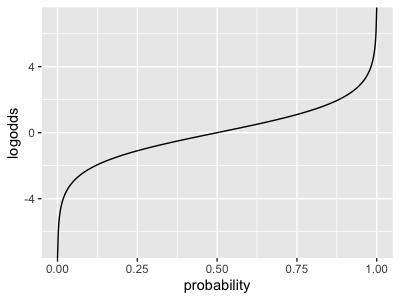

import Tabs from '@theme/Tabs';
import TabItem from '@theme/TabItem';

# Logistic regression

Before moving on let's try a different type of regression: *logistic regression*. Unlike linear regression, which models a
continuously varying outcome variable (such as expression levels), logistic regression models a binary 0/1 outcome - or more
generally *binomial* (count) or *multinomial* (categorical) outcome.

### Prerequisites

To get started, download the file 'o_bld_group_data.csv' from [this folder](The data can be found in [this
folder](https://github.com/whg-training/whg-training-resources/tree/main/docs/statistical_modelling/regression_modelling/data/) - 
and place it in your folder.  E.g. from the command line:

```
curl -O https://github.com/whg-training/whg-training-resources/tree/main/docs/statistical_modelling/regression_modelling/data/o_bld_group_data.tsv
```

(Or use the [direct link](./data/o_bld_group_data.tsv).)

Now load it into your R session:
```
data = read_delim( "o_bld_group_data.tsv", delim = "\t" )
```

### What's in the data?

The data contains genotype calls for the genetic variants rs8176719 and rs8176746, measured in a set of severe malaria cases and
population controls from several African countries. These variants lie in the *ABO* gene and together encode the most common ABO
blood group types.

The data were collected by seperatecase-control studies operating in each country and were genotyped by
[MalariaGEN](https://www.malariagen.net). They were described in [this paper](https://doi.org/10.1038/s41467-019-13480-z).

Before starting explore the data (e.g. using `View()`, `table()` and so on) and make sure you know what is in there. You should
see:

* Information on the sample identifier and sex, and ethnicity

* The `status` column, which indicates if the sample was collected as a case (i.e. came into hospital with severe symptoms of
  malaria) or a control

* A column with the rs8176719 genotypes and one with the rs8176746 genotypes.

* And some columns marked `PC_1` - `PC_5`.

:::tip Warm-up question

O blood group is encoded by a homozygous deletion (`-/-` at rs8176719). What is the frequency of O blood group in this sample in
each population?

In non-O individuals, B blood group is encoded by the 'T' allele of rs8176746. What is the frequency of B blood group in
non-O-blood group individuals in each country?
:::

::tip Note

If you want to see what the genetic effect of these variants is, I highly recommend looking it up in the [UCSC genome
browser](https://genome-euro.ucsc.edu/) and/or the [Ensembl genome
browser](https://www.ensembl.org/homo_sapiens/Variation/Summary?v=rs8176719) . You should see that rs8176719 is a *frameshift
variant* within *ABO* gene. (Which exon is it in?). Chromosomes with the deletion allele (like the GRCh38 reference sequence)
produce a malformed enzyme that prevents synthesis of A or B antigens (they cause a loss of glycosyltransferase activity). 

(Of course, humans have two copies so if the sample is heterozygous then it's quite possible the other copy does express A or B.)
:::

:::tip Question

If you have time - figure out where rs8176746 is and what effect it has on the protein. (E.g. you can do this by zooming into the
variant in the UCSC browser, figuring out the amino acid sequence (remembering that it is transcribed on the reverse strand), and
comparing this to a [table of the genetic code](https://en.wikipedia.org/wiki/Genetic_code#/media/File:Notable_mutations.svg).

:::

###  Running the regression

A and B antigens are bound to the surface of red cells and tend to stick to things - it's plausible malaria parasites might
exploit this. Let's use this data to test to see if O blood group is associated with malaria status.

To get started let's create a new variable indicating 'O' blood group status:
```
data$o_bld_group = NA           # in case any rs8176719 genotypes are missing
data$o_bld_group[ data$rs8176719 == '-/-' ] = 1
data$o_bld_group[ data$rs8176719 == '-/C' ] = 0
data$o_bld_group[ data$rs8176719 == 'C/C' ] = 0

```

Also - for best results let's make sure our `status` variable is coded the right way round (with "CONTROL" as the baseline):
```
data$status = factor( data$status, levels = c( "CONTROL", "CASE" ))
```

Running a logistic regression is very much like a linear regression, except we use `glm` in place of `lm`:
```
fit = glm(
    status ~ o_bld_group,
    data = data,
    family = "binomial"  # needed to specify logistic regression
)
```

As before we can now see the coefficients:
```
summary(fit)$coeff
```

Woah.  The estimate is $-0.334 / 0.039 = 8.6$ standard errors from zero!

### Including covariates.

But wait!  Just as before there are some covariates in the data.

Here there is one covariate we should *definitely* include: the country. This is because the samples were collected as a
case/control study seperately in each country. For all we know there were different sampling strategies or with difference numbers of
cases/controls.  Maybe this is skewing results?
```
fit2 = glm(
    status ~ o_bld_group + country,
    data = data,
    family = "binomial"  # needed to specify logistic regression
)
summary(fit2)$coeff
```
:::tip Note

This illustrates the way that regression handles categorical variables like the country by default.
One country is chosen as a 'baseline' (in an ad hoc manner) and the variation in the other countries are measured against it.
Which country did `glm` pick as the baseline here?  Which countries have higher O blood group frequencies and which have lower?

:::

:::tip Note

If you want to control which country is the baseline, turn the column into a factor with the right ordering. For example let's
order countries roughly west-to-east:
```
data$country = factor(
    data$country,
    levels = c(
        "Gambia",
        "Ghana",
        "Cameroon",
        "Tanzania",
        "Kenya"
    )
)
```
Now re-run the regression - can you see the difference?
:::

What about ethnicity? For example maybe O blood group is more common in some ethnic groups, and those happen to be less prone to
getting severe malaria or less likely to get enrolled in the study?

```
fit3 = glm(
    status ~ o_bld_group + country + ethnicity,
    data = data,
    family = "binomial"  # needed to specify logistic regression
)
summary(fit3)$coeff
```

:::tip Note
This produces a long output!  Make sure you know what it's showing.
:::

We could also try the principal components as well. They are computed from genome-wide genotypes and reflect population structure
in each country. Because of the way these have been computed (seperately in each country) the right way to include them is using
an *interaction term*.  E.g. for the first principal component:
```
fit4 = glm(
    status ~ o_bld_group + country + country * PC_1,
    data = data,
    family = "binomial"  # needed to specify logistic regression
)
summary(fit4)$coeff
```

:::tip Question

Can you 'destroy' the association by including covariates?
:::

## Interpreting logistic regression parameters.

The logistic regression model is similar to the linear regression model, but a bit more complex at first sight.
It works like this: start with same *linear predictor* as for linear regression:
$$
\mu + \beta \times \text{genotype} + \gamma \times country + ...
$$

...but now instead of modelling the outcome directly as:
$$
Y = \text{linear predictor} + \text{noise}
$$

we model the outcome as having a probability that depends on this predictor.  The full function is:
$$
P(\text{case}) = \frac{e^(\text{linear predictor})}{1 + e^(\text{linear predictor})}
$$

Or alternatively:
$$
\text{log odds}(\text{case}) = \text{linear predictor}
$$

To understand this statement you need to understand what the log-odds is - read on to find out!

### Probabilities

Our regression will model the *probability that the sample is a case*. (The probability is a number from zero to one that
expresses how confident we are (given the model) that the sample is a case. For example, if
$$
P(\text{case}|\text{model}) = 1or 1
$$
then we are completely certain the sample is a case or control, while if
$$
P(\text{case}|\text{model}) = 0.5
$$
then it is 50-50.

:::warning Important!

Like all probabilities, these probabilities are *conditional on a model* - in this case the logistic regression model. It **makes
no sense** to say "the probability of being a case" without reference to a model. Your logic will catch
fire if you ignore this rule!

:::

### Odds

The **odds** is just a rescaling of the probability - you can go back and forth between them like this:
$$
\text{odds}(X) = \frac{\text{probability}(X)}{1-\text{probability}(X)} \quad \text{and} \quad \text{probability}(X) = \frac{\text{odds}(X)}{1 + \text{odds}(X)}
$$

::tip Note
From now on I'll write $P(X)$ instead of $\text{prob}(X)$ for probabilities - but I'll keep using $\text{odds}$ for odds.
:::

:::tip Note
As in the above warning - the probabilities and odds are *always* conditional on a model, even if (like above) I haven't written it in
there... have I made that clear?
:::

To get a sense of this let's plot the probability -> odds conversion now:
```
odds <- function(p) { p / (1-p) }
x = seq( from = 0, to = 1, by = 0.001 )
plot_data = tibble(
    probability = x,
    odds = odds(x)
)
p = (
    ggplot( data = plot_data, aes( x = probability, y = odds) )
    + geom_line()
    + ylim( 0, 10 )
)
print(p)
```
[!img](images/odds.png)

Play around with the axes a bit to explore different parts of this curve (try `+ ylim( 0, 1)` for example.)

You should see:

* The probability (x axis) goes from 0 to 1
* The odds (y axis) goes from 0 to infinity
* Near zero, the two are roughly equal, but they diverge more as probabilities get higher.

### Log-odds

What about the log odds?  It's just the logarithm of the odds:
```
logodds <- function(p) { log( p/(1-p)) }
```

Plot the log-odds as well.  You should see something like:


This function (that we've called `logodds`) is normally called the [logit function](https://en.wikipedia.org/wiki/Logit). You
should see that the log-odds is on a scale from minus to positive infinity, i.e. the whole real line.

Finally - let's also plot the inverse of the logit function - that is, the function that takes us from log-odds space back to
probability space.  It is called the [logistic function](https://en.wikipedia.org/wiki/Logistic_function) and looks like this:

```
logistic <- function(x) { exp(x) / (1 + exp(x)) }
```

Plot that function now:
```
x = seq( from= -6, to = 6, by = 0.01 )
plot_data = tibble(
    logodds = x,
    probability = logistic(x)
)
print(
    ggplot( data = plot_data, aes( x = logodds, y = probability ))
    + geom_line()
    + geom_vline( xintercept = 0, linetype = 2, col = 'red' )
)
```


The **logistic function** maps the whole real line onto $(0,1)$ in a non-linear fashion.  

Play around with these functions a bit to make sure you understand them. 

:::tip Question

Check your `logistic` and `logodds` functions really inverse to each other. What probabilities correspond to negative log-odds?

:::

### The logistic regression model

The logistic regression model can now be written:
$$
\text{log-odds}(\text{case}) = \mu + \beta \times \text{genotype} + \gamma \times \text{country} + ...
$$

### Interpreting the parameters revisited

We can now interpret the parameters, namely:

:::tip Interpretation

The parameter estimate represents the **increase in log-odds associated with a unit increase in the predictor**.

:::

To really understand this, go back to the first fit (the one with no covariates):
```
summary(fit)$coeff
```

                  Estimate Std. Error   z value    Pr(>|z|)
    (Intercept)  0.1489326 0.02630689  5.661354 1.50183e-08
    o_bld_group -0.3342393 0.03889801 -8.592709 8.49425e-18
    

The estimate for o blood group is $-0.334$.  Now seperately, let's just make a table of the genotypes and outcomes:
```
table( data$status, data$o_bld_group )
```

               0    1
    CONTROL 2690 2684
    CASE    3122 2230

Let's think of this matrix as $\left(\begin{matrix} a & b \\ c & d\end{matrix}\right)$. About the simplest way we could measure
any difference in distribution is to take the ratio of the odds of being a case in each column:
$$
\text{odds ratio} = \frac{a/c}{b/d} = \frac{ad}{bc}
$$

Work this out for your table now:
```
odds_ratio = (2690*2230) / (3122*2684)
```

You should get a value like $0.7158825$.

Now for the magic trick:
```
exp( -0.3342393 )
```

    [1] 0.7158825

Hey presto!  Exponentiating the fitted parameter gives us the same value.

::tip Note

You might be wondering how 'estiamting the logarithm of the odds ratio' and the 'increase in log-odds' are related. The answer is
that `log()` transforms multiplication to addition - and division to subtraction. So the log of the odds ratio, is just the
difference in log-odds - these two statements say the same thing.

:::

In this way logistic regression provides an extension of the basic estimate that you can make from a 2x2 table as above. However,
logistic regression gives us lots of flexibility to include covariates that are much harder with the table.

## O blood group

It looks like O blood group is associated with a severe malaria outcome.  

:::tip Question

Which of these statements to you agree with:

* O blood group is associated with lower chance of having severe malaria
* O blood group is protective against severe malaria
* We can't tell if O blood group is protective against severe malaria

:::

:::tip Question

What do you make of the A/B blood group SNP?  Is it also associated?

:::

:::tip Challenge question

To do a really solid analysis, we should *look at the estimates across countries*. Create a forest plot which should have:

* one row per conutry
* on each row, plot the regression estimate just from that country
* Underneath each point plot the **95% confidence interval**.  

(The 95% confidence interval is obtained by going out 1.96 times the standard error in each direction from the point estimate:

$$

\text{95% CI} = \hat{\beta} \pm 1.96 * \text{se}

$$

Are the estimates consistent across countries?
:::
