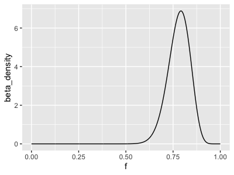

import Tabs from '@theme/Tabs';
import TabItem from '@theme/TabItem';

# Parameteric statistical modelling

So far we've fit some linear and logistic regression models and seen how they behave on some real datasets.

Before going on let's put this in some theoretical context.  

## Parametric statistical model basics

Regression models are an example of a *parametric statistical model*. The structure of these models is pretty simple. First, we
imagine we have observed some *data* that we want to use to make inferences about the world. To model it, we create a
*probabilistic model* depending on some key parameters of interest:

$$
\text{probability}(\text{data}|\text{parameters})
$$

or for brevity just

$$
\text{P}(\text{data}|\text{parameters})
$$

The model simply says "how likely was this particular data value if we assume this model with these parameters."

:::tip Note

Formally speaking $P(\cdots)$ is only a probability - a number between 0 and 1 - if what's in the bracket is a discrete
quantity. For example

$$
P(\text{pick a red sock}|\text{$20\%$ of socks are red}) = 0.2
$$

However, for continuous quantities $P(\cdots)$ is instead a *probability density*, which means you have to integrate it over some
range of values to get a probability. We'll return to that distinction below.

:::

The function $P(\text{data}|\text{parameters})$ is known as the **likelihood function**: it tells us how 'likely' our data was
under any chosen set of parameters. It is extremely important to realise that the 'probabilities' involved are nothing more than
*modelled probabilities* - i.e. they only exist assuming the model holds. Formally speaking they do not represent anything about
the 'real world', but just to do with the model. The **holy grail of statistical modelling** is then to find models that
describe data well enough that we can trust them to give sensible inferences.

### A frequency example

To give a sense of this, consider the genotype counts we observed in the [linear regression example](./linear_regression_1.md). The genotype counts were:

    A/A: 1
    A/G: 8
    G/G: 15   

If we count up the number of each allele this amounts to 10 'A' alleles and 38 'G' alleles. (That's 48 in total - is that the right
number?)

Let's model these counts using the simple likelihood function depending on a single parameter $f$ - the frequency of the 'G'
allele.

If we look at one chromosome, the chance of seeing a 'G' allele is $f$ and the chance of seeing an 'A' allele is $(1-f)$. Therefore
taking a product across samples,

$$
P(N_G=38|N=48,f) = \text{const} \times f^{N_G} \cdot (1-f)^{N_A}
$$

where $N_A = 10$ and $N_G = 38$ are the numbers of the two alleles, and $N = N_A + N_G$ is the total number of chromosomes sampled.
(I'll come back to the constant in a moment.).

Plot that now and see what it looks like:

```R
plot_data = tibble(
    f = seq( from = 0, to = 1, by = 0.001 )
)
plot_data$likelihood = plot_data$f^38 * (1-plot_data$f)^10
print(
    ggplot(
        data = plot_data,
        mapping = aes( x = f, y = likelihood )
    )
    + geom_line()
)
```


The likelihood function is very peaked around a value near $0.8$. In fact, if you zoom into this maximum likelihood estimate value
you'll soon find it is the value you would have estimated anyway from the counts - namely $38/48 = 0.7916$.

:::tip What's that about a constant?

If you look at the Y axis, you'll see that the values are very very small indeed.  So is this data somehow vanishingly unlikely?

In fact this is due to the 'constant' in the above likelihood expression, which we skipped in the calculation above. This occurs
because we are considering the *counts of the observations* as opposed to the full *sequence of observations*. Because of this, the
likelihood is not just the product of terms for individual samples like we implemented above - we need an adjustment that accounts
for the fact that the same counts might come in many different orders.

If you've studied this before you'll probably recognise the above as a **binomial distribution** - and the appropriate constant is
the binomial coefficient
$$
{N_A+N_G \choose N_G}
$$

which is the number of ways we could obtain exactly $N_G$ 'G' alleles in a sample of $N_A+N_G$ chromosomes.

If you compute this number in R:
```
choose( 48, 38 )
```

You'll see it is absolutely enormous - there are over 6.5 billion ways to produce these counts in a sample of 48 chromosomes.

If you build this factor into your likelihood computation you'll see something more reasonable on the y axis:


:::

So is all this just a more complicated way to compute a value we could have figured out anyway? Well, **no.** The likelihood
function goes further than the estimate because it provides a **quantification of how much uncertainty there is.** For example, in
the above example, $0.7916$ is the 'maximum likelihood estimate' but values from (say) around $0.74$ up to around $0.84$ all make
the data relatively likely (likelihood > 0.1), with the likelihood tailing off as we move further away.

## From the likelihood to parameter inference

You may have noticed a flaw in what is described above. The likelihood function models the probability of the data given the
parameters, but what we really want to know is *what are the parameter values*. That is, we would really like:

$$
P( \text{parameters}|\text{data}) \quad\text{instead of}\quad P(\text{data}|\text{parameters})
$$

There are two general approaches that are taken to this problem.

The **frequentist** approach is to ignore this problem, take the maximum likelihood estimate as the best estimate, and instead ask
how this estimate would vary under repeated sampling. That's what we did in the [earlier example](./linear_regresson_1.md).

The **bayesian** approach instead addresses it directly, by applying Bayes' rule to link the two terms above.

### The bayesian appoach

We will call $P( \text{parameters}|\text{data})$ the **posterior**. It is the probability of the given parameters, *after* seeing the
data - hence the name.

Bayes' rule tells us how to express the posterior in terms of the likelihood.  Specifically:

$$
P( \text{parameters}|\text{data}) = \frac{P(\text{data}|\text{parameters}) \times P(\text{parameters})}{\text{a normalising constant}}
$$

The terms in this formula have specific names:

* $P(\text{data}|\text{parameters})$ is the *likelihood function*.  This is what we described above.

* $P(\text{parameters})$ is a *prior* or *prior distribution*. It is supposed to say what our belief in the parameters is before we
  have seen the data.
  
* The term on the left, $P(\text{parameters}|\text{data})$ is the *posterior distribution*. It says what our belief in the
  parameters should be *after* seeing the data.
  
So we could re-write that as:

$$
\text{posterior} = \frac{\text{likelihood} \times \text{prior}}{\text{normalising constant}}
$$  

The 'normalising constant' is just there to make sure that the posterior is really a probability density - that is, that is sums to
one over all possible parameter values. (It is 'constant' because it doesn't depend on the parameters).

### Frequency estimation example

For example, in the frequency example above, let's suppose we use a 'uniform' prior on the frequency (any frequency equally
likely). Then the posterior distribution will have exactly the same form as the likelihood (i.e. a binomial distribution)
**except** that it has a different normalising constant - it is:

$$
P(f|N_A,N_G) = \text{constant} \times f^{N_G}\cdot(1-f)^{N_A}
$$

where the constant is now computed so that the expression integrates to 1 over the whole of parameter space (as opposed to over all
of data space, as it was earlier). 

For this example, it turns out that this constant can be readily computed and it is given by a special function known as the [beta
function](https://en.wikipedia.org/wiki/Beta_function). Specifically the constant is:

$$
\text{constant} = \frac{1}{B(N_A+1,N_G+1)}
$$

The resulting distribution is called the [beta distribution](https://en.wikipedia.org/wiki/Beta_distribution) and it is
(unsurprisingly) already implemented in R - making it easy to work with.

To check I'm not making this up, try plotting the beta distribution density now:

```
plot_data$beta_density = dbeta(
    plot_data$f,
    shape1 = 38+1, # need to add one to counts, due to how beta is defined
    shape2 = 10+1  # ditto
)
p = (
    ggplot(
        data = plot_data,
        mapping = aes( x = f, y = beta_density )
    )
    + geom_line()
)
print(p)
```


If you compare this to the above you should see that this is *identical to the likelihood function* except for a change in y axis
scale.

This beta distribution is therefore our posterior - it represents our full 'parameter inference' for the model. This is very
useful! For example, suppose we wanted to find an interval that has 95% chance of containing the true frequency:

```
quantiles = qbeta(
    c( 0.025, 0.975 ),
    shape1 = 38+1,
    shape2 = 10+1,
    lower.tail = T
)

print(
    p + geom_vline( xintercept = quantiles, linetype = 2, col = 'red' )
)
```


In other words, after seeing these data, and **as long as we believe our likelihood and prior**, we should have 95% belief that the
frequency is between $0.66$ and $0.88$.

## Example: linear regression

For example, in the [linear regression example](./linear_regression_1.md):

* the data was the normalised expression values; and

* The three parameters (in the simplest version) were: the baseline parameter $\mu$, the association effect size parameter which we
  called $\beta$, and also a *residual variance* parameter $\sigma^2$ (which we used when making a quantile-quantile plot).

Right away you'll see something peculiar about the regression model: even though the sample genotypes were certainly data, we
didn't treat them as data in the regression - we treated them as 'known beforehand'. Indeed this model only modelled the outcome
variable given the genotypes.

### Four formulations

Let's write that model out in full now. To keep the notation simple we will use $E$ to mean 'the expression value' and $G$ to mean
'the genotype' for a given sample - if they take specific values we'll denote that by $E=e$ and $G=g$ and so on. With that notation
here are four ways to write the same model:

:::tip Four ways to write the linear regression model
<Tabs>
    <TabItem value = "distribution_notation" label="Distribution notation">

**First** we could use 'distribution notation'. The symbol $N$ is generally used to indicate a gaussian or normal distribution, so
we could write the model as:

$$
P(E=e|G=g,\mu,\beta,\sigma^2) = N\left( e| \mu + \beta g, \sigma^2 \right)
$$

This can be read as "the probability (density) that $E$ equals the particular value $e$, given that the genotype $g$ and the
parameters, is obtained by evaluating the gaussian probability density with the linear predictor $\mu+\beta g$ as mean and variance
equal to $\sigma^2$, at the value $e$".
</TabItem>
<TabItem value = "distribution_notation2" label="Shorter distribution notation">

A **second**, shorter way to write the same thing is:

$$
E|G,\mu,\beta,\sigma^2 \sim  \mathcal{N}\left( \mu + \beta G, \sigma^2 \right)
$$

This can be read as "The expression value, given the genotype and parameters, has a gaussian distribution with mean $\mu+\beta G$
and variance $\sigma^2$".
</TabItem>
<TabItem value = "rv_notation" label="Random variable notation">

A **third** way to write this is to use 'random variable notation':
$$
E =  \mu + \beta G + \epsilon \quad\text{where}\quad \epsilon \sim N(0,\sigma^2)
$$

This is [the same way we wrote the model before](./linear_regression_1.md#running-a-regression), but makes explicit how the 'noise'
is modelled in terms of the parameters.
</TabItem>
<TabItem value = "full_density_notation" label="Written out in full">

**Finally** we could just write out the full expression for the normal distribution directly. If you look up the [expression for the
gaussian density](https://en.wikipedia.org/wiki/Normal_distribution) you'll figure out that the formula is:

$$
P(E|G, \mu,\beta,\sigma^2) = \frac{1}{\sqrt{2\pi\sigma^2}}\cdot e^{\frac{\left(E- (\mu + \beta G)\right)^2}{\sigma^2}}
$$
</TabItem>
</Tabs>

:::

All these four ways of writing the model say the same thing - all are useful in different circumstances.

:::tip Queston

Make sure you understand at least one of the above expressions. They all express the probability density of the expression value in
terms of the linear predictor $\mu + \beta g$ and the residual variance $\sigma^2$.

:::

### Regression or a joint model?

When are we justified in not including the genotype as part of the model?

To figure this out, let's consider instead a joint probability model for *all* the data - both the expression and genotype values:

$$
P\left( E, G | \text{parameters} \right)
$$

According to the rules of probability, this can be expanded as a product of two terms:
$$
P\left( E, G | \text{parameters} \right) = P\left( E | G, \text{parameters} \right) \cdot P\left( G | \text{parameters} \right)
$$

So *if* we can assume that the relevant parameters in both terms are unrelated to each other - then we might be justified in
working with just one of the terms.

For example, in the [expression example shown earlier](./linear_regression_1.md) the genotypes weren't known beforehand, but were
measured in the sample. A simple full model might be to say that the genotypes were drawn with some frequency $f$. The full
likelihood would then split as:

$$
P\left( E=e | G=g, \mu, \beta \right) \cdot P\left( G=g | f \right)
$$

The first term is just the regression likelihood we had before. So what this says is that *if* we assume the frequency and effect
size parameters don't influence each other, we might be justified in just focussing on the linear regression here.

If, on the other hand, we thought that the frequency and effect size might be related (for example perhaps rarer genetic variants
tend to have larger effect sizes) then focussing just on the first term wouldn't be justified.


