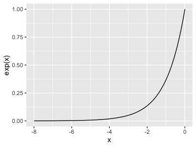
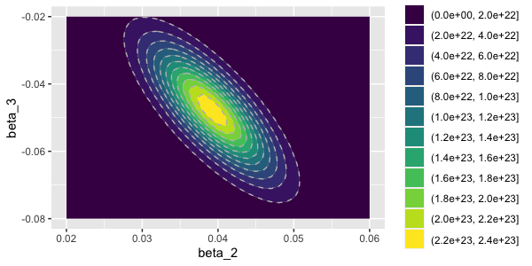
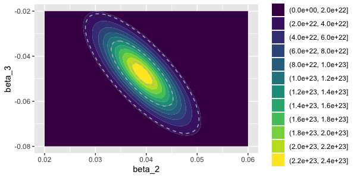
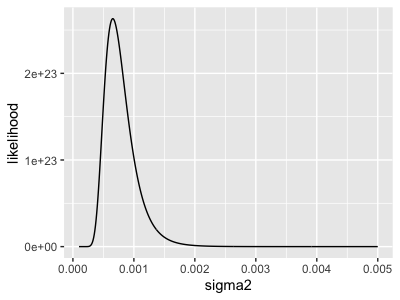

import Tabs from '@theme/Tabs';
import TabItem from '@theme/TabItem';

# Regression as a parameteric statistical model

So far we've fit some [linear](./linear_regression_1.md) and [logistic](./logistic_regression_1.md) regression models and seen how they behave on some real datasets.

Before going on let's put this in some theoretical context and ask: what are we doing when we fit the model anyway?

## Parametric statistical model basics

Regression models are an example of a *parametric statistical model* - a statistical model of data governed by a finite set of
parameters.

The structure of these models is pretty simple. First, imagine we have observed some data that we want to use to make
inferences. To model it, we create a probabilistic model that depends on some key parameters of interest:

$$
\text{probability}(\text{data}|\text{parameters})
$$

or for brevity just

$$
\text{P}(\text{data}|\text{parameters})
$$

This model simply says "how likely was this particular data value if we assume this model with these parameters."

**Definition.** The function $P(\text{data}|\text{parameters})$ is called the **likelihood function** for the model. It tells us
how 'likely' our data is for any chosen set of parameters.

**Note.** It is extremely important to realise that the 'probabilities' involved in a likelihood function are nothing more than
*modelled probabilities* - i.e. they only exist assuming the model holds. Formally speaking they do not represent anything about
the 'real world', but just to do with the model. The **holy grail of statistical modelling** is then to find models that describe
data well enough that we can trust them to give sensible inferences.

:::tip Note

Formally speaking $P(\cdots)$ is only a probability if what's in the bracket is a discrete quantity. For example, in the following
expression, there are a finite number of possible outcomes so the symbol is a probability:

$$
P(\text{pick two red socks}|\text{proportion of red socks in drawer is $\theta$}) = \theta^2
$$

However, for continuous quantities such as
$$
P(x = 5|\text{$x$ has a standard normal distribution})
$$

then $P(\cdots)$ is instead a *probability density*. This means it has be integrated over some range of values to get a
probability. The [probability cheatsheet](/statistical_modelling/probability_cheatsheet.md) has more on this. However, in many
places this won't affect our notation and we'll use $P(\cdot)$ for both.

:::

### An allele frequency example

To give a sense of this, consider the genotype counts we observed in the [linear regression example](./linear_regression_1.md).
They were:

    A/A: 1
    A/G: 8
    G/G: 15   

If we count up the number of each allele this amounts to 10 'A' alleles and 38 'G' alleles. (That's 48 in total - making sense
because we have 24 diploid individuals.)

Let's model these counts using a simple likelihood function depending on a single parameter $f$ - the frequency of the 'G'
allele.

If we look at one chromosome, the chance of seeing a 'G' allele is $f$ and the chance of seeing an 'A' allele is $(1-f)$. Therefore
for this observation the likelihood is
$$
    P(\text{allele}|f) = 
    \begin{cases}
        f & \text{if the allele is 'G'} \\
        1-f & \text{if the allele is 'A'}
    \end{cases}
$$

Let's treat the different observed chromosomes as independent - then the likelihood is obtained by taking a product across samples.
This gives:

$$
P(\text{alleles}|N=48,f) = \prod_i P(\text{allele}_i|f)
$$

An easy computation shows that this boils down to:
$$
P(\text{alleles}|N=48,f) = f^{N_G} \cdot (1-f)^{N_A}
$$

where $N_A = 10$ and $N_G = 38$ are the numbers of the two alleles, and $N = N_A + N_G$ is the total number of chromosomes sampled.

Lastly - if we are summarising by $N_G$ and $N_A$, then the actual order of samples doesn't matter. The number of ways of seeing
$N_G$ 'G' alleles among $N$ sampled chromosome is ${N \choose N_G}$, so the total likelihood becomes:

$$
P(N_G|N=48,f) = {N \choose N_G} \cdot f^{N_G} \cdot (1-f)^{N_A}
$$

```R
plot_data = tibble(
    f = seq( from = 0, to = 1, by = 0.001 )
)
plot_data$likelihood = choose( 48, 38 ) * plot_data$f^38 * (1-plot_data$f)^10
print(
    ggplot(
        data = plot_data,
        mapping = aes( x = f, y = likelihood )
    )
    + geom_line()
)
```


The likelihood function is very peaked around a value near $0.8$. In fact, if you zoom into this maximum likelihood estimate value
you'll soon find it is the value you would have estimated anyway from the counts - namely $38/48 = 0.7916$.

So is all this just a more complicated way to compute a value we could have figured out anyway? Well, **no.** The great advantage
of the likelihood function is that it provides a **quantification of how much uncertainty there is.** For example, in the above
example, $0.7916$ is the 'maximum likelihood estimate' but values from (say) around $0.74$ up to around $0.84$ clearly all make the
data relatively likely (likelihood > 0.1), with the likelihood tailing off as we move further away.

## From the likelihood to parameter inference

You may have noticed a flaw in what is described above. The likelihood function models the probability of the data given the
parameters, but what we really want to know is what the best parameter values are.  That is, we would really like to know:

$$
P( \text{parameters}|\text{data})
$$

instead of

$$
P(\text{data}|\text{parameters})
$$

There are two general approaches that are taken to this problem.

The first approach is to ignore this problem, take the maximum likelihood estimate as the best estimate, and instead ask how this
estimate would vary under repeated sampling. That's what we did in the [earlier example](./linear_regresson_1.md). This is known as
the **frequentist** approach.

The second approach is to address this directly, by using Bayes' theorem to compute the probability of the parameters:

$$
P( \text{parameters}|\text{data}) = \frac{P(\text{data}|\text{parameters}) \times P(\text{parameters})}{\text{normalising constant}}
$$

We'll come back to these approaches later. The **asymptotic theory** implies that for many problems - as long as the amount of data
is large - it doesn't really matter which approach we take: both estimates are asymptotically equivalent.

## Example: linear regression

### Notation

To write out the linear regression likelihood, let's focus on one sample first and let $Y$ denote the outcome variable (i.e.
[expression values in the example we did](./linear_regression_1.md), and let $X$ be a row vector containing the predictor values.
Specifically we will form $X$ as follows:

* The first entry of $X$ will be set to 1.
* The other entries of $X$ will contain the predictor variables.

so
$$
X = \left( \begin{matrix}1 & \text{first predictor} & \text{second predictor} & \cdots \end{matrix} \right)
$$

By doing this, the linear predictor for the sample can now be written in the form of a matrix multiplication:
$$
\text{linear predictor} = X \beta
$$

:::tip Note
For example, in our earlier example $X$ will look like:
$$
X = \left(
\begin{matrix}
1 & \text{genotype} & \text{stage}
\end{matrix}
\right)
$$
where $\text{genotype}_1$ means the genotype for sample 1, and so on.  And the parameters will be:
$$
\beta = \left(
\begin{matrix}
\beta_1 \\
\beta_1 \\
\beta_3
\end{matrix}
\right)
$$

The linear predictor is then:
$$
X\beta = 
\beta_1 + \text{genotype} \times \beta_2 + \text{stage} \times \beta_3
$$

i.e. $X\beta$ is an $N \times 1$ column vector containing the linear predictors for each sample.

So in short this is exactly the [same as before](./linear_regression_1.md) except that we have changed the name of parameters.

:::

### Likelihood

The modelling is assumption is that the $Y$ values are like $X\beta$ plus a residual error, which is normally distributed with
variance $\sigma^2$. So that gives us one way to write the likelihood:

$$
Y = X\beta + \epsilon \quad\text{where}\quad \epsilon \sim N(0,\sigma^2)
$$

where $\sim$ means "has distribution". This way of writing it is pretty clear, but involves an extra variable $\epsilon$. We could
get rid of that by writing the distribution of $Y$ directly:

$$
Y \sim N\left( X\beta,\sigma^2 \right)
$$

or more formally
$$
Y|X,\beta,\sigma^2 \sim N\left( X\beta,\sigma^2 \right)
$$

The most complete way of writing the likelihood is to fully expand out the expression for the [density of the Gaussian
distribution](https://en.wikipedia.org/wiki/Normal_distribution) density - by plugging in the values above. This gives:

$$
P(Y|X,\beta) = \frac{1}{\sqrt{2\pi\sigma^2}} \times e^{-\frac{1}{2} \frac{\left(Y - X\beta\right)^2}{\sigma^2}}
$$

All three definitions are equivalent, and they can all be useful ways to write the model.

:::tip Note

You might have noticed something peculiar above: the likelihood is only for the outcome variable $Y$. The predictor variable $X$
are treated as if they are already known i.e. are not modelled by the likelihood. That can be a bit odd - for example, in our
example both the expression values and the genotypes were 'data', but our analysis only modelled the expression values as if we
knew the genotypes beforehand. Whether or not this is appropriate depends on the problem - we'll come back to this 
below.

:::

### Deconstructing the likelihood

If you have never seen notation like this density function before, it might look pretty complicated! However there are two parts
that can be drawn out.

* First look at the first bit: $\frac{1}{\sqrt{2\pi\sigma^2}}$. This looks sort of complicated, but the key thing to note is that
  it **does not include the $\beta$ parameters**. (Nor does it make any reference to the data). It is therefore 'constant' with
  respect to these parameters, and because of this it doesn't really affect parameter inference. (Instead, its job is to ensure
  that the resulting function is an actual probability density, that is, that it sums to $1$ over all possible values $Y$.)
  
* The **second** part is the (exponential of) the term $-\frac{1}{2} \frac{(Y-X\beta)^2}{\sigma^2}$. This is the bit that contains
  the data. The numerator is the "squared residual" for the observation and the denominator is the residual variance parameter.

The squared residual $(Y-X\beta)^2$ is a positive number reflecting how far from the prediction the observed value is. To get a
sense of how this works, let's think of two extremes:

On one extreme, consider a $Y$ value that is very far from its prediction under the model - so the squared residual $(Y-X\beta)^2$
is very large. Due to the factor of $-\frac{1}{2}$, the exponent is then a very large negative value. Now because $e^{\text{(a
negative large value)}}$ is a very small value:
  


observations like this generate very *small* values for the likelihood. In other words, such observations values have **low
likelihood** under the model. For fixed parameters $\beta$, the only way to increase this likelihood is to increase the residual
error variance parameter $\sigma^2$.

At the other extreme, a value of $Y$ that is exactly equal to its prediction generates a term of the form $e^0 = 1$ to the
likelihood - they have the maximum possible likelihood.

For another view of how this all fits together see the [linear regression cheatsheet](./linear_regression_cheatsheet.md).

### The likelihood for multiple samples

As phrased above the likelihood is for a single observation.  How does this play out for multiple samples?

Luckily in basic linear regression it's simple: we treat seperate samples as independent observations of $Y$ (given their predictor
variable $X$.). This means we *multiply likelihoods* across samples:

$$
P(Y|X,\beta,\sigma^2) = \prod_{i=1}^N P(Y_i|X_i,\beta,\sigma^2)
$$

Here we extend $Y$ to mean the column vector of observed values for $N$ samples, with $Y_i$ being the value for sample $i$, and
similarly $X$ is a matrix of predictor values (including the constant 1) with row $i$ being the predictors for sample $i$.

If you follow through the definition above you can work out what the likelihood is for multiple samples - it is:
$$
P(Y|X,\beta,\sigma^2) =
\frac{1}{\sqrt{2\pi\sigma^2}^{N/2}}
\cdot
e^{
    -\frac{1}{2}
    \frac{
        \sum_i (Y_i-X_i \beta)^2
    }{
        \sigma^2
    }
}
$$

This is almost the same expression as before, except we multiple the constant terms and, in the exponent, form the *sum of squared
residuals* for the $N$ samples in the data. (It is the sum here because it is inside the exponential - exponentiation converts
multiplication to addition).

:::tip Note

The sum of squared residuals can also be written in matrix notation, as:

$$
\sum_i (Y_i - X_i \beta)^2 = (Y-X\beta)^t (Y-X\beta)
$$
:::

What all this says is that the likelihood of the data depends primarily on the *sum of squared residuals*; parameter values that
minimise this sum will lead to higher likelihood values. Thus, maximising the likelihood will lead to the 'best fit' to the data,
in the sense of minimising the squared residuals.

### Plotting the liklihood

To get a sense of how likelihoods behave let's plot it for our [earlier example](./linear_regression_1.md). First let's implement
the likelihood as a function:

```
linear_regression_likelihood = function( Y, X, beta, sigma2 ) {
    N = nrow(X)
    constant = 1 / sqrt( 2 * pi * sigma2 )
    residual = ( Y - X %*% beta )                  # %*% means matrix multiplication in R
    return(
        constant^N * exp( -0.5 * (t(residual) %*% residual) / sigma2 )
    )
}
```

And now lets plot it for our [earlier dataset](./linear_regresion_1.md). To do this let's make a grid of parameter values near
their fitted values.  For the sake of simplicity let's focus on $\beta_2$ and $\beta_3$ here and keep the others fixed:

```
plot_data = as_tibble(
    expand.grid(
        beta_1 = 0.04473606,
        beta_2 = seq( from = 0.02, to = 0.06, by = 0.001 ),
        beta_3 = seq( from = -0.08, to = -0.02, by = 0.001 ),
        sigma2 = 0.02734743^2 # equal to sigma(fit2)^2 from earlier example.
    )
)
```

Now let's plot the likelihood function. To do this, we'll generate a grid of parameter values and make a contour plot.
For simplicity we'll focus on the $beta_2$ and $\beta_3$ since these are the parameters of most interest:

```
N = nrow(data)
X = matrix(
   c(
       rep( 1, N ),
       data$dosage,
       (data$stage == 'fetal')
   ),
   nrow = N,
   ncol = 3
)
plot_data$likelihood = sapply(
    1:nrow(plot_data),
    function(i) {
       params = plot_data[i,]
       linear_regression_likelihood(
           Y = data$reads_per_base_per_million,
           X = X,
           beta = matrix( c( params$beta_1, params$beta_2, params$beta_3 ), ncol = 1 ),
           sigma2 = params$sigma2
       ) 
    }
)
print(
    ggplot(
        data = plot_data,
        mapping = aes( x = beta_2, y = beta_3, z = likelihood )
    )
    + geom_contour_filled()
    + geom_contour( linetype = 2, col = 'grey' )
)
```


This is good but we could improve it by having more interpretable contour lines. To do that, let's find the value of the likelihood
at the maximum:

```
maximum_likelihood = linear_regression_likelihood(
    Y = data$reads_per_base_per_million,
    X = X,
    beta = matrix( c( 0.04473606, 0.03918108, -0.04770967 ), ncol = 1 ),
    sigma2 = 0.02734743^2
)
```

...and plot again showing regions where the likelihood of the data is at least 90%, 50% or 10% as large as at the maximum:
```
breaks = c( .90, 0.50, .10 ) * c(maximum_likelihood)
print(
    ggplot(
        data = plot_data,
        mapping = aes( x = beta_2, y = beta_3, z = likelihood )
    )
    + geom_contour_filled()
    + geom_contour( linetype = 2, col = 'grey', breaks = breaks )
)
```


What you should see in these plots is that the $\beta_2$ and $\beta_3$ parameters are correlated in the likelihood function -
specifically they are negatively correlated, so that when $\beta_2$ is high, the model prefers $\beta_3$ to be low, and vice versa.
This is actually a direct result of the *positive* correlation that exists between the two variables (the genotype dosage and the
developmental stage) in the data:

    cor( data$dosage, data$stage == 'fetal')
    [1] 0.437595

We'll come back to this behaviour later on but in short, the model is to some extent uncertain whether the effect of the genotype
might be 'explained' by the effect of the stage variable.

To end this section let's look at the the residual variance parameter $\sigma^2$ - how does that look?

```
plot_data = as_tibble(
    expand.grid(
        beta_1 = 0.04473606,
        beta_2 = 0.03918108,
        beta_3 = -0.04770967,
        sigma2 = seq( from = 0.0001, to = 0.005, by = 0.00001 )
    )
)

plot_data$likelihood = sapply(
    1:nrow(plot_data),
    function(i) {
       params = plot_data[i,]
       linear_regression_likelihood(
           Y = data$reads_per_base_per_million,
           X = X,
           beta = matrix( c( params$beta_1, params$beta_2, params$beta_3 ), ncol = 1 ),
           sigma2 = params$sigma2
       ) 
    }
)

print(
    ggplot( data = plot_data, aes( x = sigma2, y = likelihood ))
    + geom_line()
)
```


You can see that (if we fix the $\beta$ parameters) $\sigma2$ increases rapidly to its maximum at around $0.00075$ and tails off
again afterwards.

### When is a regression model appropriate?

When are we justified in not including the genotype as part of the model?

To figure this out, let's consider instead a joint probability model for *all* the data - both the expression and genotype values:

$$
P\left( E, G | \text{parameters} \right)
$$

According to the rules of probability, this can be expanded as a product of two terms:
$$
P\left( E, G | \text{parameters} \right) = P\left( E | G, \text{parameters} \right) \cdot P\left( G | \text{parameters} \right)
$$

So *if* we can assume that the relevant parameters in both terms are unrelated to each other - then we might be justified in
working with just one of the terms.

For example, in the [expression example shown earlier](./linear_regression_1.md) the genotypes weren't known beforehand, but were
measured in the sample. A simple full model might be to say that the genotypes were drawn with some frequency $f$. The full
likelihood would then split as:

$$
P\left( E=e | G=g, \mu, \beta \right) \cdot P\left( G=g | f \right)
$$

The first term is just the regression likelihood we had before. So what this says is that *if* we assume the frequency and effect
size parameters don't influence each other, we might be justified in just focussing on the linear regression here.

If, on the other hand, we thought that the frequency and effect size might be related (for example perhaps rarer genetic variants
tend to have larger effect sizes) then focussing just on the first term wouldn't be justified.


