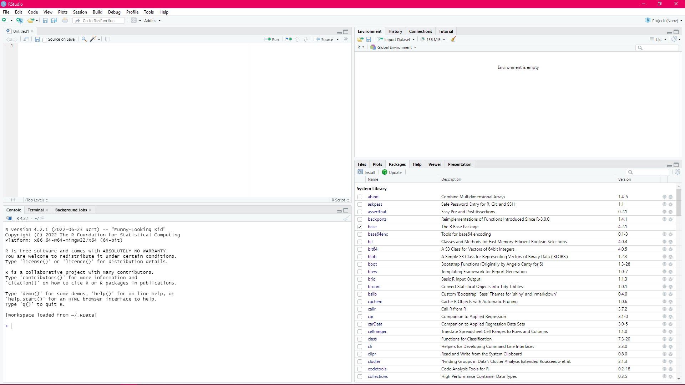

```{r include = FALSE}
knitr::opts_chunk$set(eval=FALSE)
```

# R: Introduction to Basic Features

Authors: Helen Lockstone, Matthieu Miossec, Ben Wright
Bioinformatics Core

# Workshop aims

- To introduce the R language and environment
- To explain some programming jargon and concepts
- To use R to run some typical tasks
- To be aware of the vital importance of good programming habits

This course is hosted at: 
[https://whg-training.github.io/whg-training-resources/programming/introduction_to_R/R_Introduction_to_Basic_Features.html](https://whg-training.github.io/whg-training-resources/programming/introduction_to_R/R_Introduction_to_Basic_Features.html).

This course has workshop content intended to be worked through using RStudio. 
The course tutor will lead work through that content during the session, but you are encouraged to 
work at your own pace and read ahead if you feel comfortable doing so.

The course is intended to start at the very beginning, for people with no previous programming 
experience, using R or otherwise. If you're finding it at too basic a level, feel free to skip 
ahead or use this time for something more useful to you! Some suggestions for more R material are 
at the end of this document.

## Installing R and RStudio

R and RStudio are available for a variety of platforms, including Windows, macOS and Linux. R is
open source software. R Studio is open source software, supplemented by non-free add-ons.

- [R for Windows download](https://cran.r-project.org/bin/windows/base/)
- [R for macOS X](https://cran.r-project.org/bin/macosx/)
- R for Linux can probably be obtained through your usual package manager, or else [here](https://cran.r-project.org/bin/linux/)
- [RStudio downloads](https://www.rstudio.com/products/rstudio/download/#download)

These should already be installed and ready. 

## R: what is it?

- Powerful statistical computing environment and programming language
- Developed by Robert Gentleman and Ross Ihaka at the University of Auckland in mid 1990s –
originally something to teach statistics that would run on a Mac
- [Full story of R's development](https://rss.onlinelibrary.wiley.com/doi/pdf/10.1111/j.1740-9713.2018.01169.x)
- Now widely used all around the world

## R: strengths and weaknesses

- Incredibly powerful and versatile statistical programming software… but where do I start?
- Features that make life easier in many ways… but potential pitfalls as well
- Open-source, free software with a strong support and development community
- Extensive additional functionality for bioinformatics and genomic data through the
[Bioconductor project](https://www.bioconductor.org/)
- Infamous for opaque error messages and help files

# Getting started with R

This workshop will introduce you to the R environment, with the aim of becoming familiar 
with how commands are written and structured and how to perform basic tasks associated 
with data analysis using R. 

## R fundamentals

R is, at its heart, a command line language like bash. Text commands are entered and text output
is printed to the console. Similarly, you can write R scripts to be executed when you need them.

However, unlike bash, R also keeps data in its own internal store rather than only keeping data in 
memory while the command is running. R can also open new windows to display plots it has created,
or show help files.

When you close R, it will ask you whether you want to save the workspace. If you say yes, then R 
creates a file called '.Rdata' (which is a hidden file on most operating systems by default). This 
file contains *all* of the data you had stored in your R session. This makes is easy to pick up 
where you left off, but be aware that this file can become very large if you load a lot of data 
into R.

## Getting started with RStudio

RStudio is an integrated development environment (IDE) that wraps around R and makes a lot of 
common tasks much more convenient. Launch RStudio to open a new R session.

By default, RStudio displays 4 different panels. If there's only one panel on the left, then one 
of them is currently hidden – you can make it visible by opening a new R script file from the 'File' 
menu.

### RStudio screenshot



### Bottom left

The bottom left panel is R itself, in the tab 'Console'. If you were running R without RStudio, 
this is exactly what you would see.

The `>` prompt is telling you that R is ready to receive new commands. You can type R
code here and press return to have R run that code. R will print any output from that command and
then show the `>` prompt again to say it is ready for new input. Note that 
something may have happened 'behind the scenes' – such creating or altering a data object. It is 
important to know what each command has done and it was as intended.

Two useful things to know 
about this panel are that you can use the up and down arrows to scroll through
previous commands – very useful to fix an error without retyping the entire line! – and you can use 
the tab key to auto-complete commands, variable names and file names.

The other tabs you don't need to use now.

Try typing a simple command into the R console (remember to press Return):

```{r}
6 * 7
```

You'll see that it will give you the answer. The `[1]` is a little cryptic for now, but that will 
be explained later. See how it shows the `>` prompt again afterwards.

### Top left

The top left panel is a simple text editor (like Notepad), intended to be used to write R scripts. 
The editor can have multiple files open at a time.

This text editor is integrated into RStudio and has several convenient features. If you
click on the green 'Run' button, it will copy the current line of code into the R window and run 
it. If you highlight a portion of code, the same button will copy and run that selection. There is 
also a 'Source' button, what will copy the entire file into the R panel and run it.

Try this by typing this line into the editor:

```{r}
6 * 9
```

and clicking 'Run'.

The editor also understands some other R-related files. This includes a '.rmd' file. Go to the file 
menu and select 'Open', then navigate to and select the file for this course: 
`R Introduction to Basic Features.rmd`. You'll see this entire document. The snippets of R code 
each have their own little run button (the green arrow on the right) that lets you run the entire
section (called a 'chunk') with one click.

Now you have this course open you can follow it from inside RStudio. Feel free to work through the 
material at your own pace.

### Top right

The top right panel contains information about the current R session. The 'Environment' tab lists 
all the data objects currently stored in R. Each entry is an 'object', in R's terminology. The 
'History' tab shows all the commands that the main R panel has executed so far. This is the same 
list you can browse with the arrow keys in the R panel. The other tabs here you don't need to
worry about.

### Bottom right

The bottom right panel is used to show a variety of things in a tabbed interface. 'Files' allows 
you to browse your computer's directories. 'Plots' displays any plots you have made using R in 
the current seesion. 'Help' is where R will display its help files. 

## Working with the R console 

R is a very interactive environment; commands can be entered into the console one by one, 
and each is interpreted and executed by R in real time. R is a high-level programming 
language, meaning that it is fairly human-readable. 

If a command is not valid in the way it is constructed (its syntax), R will print an error 
message to the screen. These can sometimes be hard to interpret but particularly common 
culprits are simple typing mistakes or quotes and brackets, whether they are in the wrong 
place, missing, or not in pairs (e.g. missing a closing bracket). 

You can type the R commands directly, which is useful at first to get used to the syntax 
(structure) of commands. However, you can use RStudio's editor to copy commands into the console 
if you prefer. This way, it's easier to go back and run a command again, or change it slightly 
first.

*If you see an error message, first double check that the command is entered exactly as shown. 
If you can't find the problem, please ask for help. The advantage of copying the commands 
into the text editor panel of RStudio means that you can save the file afterwards to have a 
record of what you have done and can easily re-run again in future.*

To do anything useful in R, we need to use objects to hold data and perform 
various operations on them. The terms object, variable and data structure can all refer 
generally to 'objects' created in R. 

Although variable is a widely used programming term and would be the preferred term in 
certain situations, we use 'object' as a general term throughout to refer to any of R's data 
structures. These include vectors, factors, matrices, data frames and lists. Don't worry about the 
differences between those things for now.

We will start by entering a few simple commands and discuss what is happening. 

## R command syntax 

The following few commands give some sense of how R stores information in objects and 
how simple manipulations of data can be performed. The `#` symbol indicates a comment. We'll sometimes 
use them here to show what R's output is without needing to run the command. 

The first example assigns the value 1 to a new object we create and name `x`.

```{r}
x <- 1
```

The assignment operator is `<-` and running this command creates a new object named `x` in 
R's memory. If you look in the 'Environment' panel in the top right, you'll see that an entry for 
`x` has appeared. To inspect the contents of the new object in the console, we simply type its name:

```{r}
## Inspect the contents of the new object
x
## [1] 1
```

Note that the contents of an object will be overwritten – without any warning message – if 
later assigned a different value:

```{r}
x <- 4
# x now contains the value 4
x
## [1] 4
```

We can also perform operations directly on the object (note the object itself does not 
change): 

```{r}
x * 2
## [1] 8
# x still contains the value 4
x
## [1] 4

## unless we were to re-assign the output back to the same object:
x <- x * 2
# x now contains the value 8
x
## [1] 8
```

R is case sensitive so `x` and `X` are different:

```{r}
X
## An error
```

Trying to run this command will produce an error message: `Error: object "X" not found`.
Object names are chosen by the programmer – informative names are helpful for several 
reasons. You can use capitalization, `_` or `.` to separate parts of an object name but they 
cannot contain spaces, nor start with a number. To avoid confusion or potential issues, it is 
also best not to give them the same name as an R function, which have their own defined 
names. An object named `raw_data`, `raw.data`, `rawData` (or even `d.raw` for minimal 
typing!) is fine, but trying to assign a value to a variable named `raw data` will give an error 
because R cannot parse it correctly. 

Elsewhere R ignores whitespace so the following commands are equivalent: 

```{r}
x<-4+3
x <- 4 + 3
```

Now we will assign a set of numbers to our variable x, which R will store as a vector. A vector is 
a series of different data values.

```{r}
x <- c(1, 2, 3, 4, 5)
x
## [1] 1 2 3 4 5
```

The `[1]` part of the output is R's way of displaying vectors. The number in square brackets is the 
index of the first entry in the line. If the output is long enough that it 
spans more than one line, this makes it easier to work out the index of entries on that line. Note 
that in R indices start at `1` (instead of `0` as in most other programming languages).

If we forget the closing bracket before pressing enter, then R can detect that the command is 
incomplete. It gives us a different prompt: `+`. This indicates that R is waiting for you to 
complete the command.

```{r}
x <- c(1, 2, 3, 4, 5
## + appears as the prompt
)
```

If we can't simply continue our command, use Esc or control-C to cancel the input so far and return 
to the `>` prompt and start again.

Rstudio and some other text editors highlight different parts of the syntax in different 
colours and automatically close brackets and quotation marks to help eliminate typing 
mistakes.

## R Objects 

Objects can be created in many different ways and hold different kinds of information. 
Unlike other programming languages, there is no need to initialise a variable or object in R 
(i.e. define it before first use) – it can simply be created and used directly. R also automatically 
decides which of its data structures and types are most appropriate for the data given, 
rather than being explicitly specified by the programmer.

We'll work through some examples and look at ways to access or manipulate the data 
contained within an object. Be aware that the type (class) of an object and data it contains 
(numeric, character etc) can affect how it is treated by R. 

There are many shortcuts in R to avoid tedious or error-prone steps. When we created our 
small example vector containing the numbers 1 to 5, we issued this command:

```{r}
x <- c(1, 2, 3, 4, 5) # the c function tells R to concatenate these 5 numbers
## equivalently we could use this command
x <- 1:5 # handy if we needed a much longer vector such as 1 to 100, or 1 to 100000
```

The `:` symbol is special syntax that tells R to make a sequence of whole numbers from one value to 
another. We can also put together non-consecutive strings of numbers or a mixture 

```{r}
x2 <- c(1, 3, 5, 7, 9)
x3 <- c(1:5, 7, 9, 10:15)
```

If we need to create a sequence of numbers, the function `seq` is very useful. 

```{r}
seq1 <- seq(from=1, to=99, by=2)
seq2 <- seq(from=0, to=1, by=0.01)
```

You can look at all of these objects in the 'Environment' panel to see what you get when you use 
these commands.

## Using functions

Functions are defined blocks of code that perform a particular task. R has many hundreds 
of in-built functions for common tasks, and they can be used by 'calling' the function by its 
name. Above, we used the function `seq`; the function name is followed by any arguments in 
parentheses – the arguments determine exactly what the function does and enable it to be 
useful for many situations. By changing the arguments, we changed the sequence of 
numbers that was produced. Some arguments are required and others are optional or may 
have default settings defined in the function. Documentation about the usage of any R 
function is given in the corresponding help page: 

```{r}
help(seq)
```
 
*`help` is, itself, a function that opens up the help file for a given names function.
Note that the help file is opened in the lower right panel of RStudio.* 

## Vectors 

Vectors are one-dimensional objects; in the case of the object `x` we created earlier, it has 
length 5. There is an in-built R function called length that we can use to check how long any given 
vector object is:

```{r}
length(x)
## [1] 5
## If we change what is assigned to x, the length of the vector is automatically adjusted:
x <- 1:10
length(x)
## [1] 10
```

Vectors are R's primary object type and many computations in R are highly efficient 
because they operate on the whole vector at once, rather than element by element. 

Vectors can contain numeric or character data (or both). We can create a new vector, `y`, 
containing the letters 'a', 'b', and 'c'. 

```{r}
y <- c("a", "b", "c")
```

Note how `x` and `y` are displayed differently in the 
'Environment' panel. We can also see how R has automatically treated them differently by checking 
the `class` of the objects directly: 

```{r}
class(x)
## [1] "integer"
class(y)
## [1] "character"
```

Now try running the following command: 

```{r}
y <- c(a, b, c)
## An error
```

What do you think R has tried to do and why does it result in an error message?
 
## Accessing elements of a vector 

Square brackets are used to access specific elements or subsets of a vector, factor, matrix or 
data frame. Let's create a new vector as an example:

```{r}
x <- c(1:5, 10:14)
## now extract 3rd element
x[3]
## or extract alternate elements
x[c(1, 3, 5, 7, 9)]
## or extract subset of elements
x[3:6]
```

The second and third examples above show how R can be powerful by working with vectors. Instead of 
having to use square brackets to extract each element of the vector, and then using `c` to combine 
them into a new vector, we use a vector *inside* the square brackets and R interprets that as an 
instruction to return a vector of those elements of `x`.

R will decide the most appropriate way to store the data it is provided with, and there are 
ways to convert between different object structures and classes if needed. To give more 
examples of how data is interpreted by R, run the following and note the results (feel free to 
discuss this with your neighbours).

```{r}
x2 <- c(1:5, 6.5)
class(x2)
## [1] "numeric"
x3 <- c(1:5, 6.5, "a", "b", "c")
class(x3)
## [1] "character"
```

This gives some idea of R's internal rules. Because the way data is being handled by R is 
important for both performing computations correctly and the source of many error 
messages, it is useful to be familiar with the common data types. Some functions, such as 
computing a mean for example, require numeric data objects to operate on. What happens 
when you try to find the mean of x2 and x3?

```{r}
mean(x2)
mean(x3)
```
 
## Functions and packages

There are hundreds, probably thousands, of in-built functions in R. Some you will use very 
often and others rarely or never. There are always several ways to do the same thing in R, 
using closely-related functions. 

Examples of the functions we have used so far include `length`, `mean`, and `class`. In the case of 
`length`, the argument supplied is the name of the object we wish to find the length of. We 
can check the length of another vector object simply by changing the argument. 

The `length` function is only applicable to vectors (or factors) and does not work on other 
data types such as matrices or data frames, which are 2-dimensional. Often, data is stored in 
a table format (e.g. in Excel), and commonly handled as a 'data frame' in R. We will introduce 
these ideas using practical exercises in the next section.

There are many thousands of additional functions available to R through something called 'packages'. 
Each package is a self-contained parcel of functions created for a specific application. For 
example, 'Bioconductor' is a repository of many packages related to handling data in bioinformatics. 
Because it would be confusing to always have all these functions available (and because some 
packages may end up using the same names) you need to specifically tell R to make a package 
available. This is done using the `install.packages` and `library` functions:

```{r}
## Install the package for your R environment
install.packages("ggplot2")
## Make the package available to use
library(ggplot2)
```

The first function might prompt you to choose from a list of 'mirrors', which are just different 
places on the internet where the packages are stored. It doesn't much matter which you choose, 
although choosing one close to where you currently are is recommended.

Note that when installing the package, you need to treat the package name as character data, inside 
double-quotes. Once 
the package has been installed, R is aware the package exists and can interpret the name without 
quotes when you use `library`. Installing packages is something you only need to do once per 
computer (in theory, at least). You must `library` in each new R session before trying to use any 
functions from the package; as this is what tells R to look in that package for function names 
(again, to try and handle duplicate names in different packages gracefully).

## Working directory

An important concept before we get started is the working directory. Your R session is active in 
one particular directory on your computer – by default your 'home' directory, as defined by the 
operating system.

When you save an R session, the `.RData` file is saved there. When you start a new R session in a 
particular directory, any `.RData` file is re-opened in that session. If is also possible to load 
and save these session files from within RStudio.

It is useful to set the working directory to the place where you have the files you want to work 
with. It means you have to do less typing to load the save files and you can keep the R version of 
the data alongside the original files.

We need to set a working directory for the rest of the workshop. From RStudio's Session menu, 
select 'Set working directory', and then 'Choose directory...'. If you've already downloaded the 
files for this workshop, select that directory. Otherwise, create a new directory to work in and 
select that. You can change the working directory using the R function `setwd`, but it's more 
convenient to use RStudio's interface.
 
You will also need to download two data files by entering the following commands:

```{r}
download.file("https://queex.github.io/whg-training-resources/R-intro/inflammation_data.csv", "./inflammation_data.csv")
download.file("https://queex.github.io/whg-training-resources/R-intro/sample.csv", "./sample.csv")
```

## Removing objects 

Sometimes you are testing things out and creating lots of objects – that's fine but it's always 
good to start a new session when running or checking your final code to be sure previous 
objects do not affect it in any way. Sessions can also be cleaned up by deleting objects with 
the `rm` command:

```{r}
rm(x3)
```

# Break

This is an excellent time to take a short break. Stretch your legs, get a drink.

# Workshop part 2

Earlier we introduced the R software environment, some key features of the R programming language 
and how to start using it. We will now do some practical exercises working with example data to 
perform typical tasks. First, some important acknowledgements:

*The tutorial that follows is in part adapted from the [Software Carpentry Foundation](https://software-carpentry.org/lessons/)
Programming with R, specifically the Analysing Patient Data
[tutorial](http://swcarpentry.github.io/r-novice-inflammation/01-starting-with-data/index.html).
The Software Carpentry material is available for re-use under a
[Creative Commons License](https://creativecommons.org/licenses/by/4.0/) and we are grateful to the
original authors.*

## Setup

We set up our R session for this practical before the break. You can check the current working 
directory with the following command:

```{r}
getwd()
```
The output (directory path) should match the location you are working in today, and this folder 
should also contain the files named `inflammation_data.csv` and `sample.csv`. If you see an error 
message at any point, first check the command matches that in the tutorial exactly and that you 
haven't accidentally missed an earlier command out. Pay particular attention to lower/upper case 
letters, underscores, dashes or dots in function or object names, and that brackets and quotes are 
correctly paired. If you can't spot the problem or have a question at any point, please don't 
hesitate to ask!

## Helpful Tips

- Enter your commands in the top-left panel of RStudio (a text editor) as this means they can be 
saved to keep a record of what you have done. Use the 'Run' to check that they run and do what you
expect.
- To save your script, click on the disk icon in the same toolbar as the 'Run' button. Giving a 
filename with a .R extension, such as 'R_course_code.R', saves it as an R script file. The `.R` 
suffix lets RStudio know that the file is meant to be an R script.
- Any scripts you make are separate files to the session data that is saved when you close R.

This is the usually the easiest way to work; if you need to close your session and return to it 
another time, it is easy to run the code again from start to finish. If it were appropriate, all of 
the code stored in a 
script can be executed in R from start to finish with the command: 

```{r}
source("script_name.R")
```

You may recognise the function name `source` from the button in the editor panel that does the same 
thing.

## Reading in data from a file

The first thing we need to do is load or read in the data from our files so it is accessible in the 
current R session. There are a few possible ways to do this but we will use the function `read.csv` 
because our files are saved in 'comma-separated values' or csv format. To find out details of how 
to use this function you can search RStudio's Help (bottom right panel) or type: 

```{r}
help(read.csv)
```

The help page shows us the arguments for this function and their default values where applicable. 
For example, we see `sep=","`, which means the fields in a row will be separated on commas, and 
`header=TRUE`, which means it is expecting the first row of the file to contain names for each 
column. The first file we will work with is the one named 'inflammation_data.csv'. If we inspect 
this file in Excel or a text editor (by opening it directly from its location on your computer) we 
see there are no column names, just a large set of numerical values. Therefore, we need to 
explicitly include the header argument in our command, changing it to FALSE to over-ride the 
default behaviour of the function. This is an example of how arguments modify a function's precise 
behaviour, rather than requiring two separate functions to exist for files with/without header rows. 

```{r}
inf.data <- read.csv("inflammation_data.csv", header=FALSE)
```

*Note: if you see an error message similar to 'No such file or directory' when trying to read in a 
file, it is likely that either (i) the file is not located in the current working directory, or
(ii) there is one (or more) typos in the filename.*

It's useful to break this command down a little more.

We have given a name for a new object, `inf.data`, in which to store the contents of the file 
'inflammation_data.csv'. Our object name is descriptive without being too long, shortening 
'inflammation' to 'inf' for our convenience. We are using the in-built R function `read.csv`, and 
provide two arguments:

- the name of the file to read in
- `header=FALSE`, indicating to R that our file does not have a header row

There are many other arguments to the `read.csv` function to further refine its behaviour but these 
are either optional or the default settings are fine for most situations. By running this command, 
R creates the object `inf.data` and information about it appears in the 'Environment' panel of 
RStudio. 

Notice that, unlike the vectors we've created before, that it doesn't show all the data stored in 
the object. It is detailed as `60 obs.` (observations) `of 40 variables` and if you hover the mouse 
pointer over the name, `inf.data`, it indicates that the object is a `data.frame`, which is how R 
stores tabular data.

If you double-click on the object name or click on the spreadsheet icon to the righthand side, the 
contents of the object are loaded in the top-left panel in a new tab. The 
columns have been automatically named by R as `V1` through to `V40`, as column names have to start 
with a letter. The rows are simply numbered – the only restriction to row names is that they must be 
unique. 

What do you think will happen if you run the command above without including the header argument? 
Try it by saving the contents into a new object called `test` and compare this to `inf.data`:

```{r}
test <- read.csv("inflammation_data.csv")
```

Another object named `test` now appears. View the contents of that object and compare it to 
`inf.data`.

*This is a good example of how easily something unwanted can happen in R and the importance of
checking your objects contain what you intend them to. Any mistakes can simply be corrected by
re-running the command e.g. with the appropriate header argument, and overwriting any previous
version of the object.*

## Two-dimensional data structures

Our original file contained rows and columns of data, and R has suitable 2-dimensional data 
structures to store such data: matrices and dataframes. These can both be thought of as tables of 
data, analogous to an Excel spreadsheet. Matrices require all columns to be of the same type, 
while data frames can have columns of different data types. Given that experimental data is often a 
mixture of numeric values (e.g. measurements) and associated descriptive information, data frames 
are a very commonly used data structure in R. 

*NB while it is possible to create a matrix object with mixed data types, R will use its
internal hierarchy of data types to choose one that is applicable to all of the data – often this
means numerical columns get converted to character strings, and certain functions may not perform
as expected if this is not noticed, or they may produce an error message.*

In this case, a data frame object has been created:

```{r}
class(inf.data)
```

We can check how each column of data has been treated by R, e.g. for the first column:

```{r}
class(inf.data[, 1])
```

*In fact, as all the columns contain data of the same type, R could equally well store this data as
a matrix object. A data frame has been created because the functions `read.csv` and `read.table`
are specifically designed to deal with mixed column classes and produce data frames by default.
Another function `scan` can be used to read in matrices, especially large ones.*

It is worth noting that some functions operate on matrix objects, and so converting between classes 
is sometimes needed. R has some standard functions for converting from one class to another.

```{r}
inf.data <- as.matrix(inf.data)
class(inf.data)
```

We will continue with the matrix form of this object for now, and load a mixed dataset later. 
Most operations on either kind of 2-dimensional object are the same. For example, we can find the 
dimensions of a matrix or a data frame with the `dim` function.

```{r}
dim(inf.data)
```

The output of `dim` is printed to the screen and shows the number of rows the object contains, 
followed by the number of columns (the convention is always rows, then columns but this can be hard 
to remember at first as there is no indication of which way round it is in the syntax). 

If unsure, the functions `nrow` and `ncol` will return the number of rows or columns respectively:

```{r}
nrow(inf.data)
ncol(inf.data)
```

This particular file suffers from the lack of any labels to annotate what data is recorded in the 
rows and columns. The Software Carpentry tutorial provides the following information:

*“We are studying inflammation in patients who have been given a new treatment for arthritis. Each
row holds the observations for just one patient. Each column holds the inflammation measured in a
day, so we have a set of values in successive days."*

Our object has 60 rows and 40 columns, so we infer from the information above that there are 60 
patients, and 40 days. 

Again we see a way for mistakes to easily creep into data analysis – here we have to rely on 
information given to us second-hand to know what is what. What if that information were wrong? Are 
there any checks we can make ourselves to be sure patients are in rows? We are not told how many 
patients were included so simply checking the number of rows won't help. And what if there were 
50 patients and measurements taken over 50 days?

Even with careful scrutiny it would be hard to know how the data are presented (patients in rows or 
columns) from the data alone. We could perhaps make some plots to help us, or we might spot the 
zero values in the first column. Scrolling down the object display in the top-left panel or 
displaying the first column in the console confirms they are all zeroes, and the values in each row 
tend to rise across the first few columns. We may be reassured by this that the patients are indeed 
in the rows, since we might expect inflammation to rise over time, and an individual recording 0 on 
every single day might be unlikely (though not impossible). 

It would be prudent to add some row and column names to reduce the chance of making a mistake later 
when dealing with this data:

```{r}
rownames(inf.data) <- paste("Patient", 1:60, sep="_")
colnames(inf.data) <- paste("Day", 1:40, sep="_")
```

This introduces the very useful and versatile function `paste`. Note that adding row and column 
names does not change the size of the data object, but we can see them displayed by reloading the 
object. The row and column names are not part of the data itself. They are similar to the 
alphabetical columns and numbered rows in an Excel spreadsheet.

## Accessing data

Earlier we looked at accessing elements of a one-dimensional vector object. For matrices and 
dataframes, a similar approach with square brackets is used:

`object_name[rows,  cols]`

By specifying the rows and columns of interest, an object can be subset in a variety of ways to 
inspect or extract different parts of it.

```{r}
inf.data[1, 1] # this pulls out the data value in the first row of the first column
inf.data[30, 20] # any single entry can be extracted by specifying the row and column
```

Think about how might you select the data in the first 5 rows for the first 5 columns.

```{r}
## If we need to select non-contiguous portions of the object, we'll need the help of c():
inf.data[c(1, 3, 5), c(10, 20)]

## If you want to display all columns for selected row(s), leave blank space after the comma:
inf.data[5, ] # All columns for row 5

## Or blank space before the comma to select all rows for given column(s):
inf.data[, 1:5] # all rows, columns 1 through 5
```

When you select a single column from a data frame, R will 'helpfully' turn it into a vector:

```{r}
test <- inf.data[, 2] # Select the second column
class(test)
```

This can cause errors if you were expecting `test` to still be a data frame in a later command.

We added column names to our object earlier. Rows and columns can also be accessed by name (in 
double-quotes) inside square brackets. `$` is a shorthand way of referring to a named column in R. 
Both alternatives in the snippet below return the same vector.

```{r}
inf.data[, "Day_3"]
inf.data$Day_3
```

Suppose you want to determine the maximum inflammation for patient 5 across days three to seven. 
To do this you would extract the relevant subset from the data frame and calculate the maximum 
value. Which of the following lines of R code gives the correct answer?

1.	`max(inf.data[5, ])`
2.	`max(inf.data[3:7, 5])`
3.	`max(inf.data[5, 3:7])`
4.	`max(inf.data[5, 3, 7])`

## Analysing data

We can perform many simple analyses of the data by applying functions such as max, min, mean, or 
summary to our data object. We might want to determine the maximum value per patient or the average 
value per day. The following examples illustrate how this can be done extremely efficiently in R, 
starting with an approach that is the opposite (and definitely not recommended!).

Suppose we want to find the maximum inflammation score for each patient across the 40 days of 
measurements.  Let's start by calculating it for patient 1.

Extracting the data for patient 1 (i.e. the first row) is the first obvious step, and perhaps we 
decide it makes sense to store the values for this patient in a new object:

```{r}
inf.patient1 <- inf.data[1, ]
```

We can then calculate the maximum value for Patient 1:

```{r}
max(inf.patient1)
```

Although this seems reasonable enough, there are several issues:

- We've created an additional object to store data that is simply a duplicate of what is already 
contained in our original object
- It doesn't scale well to do this for all 60 patients
- The result is output to the console and therefore hard to do anything further with

If we did continue with this approach, there would be 60 new objects (all with very similar names), 
a high probability of having made a typing mistake somewhere (perhaps overwriting one patient's 
data with another), and a large set of results that we'd have to manually write down or transfer to 
an Excel spreadsheet – all of which is very messy and prone to error. 

We can easily dispense with the intermediate step of creating a new object:

```{r }
# max inflammation for patient 1
max(inf.data[1, ])

# or equivalently
max(inf.data["Patient_1", ])
```

These commands are the same as extracting the data for patient 1 as we did earlier, but instead of 
printing to the screen or storing in a new object, the command is used directly as an argument to 
the function `max` by enclosing in the parentheses. 

*Commands can be nested in this way to achieve multiple steps in a single line of code; too many
commands in one line though can make it harder to work out what the code is doing, as well as
increase the chance of the code not doing as intended – the location of brackets becomes vital.*

We'd really like a way to this for all 60 patients without duplicating the code 60 times. Loops are 
one option (not discussed here) but the `apply` function is the most efficient approach:

`apply` allows us to repeat a function on all of the rows (`MARGIN = 1`) or columns (`MARGIN = 2`) 
of a data frame simultaneously: 

```{r}
max_inf_patient <- apply(inf.data, MARGIN=1, max)
```

Similarly, we could compute the average inflammation per day with a single line of code:

```{r }
avg_inf_day <- apply(inf.data, MARGIN=2, mean)
```

Comparing these two commands will help understand the `apply` function, which is not intuitive but 
highly efficient as we have seen.  The arguments to `apply` are:

- The data object
- `MARGIN`, indicating whether to apply over rows (1) or columns (2)
- The name of the function to be applied (functions can sometimes be treated as objects when used as 
arguments for other functions)

We wanted to find the maximum inflammation score for each patient, so we looked across the rows and 
used the `max` function. To modify the command to find the average inflammation per day, we switched 
the MARGIN argument to 2 for columns, and gave the final argument as `mean`. 

*While the MARGIN argument is explicitly assigned above, R is equally happy to infer from the
shortened command `apply(inf.data, 1, max)` that the 1 should be assigned to the second defined
argument of `apply`. You can also write your own bespoke functions as required and use apply to
run them over an object.*

We have also solved the final issue with our initial approach by storing the results in 
suitably-named objects for further work. 

```{r}
length(max_inf_patient)
head(max_inf_patient)
```

`head` is a function that shows the first six elements of a vector or the first 6 rows of a data 
frame.

Another useful function is `summary`. This returns the minimum value, first quartile, median, mean, 
third quartile and the maximum value, all very useful information to make an initial inspection of 
your data.

```{r}
summary(inf.data[, 1:4]) # for each of the first 4 days
```

## Plotting data

Visualising data is a vital part of statistical analysis, and R's plotting capabilities are a key 
reason for its popularity. There is a related course R: Visualisation that you can take if 
interested to learn more. Here, we introduce ways to make a few simple plots. 
Let's take a look at the average inflammation over time. Recall that we already calculated these 
values above and saved them in an object named `avg_inf_day`. Plotting the values is done with the 
function `plot`:

```{r}
plot(avg_inf_day)

## Default labels and settings are used but we can refine our plot with some additional arguments:
plot(avg_inf_day, main="Inflammation Scores Over Time", xlab="Day", ylab="Average_inflammation_score") # adding title and axis labels
plot(avg_inf_day, main="Inflammation Scores Over Time", xlab="Day", ylab="Average_inflammation_score", pch=4, col="red") # changing the plotting symbols and colour

## Similarly, we could plot the data per patient:
plot(max_inf_patient)

## Here, we might decide to use a boxplot instead:
boxplot(max_inf_patient, main="Maximum Inflammation Scores", ylab="Max_inf_score")
legend("topright", legend="n=60 patients", cex=0.8) # adding a legend
```

In RStudio, the 'Plots' panel in the bottom right contains a history of all the plots you've made 
in the current session. In vanilla R, a new plot will replace the existing one unless you create a 
new window for it.

When we are happy with our plots, they can be saved to a file.

```{r}
pdf("Inflammation_plots.pdf", onefile=T)
plot(avg_inf_day, main="Inflammation Scores Over Time", xlab="Day", ylab="Average_inflammation_score", pch=4, col="red")
boxplot(max_inf_patient, main="Maximum Inflammation Scores", ylab="Max_inf_score")
legend("topright", legend="n=60 patients", cex=0.8)
dev.off()
```

This will be saved to the current working directory by default so if we check the folder, a new file 
named 'Inflammation_plots.pdf' should have been created. The `onefile=T` argument instructs R to 
append additional plots to the same file and the `dev.off()` command at the end closes the file 
connection. You can also export plots directly to a pdf file from the RStudio 'Plot' panel.

## Handling data with factors

We'll next read in data from another file to illustrate a few more features of data frames and how 
to work with them in R. In this case the file does contain a header row and the default arguments 
for read.csv are appropriate for this file so we only need provide the filename:

```{r}
data2 <- read.csv("sample.csv")
head(data2)
```

This displays the first 6 rows, and we can see immediately that we have a range of different types 
of data in each column. Let's see how R has treated it (you can paste the following 4 lines as one 
block). 

```{r}
for(i in 1:ncol(data2)) {
    print(class(data2[, i]))
}
```

Here, we've used a `for` loop to iterate over each column in the object `data2`, and print to 
screen the class of each column. The output tells us that columns 1:3 are treated as characters,
and mostof the rest are treated as integers. Column 5 is 'numeric', the basic data type in R for
non-integer numbers. R has a 
number of different classes of data it can store and sometimes functions will behave differently 
depending on what type of data they are given. 

Although columns 1 – 3 are currently characters, some functions in R that perform statistical 
analysis prefer a data type called 'factors'. Factors are useful when you have category data, where 
the character data can only come from a well defined set of possibilities. Factors can be useful
when you want to make sure incorrect values don't creep in accidentally, because R will report an 
error if factor data tries to be changed to value outside that set.

We can specifically convert the Group column to a factor:

```{r}
data2$Group <- as.factor(data2$Group)
class(data2$Group)
```

The `as.factor` function returns a factor version of a vector. However, as this doesn't change the 
original `data2` object by itself, we need to assign that vector of factors back to the column, 
replacing what was there before. You can see how using the `$` syntax makes this line easier to 
read. R has a number of different `as.` functions for converting to different data types.

A very useful summary function is `table`:

```{r}
table(data2$Group)
table(data2$Gender)
```

This alerts us to the fact that data in the Gender column has not been entered consistently, which 
we might have already spotted from viewing the object in RStudio. 

To fix this, we can make sure `F` and `M` are used throughout; this involves determining which rows 
contain a lowercase `f` for example, and substituting with `F`. Similarly for the lowercase case 
`m`. The following code does each a different way.

```{r}
data2$Gender <- gsub("f", "F", data2$Gender)
data2$Gender[data2$Gender=="m"] <- "M"

## checking we have modified the data as intended
table(data2$Gender)
```

The `gsub` function replaces the first argument `"f"` with the second argument `"F"` in the third 
argument `data2$Gender` wherever it appears, leaving the other entries unchanged. As before, we 
need to assign this new vector back to the original object.

The second line shows one of R's particularly useful features. We're telling R to replace values in 
`data2$Gender`, but only where those values equal `"m"`. Indices in R can be used when assigning 
values to objects, not just when extracting them.

This is one example of how there can be multiple ways of doing a particular task in R. When 
deciding which method to use, in general, it is better to stick with the method you understand the
best as that's the method where you are least likely to make a mistake. Some mistakes will cause R 
to generate an error, but the more dangerous mistakes are ones that don't result in an error but 
result in incorrect data.

## Putting it together

See if you can solve the following problem using R:

- Create a new vector containing a set of any 9 letters, including at least 3 vowels. Give your 
vector object a suitably descriptive name
- Check the length of your vector equals 9
- Now extract subsets of letters to create as many new short words as you can 
- Hint: use the `c()` function and `:` operator within square brackets

## Bioconductor

[Bioconductor](https://www.bioconductor.org/) is a separate third-party repository of R code, 
specifically geared towards bioinformatics. Many of the packages in Bioconductor are also available 
via R's usual package installation method. However, Bioconductor has its own preferred 
installation mechanism which gets around some of R's more annoying limitations with version 
incompatibilities. In particular, the packages in Bioconductor are updated more swiftly following 
the release of a new version of R. To get started with Bioconductor, use the following command:

```{r}
source("https://bioconductor.org/biocLite.R")
```

This loads and runs an R script hosted on the web that defines a new function. You then use this 
function in a similar way to how you would use the `install.packages` function:

```{r}
biocLite("limma")
```

Loading Bioconductor packages this way is typically a longer process but more reliable.

# Getting help

As you read the R help pages, you may not find them terribly helpful. The R `help` function is most 
useful for refreshing your memory about specific functions you have used before. Unfortunately, it 
is not very useful for learning the how to use the functions in the first place.

There are several online forums used by R programmers, novice and expert, to get help and advice 
from their peers. Searching for your R problem will often give results from one of these forums.

One page 'quick reference' documents:

- [R cheat sheet](https://queex.github.io/whg-training-resources/R-intro/r-cheat-sheet.pdf)
- [R reference card](https://queex.github.io/whg-training-resources/R-intro/R_reference_card.pdf)

# Further resources and useful information

The Software Carpentry Foundation website contains many tutorials for learning a variety of 
programming languages, including R. There is also a series of domain-specific Data Carpentry 
courses, which focus on computational skills needed to handle and analyse data – tutorials are 
currently available for Ecology, Genomics, Geospatial Data and Social Sciences, with others in 
development. 

- [Software Carpentry lessons](https://software-carpentry.org/lessons/)
- [Data Carpentry lessons](https://datacarpentry.org/lessons/)

In particular, the tutorials at the following links give further details and examples on some of 
the ideas already introduced or extend to other topics once you feel comfortable interacting with 
the R environment. 

- [Data structures](http://swcarpentry.github.io/r-novice-inflammation/13-supp-data-structures/index.html)
- [Read and write csv files](http://swcarpentry.github.io/r-novice-inflammation/11-supp-read-write-csv/index.html)
- [Factors](http://swcarpentry.github.io/r-novice-inflammation/12-supp-factors/index.html)
- [Addressing data](http://swcarpentry.github.io/r-novice-inflammation/10-supp-addressing-data/index.html)
- [Best practices](http://swcarpentry.github.io/r-novice-inflammation/06-best-practices-R/index.html)
- [R genomics](https://datacarpentry.org/R-genomics/)
- [Geospatial data](https://datacarpentry.org/r-intro-geospatial/)

# Putting it together example solution

```{r}
random_letters <- c("r", "t", "d", "e", "e", "i", "a", "s", "n")
length(random_letters)
# [1] 9
random_letters[c(8, 7, 6, 3)]
# [1] "s" "a" "i" "d"
random_letters[c(1, 7, 6, 8, 4)]
# [1] "r" "a" "i" "s" "e"
random_letters[c(8, 2, 4:5, 1)]
# [1] "s" "t" "e" "e" "r"
random_letters[c(2, 1, 4, 4)]
# [1] "t" "r" "e" "e"
```

# Epilogue: good programming habits

1. Break it down into small steps
    - Write code to do individual parts of your overall task and build it up into a larger script
    - This makes it easier to get right and test as you are going along
    - It is also a good way to solve errors/bugs in your code
2. Pay attention to details and program carefully
    - Commands must be accurate both in their syntax and what they do
    - It is easy to overwrite objects, pull out wrong subsets of data, mix up sample names etc.
    - To avoid this, you need to check carefully all the time what you are working with and what R 
    produces after you run a command
    - Inspect object contents, make plots, test examples can all helpGood programming habits
3. Test your code thoroughly
    - You are the only person who can make sure it is doing what you intend it to do
    - R will give an error if a command is incorrectly specified according to the rules of the 
    language but it can't tell you if the command you've written does not do what you think it does…
    - …and it will go ahead and execute it regardless, because that is what you have instructed R 
    to do!
4. Comment your code
    - Comments are really useful to jog your memory if you come back to some code after a while or 
    want someone else to understand it. 

# Finally…

Please let us know if you have any questions and good luck on your programming journey! 

We are happy to help anytime:
[bioinformatics@well.ox.ac.uk](mailto://bioinformatics@well.ox.ac.uk)